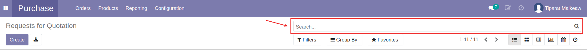
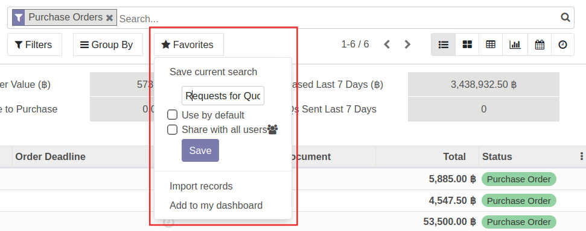
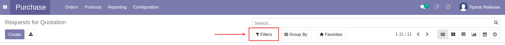
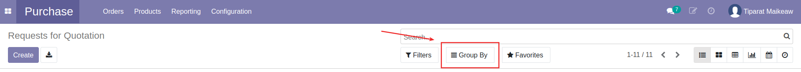
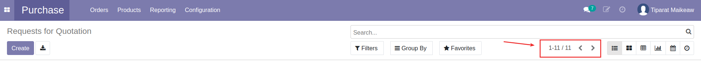
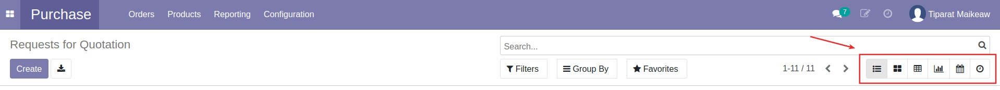
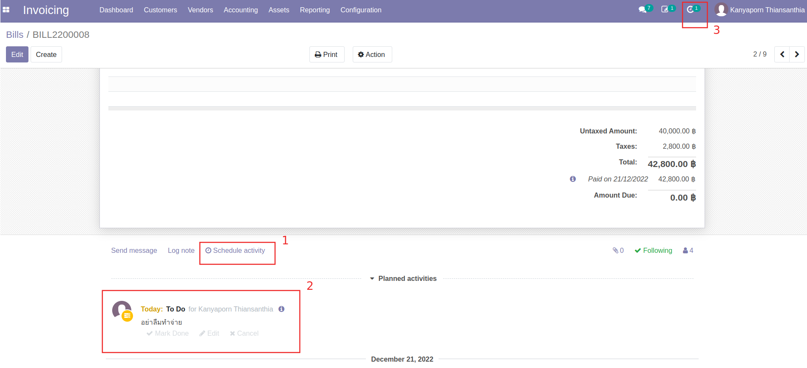
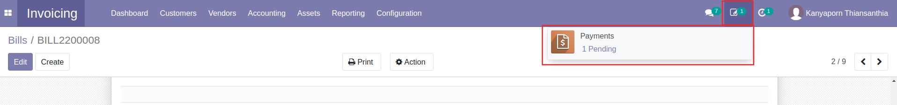

# การใช้ฟีเจอร์พื้นฐาน

## การค้นหาเอกสาร (Search)

* สามารถค้นหาเอกสารด้วยการกรอกข้อความหรือเลขที่เอกสารบางส่วนลงในช่องค้นหาได้
* สามารถเลือกหมวดที่ต้องการค้นหาได้ โดยหมวดการค้นหาแตกต่างกันตามหน้ารายการเอกสาร เช่น ค้นหาจากชื่อ Vendor ค้นหาจากเลขที่เอกสาร เป็นต้น

!!! Note
    * ตามสิทธิ์ของผู้ใช้งานแต่ละคนและในแต่ละหน้าเอกสารอาจมีฟีเจอร์พื้นฐานที่แตกต่างกันเล็กน้อย
    * สามารถบันทึกการค้นหา การกรองข้อมูล หรือการจัดกลุ่มที่กำหนดไว้ได้ โดย
        * กดปุ่ม Favourites > Save current search 
        * ตั้งชื่อการกำหนดค่าที่ตั้งไว้
        * เลือกบันทึกได้ 2 แบบ
            * Use by default: บันทึกการกำหนดค่านี้ สำหรับใช้เป็นค่าเริ่มต้นของตัวเอง
            * Share with all users: บันทึกการกำหนดค่านี้ และแชร์การกำหนดค่านี้ให้ผู้อื่นใช้ด้วย
            

---

## การกรองรายการเอกสาร (Filters)

* สามารถกรองลิสต์รายการเอกสารที่ต้องการดูได้ โดยระบบมีเงื่อนไขให้เลือกรองตามข้อมูลของเอกสารแต่ละประเภท เช่น ที่เอกสาร Purchase Order ต้องการกรองดูรายการเอกสารที่รออนุมัติ ทำได้โดยเลือก Filter "To Approve" เป็นต้น

!!! Note
    * ตามสิทธิ์ของผู้ใช้งานแต่ละคนและในแต่ละหน้าเอกสารอาจมีฟีเจอร์พื้นฐานที่แตกต่างกันเล็กน้อย
    * สามารถบันทึกการค้นหา การกรองข้อมูล หรือการจัดกลุ่มที่กำหนดไว้ได้ โดย
        * กดปุ่ม Favourites > Save current search 
        * ตั้งชื่อการกำหนดค่าที่ตั้งไว้
        * เลือกบันทึกได้ 2 แบบ
            * Use by default: บันทึกการกำหนดค่านี้ สำหรับใช้เป็นค่าเริ่มต้นของตัวเอง
            * Share with all users: บันทึกการกำหนดค่านี้ และแชร์การกำหนดค่านี้ให้ผู้อื่นใช้ด้วย
            

---

## การจัดกลุ่มการแสดงรายการเอกสาร (Group By)

* สามารถจัดกลุ่มแสดงรายการเอกสารตามเงื่อนไขต่างๆได้ เช่น จัดกลุ่มแสดงรายการเอกสารตามชื่อ Vendor เป็นต้น

!!! Note
    * ตามสิทธิ์ของผู้ใช้งานแต่ละคนและในแต่ละหน้าเอกสารอาจมีฟีเจอร์พื้นฐานที่แตกต่างกันเล็กน้อย
    * สามารถบันทึกการค้นหา การกรองข้อมูล หรือการจัดกลุ่มที่กำหนดไว้ได้ โดย
        * กดปุ่ม Favourites > Save current search 
        * ตั้งชื่อการกำหนดค่าที่ตั้งไว้
        * เลือกบันทึกได้ 2 แบบ
            * Use by default: บันทึกการกำหนดค่านี้ สำหรับใช้เป็นค่าเริ่มต้นของตัวเอง
            * Share with all users: บันทึกการกำหนดค่านี้ และแชร์การกำหนดค่านี้ให้ผู้อื่นใช้ด้วย
            

---

## การกำหนดจำนวนรายการที่แสดง

* ระบบแสดงจำนวนรายการที่แสดงในแต่ละหน้า
* สามารถแก้ไขจำนวนรายการที่แสดงได้ โดยกดเพื่อแก้ไขตัวเลข

---

## การเปลี่ยนแปลงมุมมองรายการเอกสาร

* สามารถเลือกเปลี่ยนแปลงมุมมองรายการได้หลากหลายแบบ

!!! Note
    * ตามสิทธิ์ของผู้ใช้งานแต่ละคนและในแต่ละหน้าเอกสารอาจมีฟีเจอร์พื้นฐานที่แตกต่างกันเล็กน้อย
---

## การแนบเอกสารที่เกี่ยวข้อง

ที่หน้าเอกสารทุกรายการในระบบสามารถแนบไฟล์ที่เกี่ยวข้องไว้ด้านล่างของเอกสารได้ โดยมีขั้นตอนดังนี้

  * ที่ด้านล่างของเอกสาร กดที่รูปคลิปหนีบกระดาษ 
  * ระบบจะแสดงปุ่ม +Attachment เพื่อให้เพิ่มไฟล์ที่ต้องการแนบ โดยสามารถแนบเป็นไฟล์ pdf หรือไฟล์รูปภาพได้ฃ

ผู้ใช้งานที่สามารถเข้าถึงเอกสารนี้ ก็จะสามารถเปิดดูไฟล์แนบหรือดาวน์โหลดไฟล์ไว้ได้

---

## การใช้ Schedule Activity

* (1) ที่ด้านล่างของทุกเอกสารในระบบ สามารถตั้ง Schedule เพื่อแจ้งเตือนการทำงาน โดยสามารถแจ้งเตือนสำหรับตัวเองหรือระบุชื่อผู้ใช้งานอื่นได้
* (2) เมื่อตั้ง Schedule แล้ว จะแสดงที่ log note ของเอกสาร
* (3) และเมื่อถึงกำหนดจะมีแจ้งเตือนที่ไอคอนนาฬิกาด้วย

---

## การใช้ Reviews

* แสดงจำนวนและประเภทเอกสารที่รอการอนุมัติ
* สามารถกดปุ่ม เพื่อเข้าถึงเอกสารที่รออนุมัติได้

---
End.

