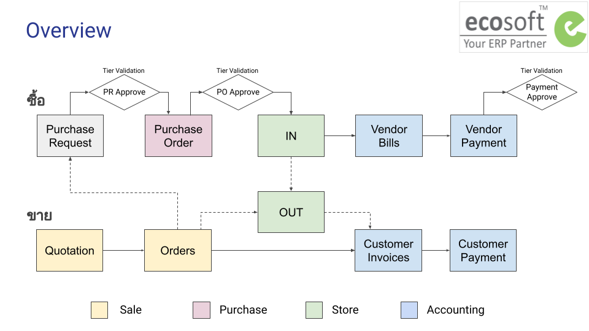

# ภาพรวม

## กระบวนการทำงาน

กระบวนการทำงานแบ่งตามฝ่ายต่างๆ ดังนี้

1. Sale - ฝ่ายขาย
    * การออกใบเสนอราคาและยืนยันการขาย 
2. Purchase - ฝ่ายจัดซื้อ 
    * การขอซื้อขอจ้าง โดยผู้ขอซื้อ
    * การจัดซื้อจัดจ้าง โดยฝ่ายจัดซื้อ
3. Inventory - ฝ่ายสโตร์
    * การรับของเข้าสโตร์
    * การตัดของออกจากสโตร์
4. Accounting - ฝ่ายบัญชี

...

## การใช้ฟีเจอร์พื้นฐาน

### การค้นหาเอกสาร

### การจัดกลุ่มการแสดงรายการเอกสาร

### การแนบเอกสารที่เกี่ยวข้อง

ที่หน้าเอกสารทุกรายการในระบบสามารถแนบไฟล์ที่เกี่ยวข้องไว้ด้านล่างของเอกสารได้ โดยมีขั้นตอนดังนี้

  * ที่ด้านล่างของเอกสาร กดที่รูปคลิปหนีบกระดาษ 
  * ระบบจะแสดงปุ่ม +Attachment เพื่อให้เพิ่มไฟล์ที่ต้องการแนบ โดยสามารถแนบเป็นไฟล์ pdf หรือไฟล์รูปภาพได้ฃ

ผู้ใช้งานที่สามารถเข้าถึงเอกสารนี้ ก็จะสามารถเปิดดูไฟล์แนบหรือดาวน์โหลดไฟล์ไว้ได้

...

!!! note
    xxx

