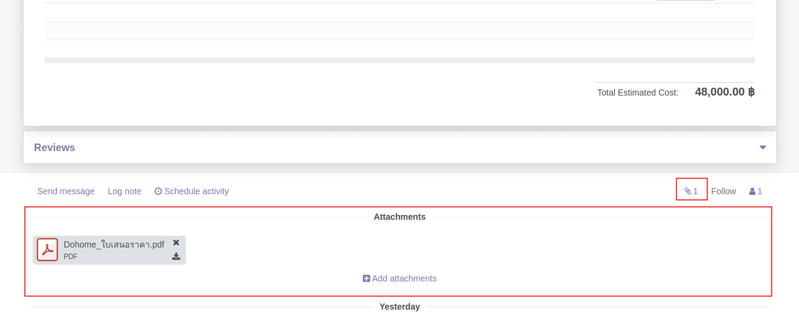

# Overview

## ภาพรวมกระบวนการทำงาน
ภาพรวมกระบวนการขาย

ภาพรวมกระบวนการซื้อ

---

## แนะนำฟังก์ชันพื้นฐานของระบบ
1. การค้นหา กรองการค้นหา และจัดกลุ่มการค้นหาเอกสาร
2. การแนบเอกสารที่เกี่ยวข้อง

### 1. การค้นหา กรองการค้นหา และจัดกลุ่มการค้นหาเอกสาร

### 2. การแนบเอกสารที่เกี่ยวข้อง

หากต้องการแนบเอกสารที่เกี่ยวข้อง ในทุกหน้าเอกสารผู้ใช้งานสามารถทำได้ดังนี้

   * ที่หน้าเอกสาร เลื่อนลงมาด้านล่าง 
   * กดรูปคลิปหนีบกระดาษ ระบบจะแสดงปุ่ม +Attachment เพื่อให้เพิ่มเอกสารที่ต้องการแนบ โดยสามารถแนบได้ทั้งในรูปแบบไฟล์ PDF และรูปภาพ

