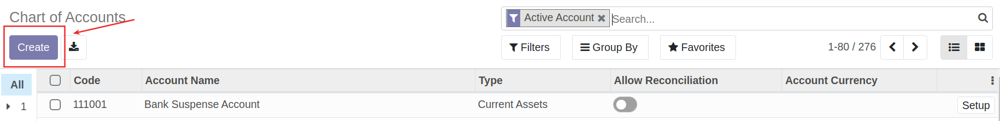
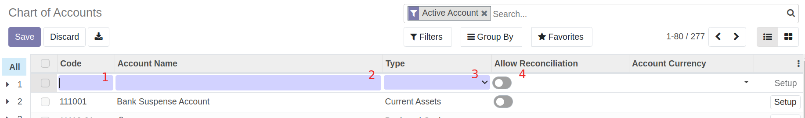
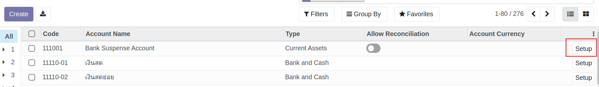
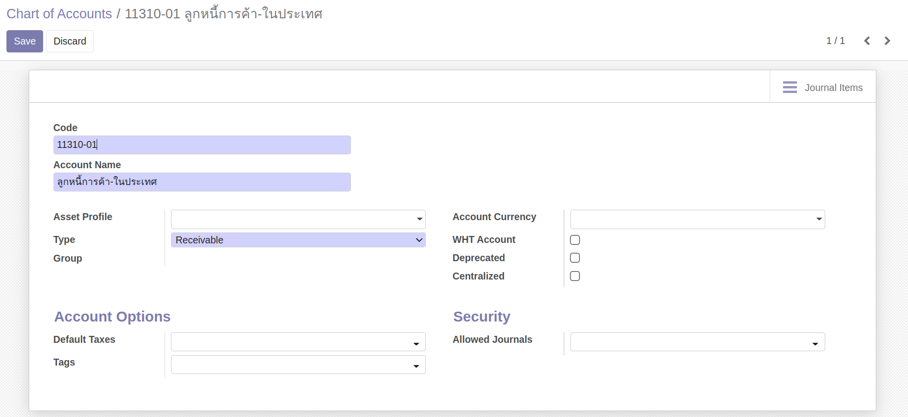

# การจัดการข้อมูลหลักผังบัญชี (Chart of Accounts)

!!! Warning
    การลบ เพิ่ม หรือแก้ไขผังบัญชี จะส่งผลกระทบกับโครงสร้าง การบันทึกบัญชีและการออกรายงานของทุกรายการ

## การเพิ่มข้อมูลผังบัญชี

**Menu:** Invoicing > Configuration > Chart of Accounts

1. กดปุ่ม Create เพื่อสร้างรหัสบัญชี 

2. กรอกข้อมูลดังนี้

    * (1) Code: กรอกรหัสบัญชีที่ต้องการเพิ่ม
    * (2) Account Name: ชื่อรหัสบัญชี
    * (3) Type: เลือกประเภทของรหัสบัญชี
    * (4) Allow Reconciliation:     
        * เปิด หากต้องการกระทบยอดรหัสบัญชี
        * ปิด หากไม่ต้องการกระทบยอดรหัสบัญชี
    
3. หากต้องการกรอกข้อมูลของรหัสบัญชีเพิ่มเติมให้กด "Set Up" 

4. ระบบจะแสดงหน้าต่างสำหรับการตั้งค่าเกี่ยวกับรหัสบัญชีเพิ่มเติม ดังนี้

    * Asset Profile: เลือกหมวดหมู่ครุภัณฑ์ ใช้สำหรับรหัสบัญชีที่ต้องการผูกกับหมวดหมู่ครุภัณฑ์ (ถ้ามี)
    * Type Group: แสดงประเภทของรหัสบัญชี
    * WHT Account: รหัสบัญชีที่เกี่ยวข้องกับการบันทึกหัก ณ ที่จ่าย
    * Deprecated: ทำเครื่องหมาย เมื่อไม่ต้องการใช้งานรหัสบัญชีนั้นๆแล้ว
    * Centralized: ทำเครื่องหมาย เมื่อต้องการให้บัญชีแยกประเภทไม่แสดงรายละเอียด
    * Default Taxes: ตั้งค่าให้แสดงภาษีมูลค่าเพิ่ม เมื่อมีการใช้งานรหัสบัญชี (ถ้ามี)
    * Tags: ใช้สำหรับการผูกกับงบกระแสเงินสด (ถ้ามี)
    * Allowed Journals: เลือกสมุดบัญชีที่ต้องการใช้งาน (ถ้ามี)
    
5. กดปุ่ม Save เพื่อบันทึกข้อมูล

End.

