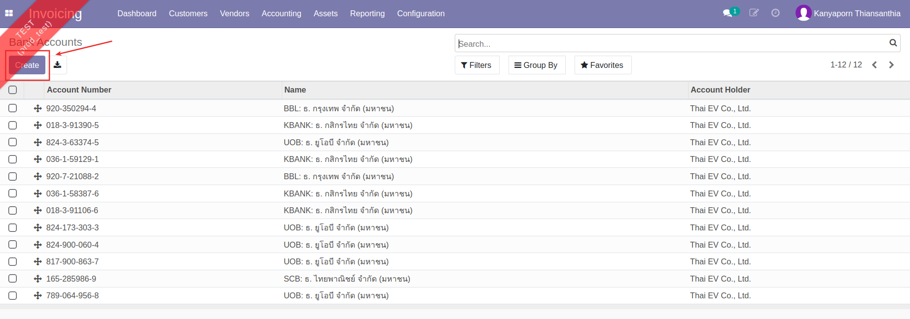
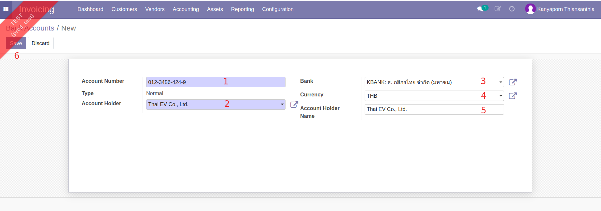
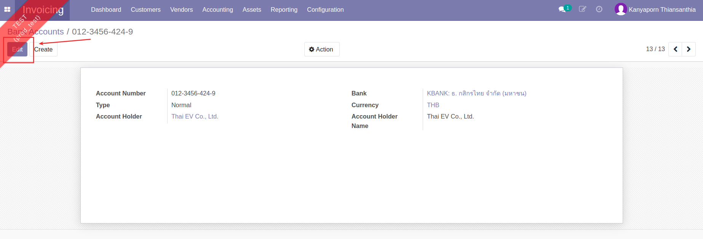

# การจัดการข้อมูลบัญชีธนาคาร (Bank Accounts)

!!! Warning
    เฉพาะฝ่ายการเงินที่มีสิทธิ์ การเพิ่ม แก้ไข หรือลบข้อมูลบัญชีธนาคารมีผลกระทบกับการบันทึกลงสมุดรายวัน (Journals) และการบันทึกบัญชี

**Menu:** Invoicing > Configuration > Bank Accounts
    
## การสร้างและแก้ไขข้อมูลบัญชีธนาคาร (Bank Accounts)

1. กดปุ่ม Create เพื่อสร้างข้อมูลบัญชีธนาคาร

2. กรอกข้อมูลบัญชีธนาคาร

    * (1) Account Number: กรอกเลขที่บัญชีธนาคาร
    * (2) Account Holder: เลือกชื่อเจ้าของบัญชี
    * (3) Bank: เลือกธนาคาร
    * (4) Currency: เลือกสกุลเงิน
    * (5) Account Holder Name: กรอกชื่อบัญชี
    * (6) ตรวจทานข้อมูล และกดปุ่ม Save เพื่อบันทึก

3. หากต้องการแก้ไขข้อมูล สามารถกดปุ่ม Edit เพื่อแก้ไขได้

!!! Note
    เมื่อมีบัญชีธนาคารของบริษัทใหม่ จะต้องดำเนินการสร้างข้อมูลหลักที่เกี่ยวข้อง ตามลำดับดังนี้

    1. สร้างบัญชีใหม่ที่ผังบัญชี (Chart of Accounts)
    2. สร้างบัญชีธนาคารใหม่ (Bank Accounts)
    3. สร้างสมุดรายวันใหม่ (Journals) 

---

End.

