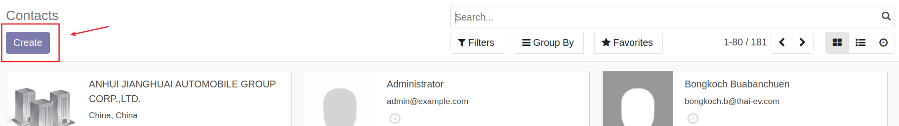
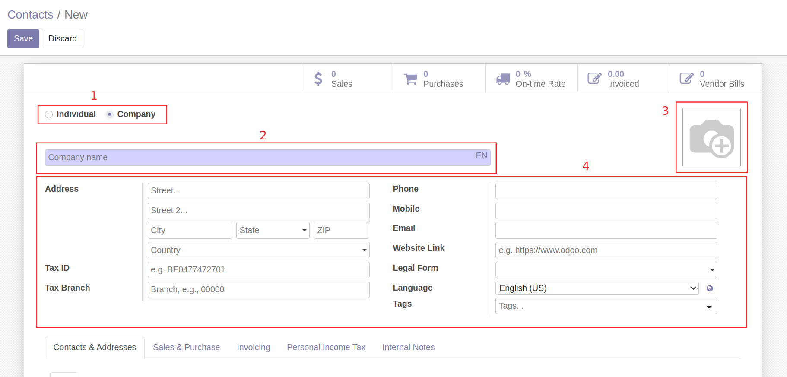
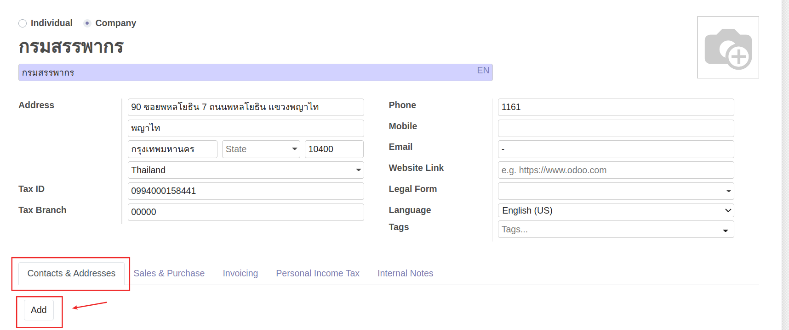
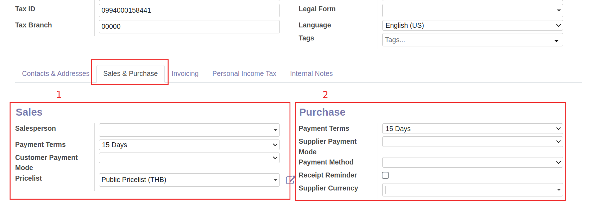
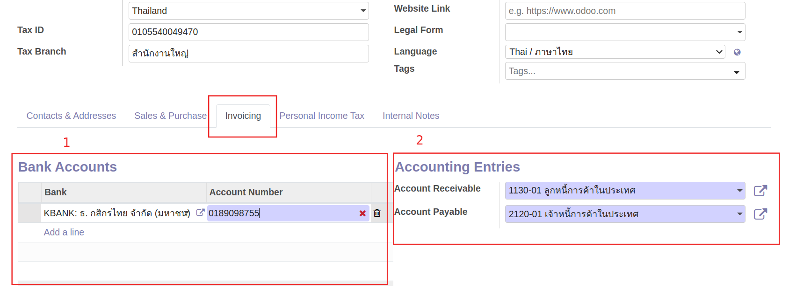

# การจัดการข้อมูลหลักคู่ค้า (Contacts)

## การสร้างข้อมูลหลักคู่ค้า

!!! Warning
    ก่อนทำการสร้างคู่ค้ารายใหม่ ควรตรวจสอบในระบบว่ามีคู่ค้ารายนี้แล้วหรือไม่ เพื่อป้องกันการสร้างข้อมูลซ้ำซ้อน ซึ่งอาจจะทำให้เกิดการบันทึกข้อมูลไม่ถูกต้องตามที่ควรจะเป็น

เมื่อมีคู่ค้ารายใหม่ สามารถสร้างคู่ค้ารายใหม่ได้ โดยมีขั้นตอนดังนี้

**Menu:** Contacts > Contacts

1. กดปุ่ม Create เพื่อสร้างคู่ค้ารายใหม่ 

2. กรอกข้อมูลส่วน Header

    * (1) เลือกประเภทของคู่ค้า
        * Individual: ประเภทบุคคล
        * Company: ประเภทนิติบุคคล
    * (2) กรอกชื่อคู่ค้า
    * (3) เพิ่มรูป (ถ้ามี)
    * (4) กรอกรายละเอียดของคู่ค้า
        * Address: ข้อมูลที่อยู่
        * Tax ID: เลขประจำตัวผู้เสียภาษี
        * Tax Branch: รหัสสาขา
        * Phone: เบอร์โทรติดต่อ
        * Mobile: เบอร์โทรมือถือ
        * Email: อีเมล

3. ที่แท็บ Contacts & Addresses สามารถเพิ่มรายชื่อผู้ติดต่อ หรือที่อยู่อื่นๆของคู่ค้ารายนี้ได้ โดยกดปุ่ม Add

4. ที่แท็บ Sales & Purchases 

    * (1) Sales กรณีคู่ค้าฝั่งขาย
        * Payment Terms: เลือกเงื่อนไขระยะเวลาการชำระเงิน
    * (2) Purchase กรณีคู่ค้าฝั่งซื้อ
        * Payment Terms: เลือกเงื่อนไขระยะเวลาการชำระเงิน
        * Supplier Currency: กรณีมีการจัดซื้อจาก vendor ต่างประเทศ สามารถตั้งค่า currency ของคู่ค้ารายนี้ได้
5. ที่แท็บ Invoicing 
   
    * (1) Bank Accounts: กรอกข้อมูลบัญชีธนาคารของคู่ค้า
    * (2) Accounting Entries
        * Account Receivable ระบบเลือกบัญชีมาให้อัตโนมัติ
        * Account Payable ระบบเลือกบัญชีมาให้อัตโนมัติ

6. กดปุ่ม Save เพื่อบันทึกข้อมูลคู่ค้า สามารถกดปุ่ม Edit ได้หากต้องการแก้ไขข้อมูล

End.

