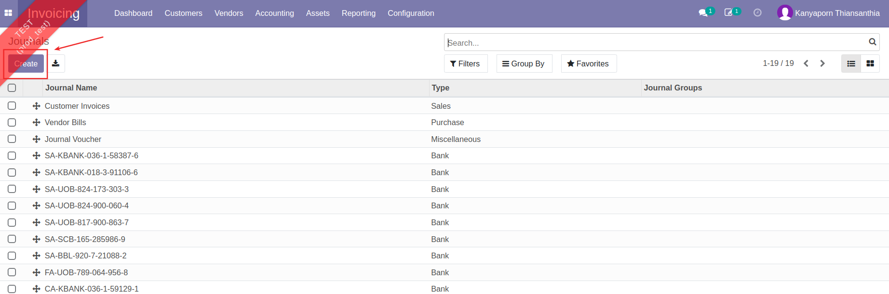
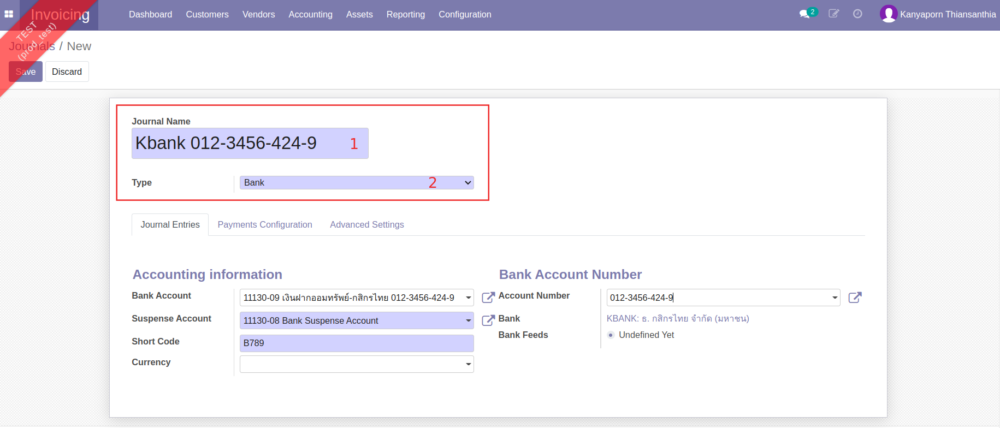
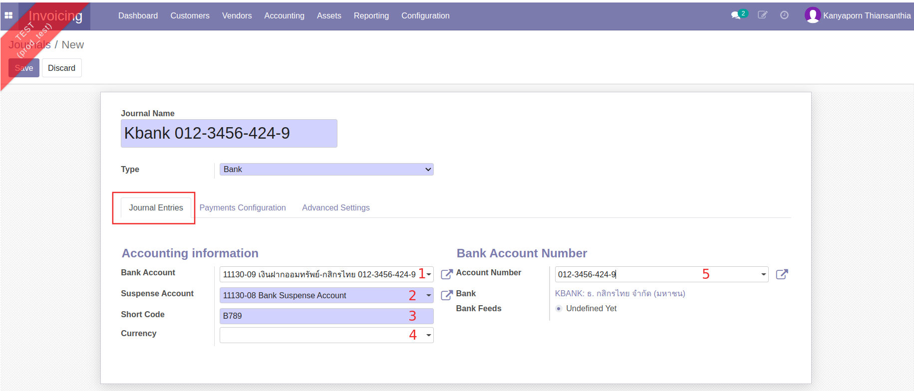
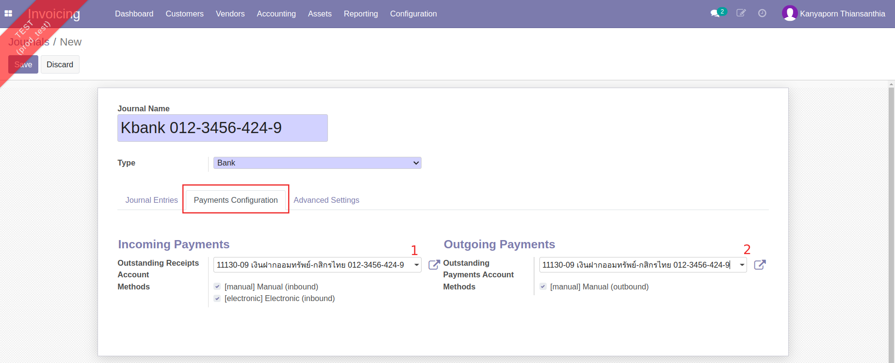
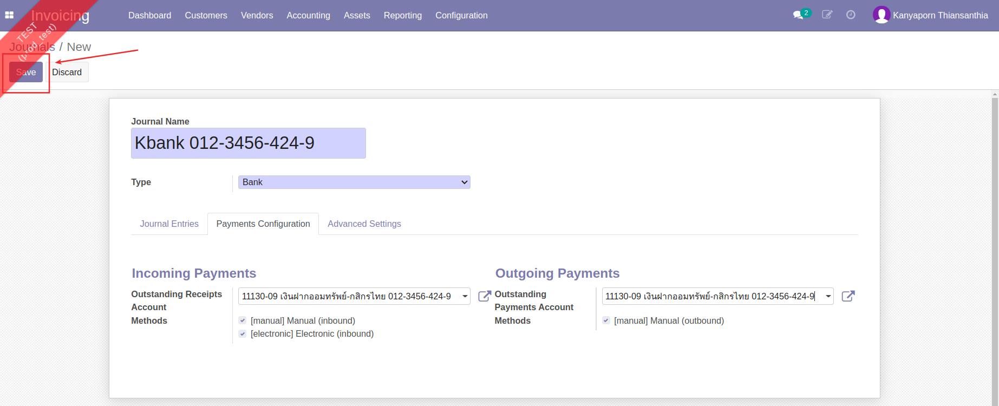

# การจัดการข้อมูลหลักสมุดรายวัน (Journals)

!!! Warning
    เฉพาะฝ่ายการเงินที่มีสิทธิ์ การเพิ่ม แก้ไข หรือลบข้อมูลสมุดรายวัน (Journals) มีผลต่อการบันทึกบัญชี ควรตรวจทานข้อมูลให้ถี่ถ้วน เพื่อป้องกันความผิดพลาด

**Menu:** Invoicing > Configuration > Journals
    
## การสร้างและแก้ไขสมุดรายวันธนาคาร

1. กดปุ่ม Create เพื่อสร้างสมุดรายวันใหม่

2. กรอกข้อมูลส่วน Header

    * (1) Journal Name: กรอกชื่อสมุดรายวัน
    * (2) Type: เลือกประเภทสมุดรายวันเป็น Bank

3. ที่แท็บ Journal Entries

    * (1) Bank Account: เลือกผังบัญชีที่เกี่ยวข้อง
    * (2) Suspense Account: เลือกบัญชีพัก (Bank Suspense Account)
    * (3) Short Code: กรอก Short Code 
    * (4) Currency: เลือกเรทเงิน
    * (5) Account Number: เลือกเลขที่บัญชีธนาคารที่เกี่ยวข้อง ระบบจะดึงข้อมูลธนาคารมาให้อัตโนมัติ

4. ที่แท็บ Payments Configuration

    * (1) Outstanding Receipts Account: เลือกบัญชีที่เกี่ยวข้อง
    * (2) Outstanding Payments Account: เลือกบัญชีที่เกี่ยวข้อง

5. ตรวจทานข้อมูลและกดปุ่ม Save เพื่อบันทึก หากต้องการแก้ไขให้กดปุ่ม Edit

---
End.

