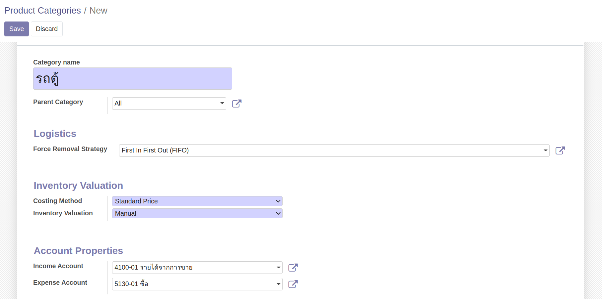

# การจัดการข้อมูลหลักหมวดหมู่สินค้า (Product Categories)

ผู้รับผิดชอบ สามารถจัดการข้อมูลหลักหมวดหมู่สินค้า (Product Categories) ได้ 2 ช่องทาง ตามสิทธิ์ของแต่ละผู้ใช้งาน

**Menu:** Purchase > Configuration > Product Categories

**Menu:** Invoicing > Configuration > Product Categories

โดยมีขั้นตอนดังนี้

1. กดปุ่ม Create 

2. กรอกข้อมูล ดังนี้

    * Category Name:
    * Parent Category: เลือก Parent (ถ้ามี)
    * Logistics
        * Force Removal Strategy: เลือกการจัดการสต็อค
            * First In First Out (FIFO)
            * Last In First Out (LIFO)
    * Inventory Valuation: การตีราคาสินค้าคงเหลือ
        * Costing Method: เลือกการคำนวณต้นทุน
            * Standard Price
            * First In First Out (FIFO)
            * Average Cost (AVCO)
        * Inventory Valuation: การตีราคาสินค้าคงเหลือ
            * Manual
            * Automated
        * Account Properties: การบันทึกบัญชี
            * Income Account: เลือกบัญชีบันทึกรายได้
            * Expense Account: เลือกบัญชีบันทึกค่าใช้จ่าย
3. กดปุ่ม Save เพื่อบันทึกข้อมูล สามารถกดปุ่ม Edit ได้หากต้องการแก้ไขข้อมูล

!!! Warning
    การแก้ไขข้อมูล อาจมีผลกระทบกับการจัดการสต็อค บันทึกต้นทุน การบันทึกบัญชีได้
