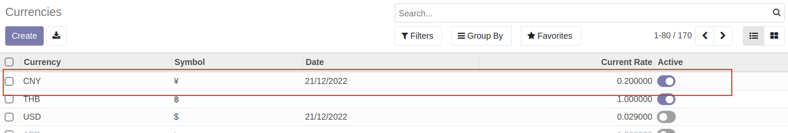
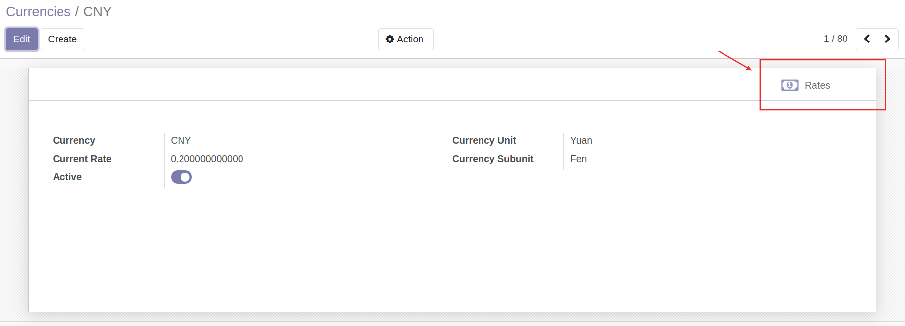
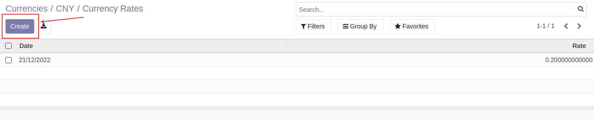
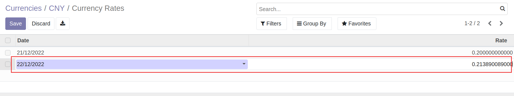

# การจัดการข้อมูลหลักสกุลเงิน (Currencies)

!!! Warning
    เฉพาะฝ่ายการเงินที่มีสิทธิ์ จะต้องทำการอัปเดตค่าเงิน ณ วันที่ปัจจุบันก่อนการบันทึกบัญชี เพื่อให้ระบบจะนำมาคำนวณเป็นค่าเงินบาทในการบันทึกบัญชี

ผู้รับผิดชอบ สามารถจัดการข้อมูลหลักสกุลเงิน (Currencies) ได้ที่

**Menu:** Invoicing > Configuration > Currencies
    
## การเปิดใช้สกุลเงินอื่น

1. ค้นหาสกุลเงินที่ต้องการเปิดใช้ 
2. ที่คอลัมน์ Active ให้กดเปิด เพื่อเปิดใช้สกุลเงิน

---

## การอัปเดตค่าเงิน

1. เลือกสกุลเงินที่ต้องการอัปเดตค่าเงิน

2. กด Smart Button "Rates"

3. กดปุ่ม Create 

4. กรอกข้อมูล 

    * Date: วันที่
    * Rate: ค่าเงิน ณ วันนั้นๆ โดยกรอกค่าเงินสกุลนั้นๆต่อ 1 บาท (ใช้การคำนวณ 1 บาท หารด้วยค่าเงินสกุลนั้นๆ)

5. กดปุ่ม Save เพื่อบันทึกข้อมูล

End.

