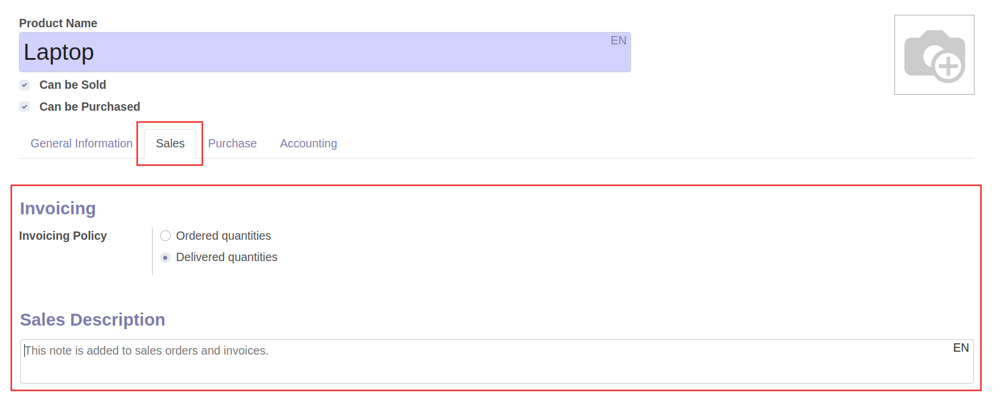
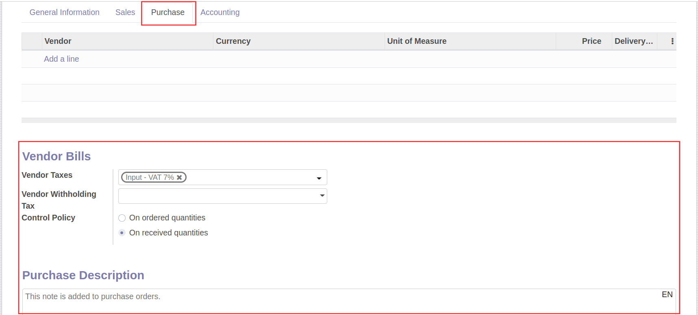

# การจัดการข้อมูลหลักสินค้า (Products)

!!! Warning
    ก่อนทำการสร้างข้อมูลสินค้าใหม่ ควรตรวจสอบในระบบว่ามีสินค้ารายการนี้แล้วหรือไม่ เพื่อป้องกันการสร้างข้อมูลซ้ำซ้อน ซึ่งอาจจะทำให้เกิดการบันทึกข้อมูลไม่ถูกต้องตามที่ควรจะเป็น

## การสร้างข้อมูลหลักสินค้า

ผู้รับผิดชอบ สามารถจัดการข้อมูลหลักสินค้า (Products) ได้ 2 ช่องทาง ตามสิทธิ์ของแต่ละผู้ใช้งาน

**Menu:** Sale > Products > Products

**Menu:** Purchase > Products > Products

โดยมีขั้นตอนดังนี้

1. กดปุ่ม Create 

2. กรอกข้อมูลส่วน Header

    * (1) Product Name: กรอกชื่อสินค้า
    * (2) ทำเครื่องหมาย หาก Product นี้
        * Can be Sold: สามารถขายได้
        * Can be Purchased: สามารถจัดซื้อได้
    * (3) ใส่รูป product (ถ้ามี)

3. ที่แท็บ General Information

    * Product Type: เลือกประเภทของ product
        * Consumable: วัสดุสิ้นเปลือง
        * Storable: product ที่มีการรับเข้าสต็อค
        * Service: product ประเภทการให้บริการ
    * Product Category: เลือกหมวดหมู่ของ product เพื่อเชื่อมโยงกับการบันทึกบัญชี
    * Internal Reference: รหัสภายใน (ถ้ามี)
    * Barcode: บาร์โค้ดสินค้า (ถ้ามี)
    * Sales Price: ตั้งราคาขาย (กรณี product นี้เปิดการขาย ระบบจะดึงราคานี้ไปแสดงเป็นค่าเริ่มต้นในใบเสนอราคา)
    * Customer Taxes: ภาษีมูลค่าเพิ่ม (ถ้ามี)
    * Witholding Tax: ภาษี หัก ณ ที่จ่าย (ถ้ามี)
    * Cost: ราคาต้นทุน (กรณีเลือกบันทึกต้นทุน เป็น Standard price ระบบจะนำราคานี้ไปบันทึกต้นทุน)
    * Unit of Measure: หน่วยนับ
    * Purchase Unit of Measure: หน่วยนับสำหรับการรับเข้าสต็อค 

4. ที่แท็บ Sales (จะแสดงแท็บนี้ เมื่อมีการเลือก Can be Sold)

    * Invocing Policy: เงื่อนไขการออกบิล
        * Ordered quantities: ออกบิลตามจำนวนที่ออเดอร์
        * Delivered quantities: ออกบิลตามจำนวนที่ส่งของ
    * Sales Description: กรอกคำอธิบายหรือรายละเอียดอื่นๆ (ถ้ามี) ซึ่งจะแสดงในเอกสาร Sale Orders และ Invoices

5. ที่แท็บ Purchase (จะแสดงแท็บนี้ เมื่อมีการเลือก Can be Purchased)

    * Vendor Taxes: ภาษีมูลค่าเพิ่ม (ถ้ามี)
    * Vendor Witholding Tax: ภาษี หัก ณ ที่จ่าย (ถ้ามี)
    * Control Policy:
        * On ordered quantities: รับวางบิลตามจำนวนที่ออเดอร์
        * On received quantities: รับวางบิลตามจำนวนที่ได้รับของ
    * Purchase Description: กรอกคำอธิบายหรือรายละเอียดอื่นๆ (ถ้ามี) ซึ่งจะแสดงในเอกสาร Purchase Orders

6. กดปุ่ม Save เพื่อบันทึกข้อมูล สามารถกดปุ่ม Edit ได้หากต้องการแก้ไขข้อมูล

End.

