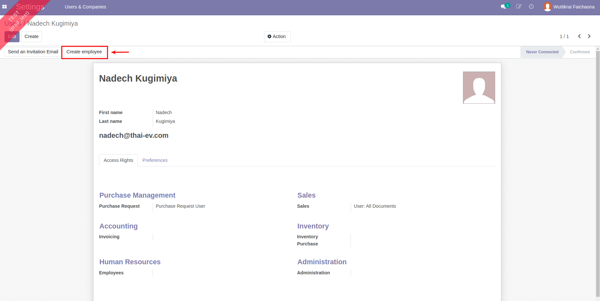

# การจัดการข้อมูลผู้ใช้งาน (Users)

**Menu:** Settings > Users & Companies > Users
    
## การสร้างข้อมูลผู้ใช้งาน (User)

1. กดปุ่ม Create เพื่อสร้างผู้ใช้งานใหม่

2. กรอกข้อมูลดังนี้

    * (1) First Name: กรอกชื่อผู้ใช้งาน
    * (2) Last Name: กรอกนามสกุลผู้ใช้งาน
    * (3) Email Address: กรอกเมลสำหรับใช้ Login ระบบ
    * (4) Access Rights: กำหนดสิทธิ์การเข้าถึงแต่ละ Module
        * Purchase Request
            * Purchase Request User: สามารถเข้าถึง Module Purchase Request
            * Purchase Request Manager: สามารถอนุมัติเอกสาร Purchase Request (PR) และสำหรับแผนกจัดซื้อ
        * Sales
            * User: Own Documents Only: สามารถเข้าถึง Module Sales และเห็นเฉพาะเอกสารของตัวเอง
            * User: All Documents: สามารถเข้าถึง Module Sales และเห็นเอกสารทั้งหมด
            * Administrator: สามารถเข้าถึง Configuration
        * Invoicing
            * Bill: สามารถเข้าถึง Module Invoicing
            * Billing Administrator: สามารถเข้าถึง Configuration
        * Inventory
            * User: สามารถเข้าถึง Module Inventory
            * Administrator: สามารถเข้าถึง Configuration
        * Purchase
            * User: สามารถเข้าถึง Module Purchase
            * Administrator: สามารถเข้าถึง Configuration
        * Employees
            * Officer: สามารถเข้าถึง Module Employee
            * Administrator: สามารถเข้าถึง Configuration
        * Administration
            * Settings: สามาถเข้าถึงการ Settings ระบบได้
            * Access Rights: สามารถกำหนดสิทธิ์การใช้งานของ User ได้
    * (5) กดปุ่ม Save เพื่อบันทึกข้อมูลผู้ใช้งาน สามารถกดปุ่ม Edit ได้หากต้องการแก้ไขข้อมูล

    !!! Info
            สิทธิ์ที่สูงกว่าจะ Inherited สิทธิ์ที่ต่ำกว่า

3. กดปุ่ม Create Employee เพื่อสร้างข้อมูล Employee

4. ระบบสร้าง Smart Button Employee กดปุ่ม Smart Button Employee เพื่อเข้าไปกรอกข้อมูลเพิ่มเติม

5. กดที่รายการ Employee

6. กดปุ่ม Edit เพื่อกรอกข้อมูลเพิ่มเติม

7. กรอกข้อมูลดังนี้

    * (1) Department: เลือกแผนก
    * (2) Manager: ระบบดึงค่ามาให้ตามที่ Setting ในแผนกนั้นๆ ไว้ (ไม่จำเป็นต้องแก้ไข)
    * (3) Coach: ระบบดึงค่ามาให้ตามที่ Setting ในแผนกนั้นๆ ไว้ (ไม่จำเป็นต้องแก้ไข)
    * (4) กดปุ่ม Save เพื่อบันทึกข้อมูล Employee สามารถกดปุ่ม Edit ได้หากต้องการแก้ไขข้อมูล

!!! Info
    กรณี Employee มีตำแหน่งตามภาพ ให้ไปที่แท็บ HR Settings ที่ Job Position เลือกตำแหน่ง (ข้อมูลที่ Job Position มีผลกับ Tier การอนุมัติเอกสาร)
    

---

## การตั้งรหัสเริ่มต้น (Change Password)

1. กดปุ่ม Action เลือก Change Password

2. กรอกข้อมูลดังนี้

    * (1) New Password: กรอกรหัสผ่านเริ่มต้น
    * (2) กดปุ่ม Change Password เพื่อยืนยันการตั้งรหัสผ่าน

End.