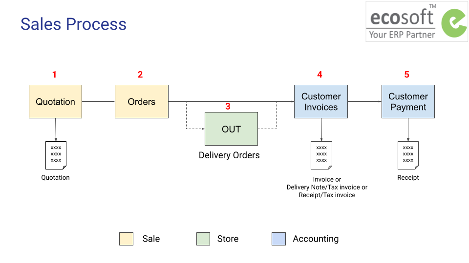

# กระบวนการขาย

## ภาพรวมกระบวนการขาย

## กระบวนการทำงาน

1. การออกใบเสนอราคา (Quotation)

## บทบาทผู้ใช้งาน

1. เข้าถึงเมนู Sale 
2. สร้างข้อมูลหลักคู่ค้า (Contacts)
3. ออกใบเสนอราคาและคอนเฟิร์มออเดอร์

End.

