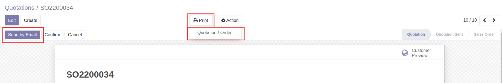
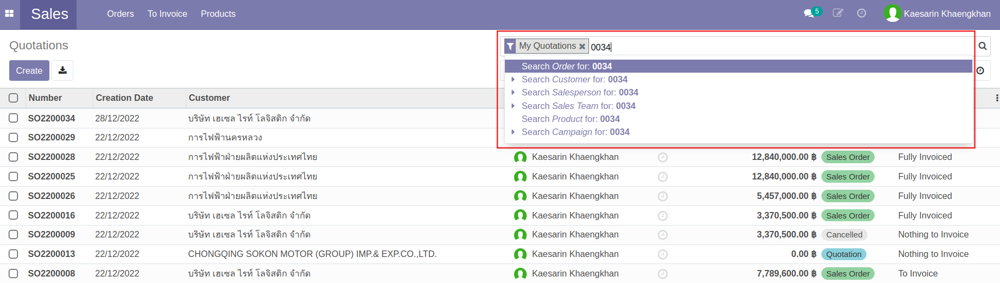
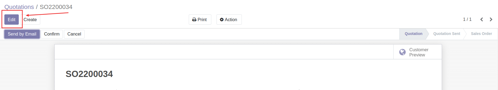
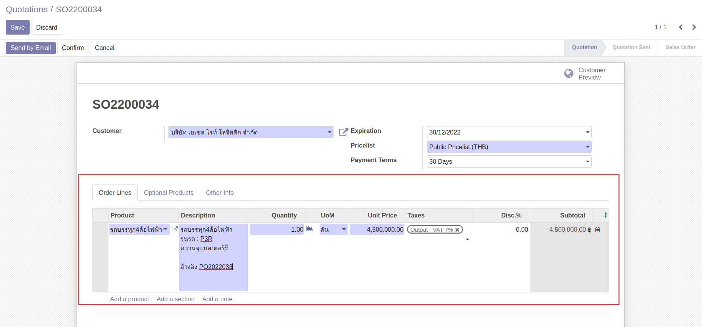
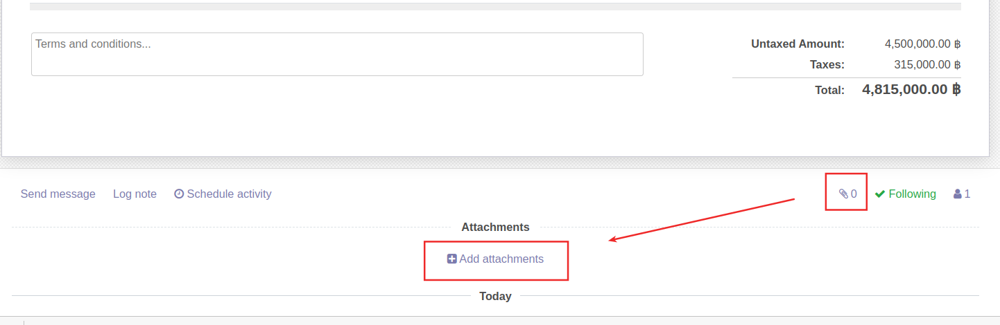
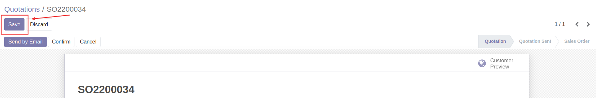

# กระบวนการขาย (Sales Process)

## การออกใบเสนอราคา
**Menu:** Sales > Orders > Quotations

1. กดปุ่ม Create เพื่อสร้างใบเสนอราคา (Quotation)

2. กรอกข้อมูลส่วน Header

    * Customer: เลือกชื่อลูกค้า
    * Expiration: เลือกวันสิ้นสุดของการยืนราคาตามใบเสนอราคา
    * Payment Terms: เลือกเงื่อนไขการชำระเงิน (หากลูกค้าที่เลือกมีการตั้งค่าเงื่อนไขการชำระเงินไว้ ระบบจะดึงข้อมูลมาใส่ให้อัตโนมัติ)
3. ที่แท็บ Order Lines กดปุ่ม Add a product เพิ่มบรรทัดรายการ เพื่อกรอกรายละเอียดใบเสนอราคา 

4. กรอกรายละเอียดรายการขาย
 
    * Product: เลือกสินค้าที่ต้องการขาย
    * Description: กรอกคำอธิบาย เช่น รายละเอียดสินค้า เป็นต้น
    * Quantity: กรอกจำนวน
    * UoM: หน่วยนับ (ระบบดึงค่าเริ่มต้นหน่วยนับของสินค้านั้นๆมาให้)
    * Unit Price: กรอกราคาขายต่อ 1 หน่วย
    * Taxes: ภาษีมูลค่าเพิ่ม (ถ้ามี)
    * Disc.%: ใส่ส่วนลดเป็น % (ถ้ามี)
    * Sub Total: ยอดรวมรายการสินค้า (ระบบคำนวณให้อัตโนมัติ) 
    
    !!! Info
        * การเช็คจำนวนสินค้าคงเหลือในสต็อค สามารถดูได้จากไอคอนรูปกราฟด้านข้างคอลัมน์ Quantity ได้
            * ไอคอนเป็น *สีม่วง* หมายความว่า มีของในสต็อค *เพียงพอ*
            * ไอคอนเป็น *สีแดง* หมายความว่า มีของในสต็อค *ไม่เพียงพอ*
        * กรณีบริการซ่อม
            * อยู่ในประกัน ช่อง Unit Price ของบรรทัดรายการอะไหล่ที่ต้องการเบิก ให้ใส่ค่าเป็น 0
            * ไม่อยู่ในประกัน ช่อง Unit Price ของบรรทัดรายการอะไหล่ที่ต้องการเบิก ให้ใส่ราคาขายของอะไหล่

5. กดปุ่ม Save เพื่อบันทึกข้อมูลใบเสนอราคา ระบบจะสร้างเลขที่ใบเสนอราคาให้อัตโนมัติ ตรวจทานอีกครั้ง

    * ถ้าไม่ถูกต้อง ต้องการแก้ไข ให้กดปุ่ม Edit และแก้ไขใหถูกต้อง และกดปุ่ม Save
    * ถ้าถูกต้องให้ดำเนินการขั้นตอนต่อไป
6. ส่งเอกสารใบเสนอราคาให้ลูกค้า

    * Send by Email: หากมีการตั้งค่า Outgoing email แล้ว 
        * เมื่อกดปุ่มนี้จะสามารถส่งอีเมลใบเสนอราคาให้ลูกค้าได้ โดยสถานะเอกสารจะเปลี่ยนจาก Quotation เป็น Quotation Sent
        * และถ้าลูกค้าลงลายเซ็นต์อิเล็กทรอนิคส์กลับมา ระบบจะยืนยันใบเสนอราคาและสถานะเอกสารจะเปลี่ยนเป็น Sales Order ให้อัตโนมัติ 
    * Print Quotation/Order Form: กดปุ่ม Print เลือก Quotation/Order ระบบสร้างเอกสารออกมาให้ในรูปแบบ PDF

## การยืนยันใบเสนอราคา

**Menu:** Sales > Orders > Quotations

1. ค้นหาใบเสนอราคา โดยสามารถพิมพ์เลขที่ใบเสนอราคา

2. กดที่รายการเพื่อเปิดหน้าเอกสารใบเสนอราคา

3. กดปุ่ม Edit 

4. กรอกข้อมูล PO ของลูกค้า และ/หรือแนบเอกสาร (ถ้ามี) 

5. กดปุ่ม Save เพื่อบันทึกข้อมูล และตรวจสอบ หากต้องการแก้ไขสามารถกด Edit ได้

6. เลือกดำเนินการ

    * กดปุ่ม Confirm หากต้องการยืนยันใบเสนอราคา สถานะของเอกสารเปลี่ยนจาก Quotation เป็น Sales Order
    * กดปุ่ม Cancel หากต้องการยกเลิกใบเสนอราคา สถานะของเอกสารเปลี่ยนจาก Quotation เป็น Cancelled

!!! Info
    กรณีของไม่เพียงพอที่จะเบิกหรือจัดส่ง จะต้องทำรายการขอซื้อ (PR) เพื่อให้ฝ่ายจัดซื้อทำการสั่งซื้อเพิ่มเข้ามา
 
End.