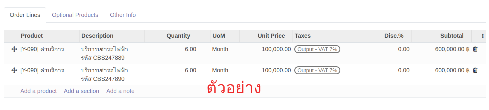

# กระบวนการขาย (Sales)

## การออกใบเสนอราคาและยืนยันการขาย 
**Menu:** Sales > Orders > Quotations

เมื่อฝ่ายขายต้องการออกใบเสนอราคา สามารถทำได้ โดยมีขั้นตอนดังนี้

1. กดปุ่ม Create เพื่อสร้างใบเสนอราคา (Quotation)

2. กรอกข้อมูลส่วน Header

    * Customer: เลือกชื่อคู่ค้า
    * Expiration: เลือกวันสิ้นสุดของการยืนราคาตามใบเสนอราคา
    * Payment Terms: เลือกเงื่อนไขการชำระเงิน (หากคู่ค้าที่เลือกมีการตั้งค่าเงื่อนไขการชำระเงินไว้ ระบบจะดึงข้อมูลมาใส่ให้อัตโนมัติ)
    
3. ที่แท็บ Order Lines กดปุ่ม Add a product เพิ่มบรรทัดรายการ เพื่อกรอกรายละเอียดใบเสนอราคา 
   
4. กรอกรายละเอียดรายการขาย

    **กรณีขายสินค้า**
     
        
    * Product: เลือกรายการสินค้าที่ต้องการขาย
    * Description: กรอกคำอธิบาย เช่น รหัส รายละเอียดสินค้า เป็นต้น
    * Quantity: กรอกจำนวน สามารถเช็คจำนวนสินค้าคงเหลือในสต็อคที่ไอคอนรูปกราฟด้านข้างได้
        * ไอคอนเป็น *สีม่วง* หมายความว่า มีของในสต็อค *เพียงพอ*
        * ไอคอนเป็น *สีแดง* หมายความว่า มีของในสต็อค *ไม่เพียงพอ*
    * UoM: หน่วยนับ (ระบบดึงค่าเริ่มต้นหน่วยนับของสินค้านั้นๆมาให้)
    * Unit Price: กรอกราคาขายต่อ 1 หน่วย
    * Taxes: ภาษีมูลค่าเพิ่ม (ถ้ามี)
    * Disc.%: ใส่ส่วนลดเป็น % (ถ้ามี)
    * Sub Total: ยอดรวมรายการสินค้า (ระบบคำนวณให้อัตโนมัติ) 
      

    **กรณีให้บริการเช่า**
    
 
    * Product: เลือกรายการสินค้าเป็น ค่าบริการ 
    * Description: กรอกคำอธิบาย เช่น ระยะเวลาการเช่า รหัส รายละเอียด เป็นต้น
    * Quantity: กรอกจำนวนการให้บริการ 
    * UoM: หน่วยนับการให้บริการเช่า 
    * Unit Price: กรอกราคาให้เช่าต่อ 1 หน่วย
    * Taxes: ภาษีมูลค่าเพิ่ม (ถ้ามี)
    * Disc.%: ใส่ส่วนลดเป็น % (ถ้ามี)
    * Sub Total: ยอดรวมรายการ (ระบบคำนวณให้อัตโนมัติ) 
     

    **กรณีให้บริการซ่อมพร้อมเบิกอะไหล่**
     
    
    * Product: 
        * บรรทัดแรก เลือกรายการสินค้าเป็น ค่าบริการ
        * บรรทัดถัดๆไป เลือกรายการสินค้าเป็น รายการอะไหล่ที่ต้องการเบิก
    * Description: กรอกคำอธิบาย เช่น รายละเอียดการซ่อม เป็นต้น
    * Quantity: กรอกจำนวนการให้บริการ
    * UoM: หน่วยนับการให้บริการซ่อม (ชั่วโมง) 
    * Unit Price: กรอกราคาให้บริการต่อ 1 หน่วย
        * กรณีให้บริการซ่อมแบบ *อยู่ในประกัน* ช่อง Unit Price ของบรรทัดรายการอะไหล่ที่ต้องการเบิก ให้ใส่ค่าเป็น 0
        * กรณีให้บริการซ่อมแบบ *ไม่อยู่ในประกัน* ช่อง Unit Price ของบรรทัดรายการอะไหล่ที่ต้องการเบิก ให้ใส่ราคาขายของอะไหล่
    * Taxes: ภาษีมูลค่าเพิ่ม (ถ้ามี)
    * Disc.%: ใส่ส่วนลดเป็น % (ถ้ามี)
    * Sub Total: ยอดรวมรายการ (ระบบคำนวณให้อัตโนมัติ) 
     

5. กดปุ่ม Save เพื่อบันทึกข้อมูลใบเสนอราคา ระบบจะสร้างเลขที่ใบเสนอราคาให้อัตโนมัติ (หากต้องการแก้ไขรายละเอียดในใบเสนอราคา สามารถกด Edit เพื่อแก้ไขข้อมูลได้)
 
6. เลือกดำเนินการต่อได้ดังนี้
 
    * Send by Email: หากมีการตั้งค่า Outgoing email แล้ว 
        * เมื่อกดปุ่มนี้จะสามารถส่งอีเมลใบเสนอราคาให้ลูกค้าได้ โดยสถานะเอกสารจะเปลี่ยนจาก Quotation --> Quotation Sent
        * และถ้าลูกค้าลงลายเซ็นต์อิเล็กทรอนิคส์กลับมา ระบบจะยืนยันใบเสนอราคาและสถานะเอกสารจะเปลี่ยนเป็น Sales Order ให้อัตโนมัติ 
    * Confirm: กรณีมีการตกลงกันภายนอกระบบ สามารถกดปุ่ม Confirm เพื่อยืนยันใบเสนอราคาและสถานะเอกสารจะเปลี่ยนจาก Quotation เป็น Sales Order
    * Cancel: ยกเลิกใบเสนอราคา
    
7. เมื่อยืนยันใบเสนอราคาและสถานะเอกสารเป็น Sales Order แล้ว
  
    * (1) กรณีมีของที่ต้องส่ง/เบิก ระบบจะแสดง Smart Button รูปรถ แสดงรายการของที่ต้องส่ง/เบิก
    * (2) ที่แท็บ Order Line 
        * Quantity: จำนวนที่ตกลงซื้อขาย
        * Delivered: จำนวนที่ได้จัดส่ง/เบิก 
        * Invoiced: จำนวนที่ออกใบแจ้งหนี้ 

---    

!!! Info
    กรณีของไม่เพียงพอที่จะเบิกหรือจัดส่ง จะต้องทำรายการขอซื้อ (PR) เพื่อให้ฝ่ายจัดซื้อทำการสั่งซื้อเพิ่มเข้ามา 

    
End.

