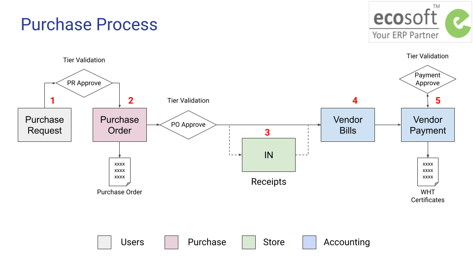

# Purchase Process

## กระบวนการทำงาน

1. การขอซื้อขอจ้าง 
2. การจัดซื้อจัดจ้าง

## บทบาทผู้ใช้งานในระบบ

1. ผู้ขอซื้อ สร้างเอกสาร Purchase Request (PR) และส่งอนุมัติการขอซื้อขอจ้าง
2. ฝ่ายจัดซื้อ สร้างเอกสาร Requests for Quotation (RFQ) และส่งอนุมัติการจัดซื้อจัดจ้าง

End.
