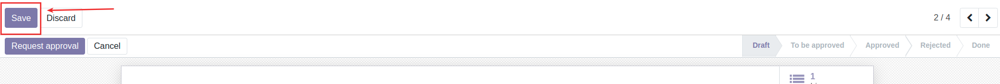
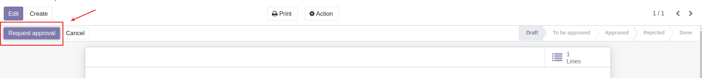
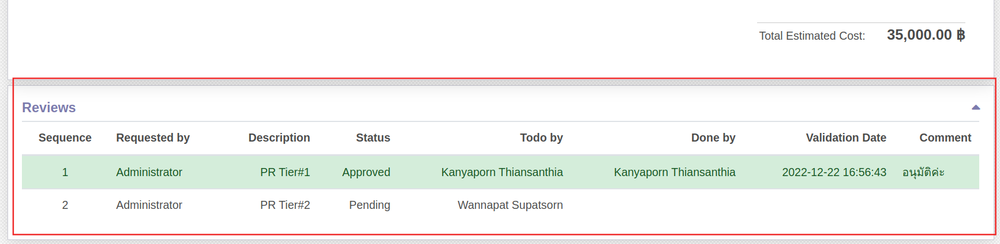

# กระบวนการขอซื้อขอจ้าง

## การสร้างใบขอซื้อขอจ้าง (Purchase Request: PR)

**Menu:** Purchase Requests > Purchase Requests > Purchase Requests

1. กดปุ่ม Create เพื่อสร้าง Purchase Request (PR)

2. กรอกข้อมูลส่วน Header

    * Requested By: ชื่อผู้ขอ (ระบบ Default ตามชื่อ user ที่ login ไม่จำเป็นต้องแก้ไข)
    * Creation Date: วันที่สร้างเอกสาร (ระบบ Default เป็นวันที่ปัจจุบัน ไม่จำเป็นต้องแก้ไข)
    * Source Document: เอกสารต้นทางของการขอซื้อขอจ้าง
    * Description: คำอธิบายการขอซื้อขอจ้าง

3. ที่แท็บ Product กด Add a Line เพื่อเพิ่มรายการที่ต้องการขอซื้อขอจ้าง

4. ระบบแสดงหน้าต่างให้กรอกข้อมูลจัดซื้อจัดจ้าง ดังนี้

    * (1) กรอกรายละเอียดการขอซื้อ
        * Product: เลือกสินค้า/บริการที่ต้องการขอซื้อขอจ้าง
        * Description: รายละเอียดเพิ่มเติมการขอซื้อจ้าง
        * Quantity: จำนวน
        * Requested Date: วันที่ทำรายการ (ระบบ Default วันที่ปัจจุบัน)
        * Estimated Cost: ยอดซื้อโดยประมาณ (กรณีไม่ทราบสามารถกรอกเป็น 0 ได้)
    * (2) เลือกดำเนินการ
        * Save & Close: บันทึกรายการนี้และปิดหน้าต่าง
        * Save & New: บันทึกรายการนี้และสร้างรายการใหม่เพิ่ม
        * Discard: ละทิ้งรายการนี้

5. กดปุ่ม Save เพื่อบันทึกข้อมูลและตรวจทาน

    * ถ้าไม่ถูกต้อง ต้องการแก้ไข ให้กดปุ่ม Edit และแก้ไขใหถูกต้อง และกดปุ่ม Save
    * ถ้าถูกต้องให้ดำเนินการขั้นตอนต่อไป

6. สามารถแนบเอกสารประกอบการพิจารณาได้ที่รูปไอคอน paper clip ด้านล่างของเอกสาร กดที่ไอคอน หลังจากนั้นกดปุ่ม Add attachments และเลือกไฟล์จากในเครื่องคอมพิวเตอร์ของเรา

7. กดปุ่ม Request Approval เพื่อส่งอนุมัติการจัดซื้อจัดจ้าง สถานะเอกสารจะเปลี่ยนจาก Draft เป็น To be Approved

8. เมื่อเอกสารได้รับการอนุมัติแล้วสถานะของเอกสารจะเปลี่ยนจาก To be Approved เป็น Approved
    
!!! Info
    สามารถดูลำดับขั้นและสถานะการอนุมัติเอกสารได้ที่ Reviews ที่ด้านล่างของเอกสาร
    
            
End.