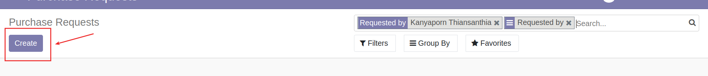
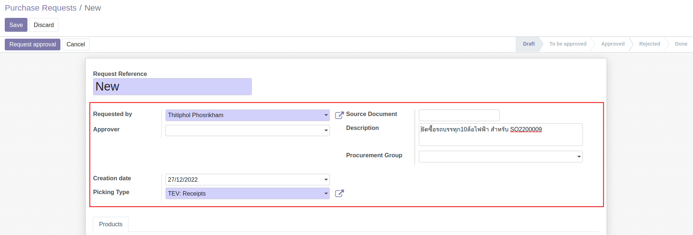
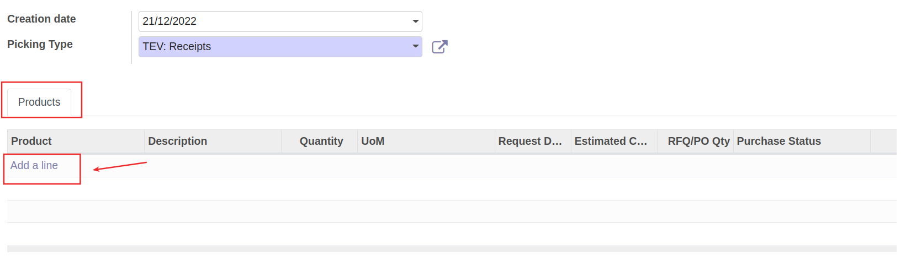
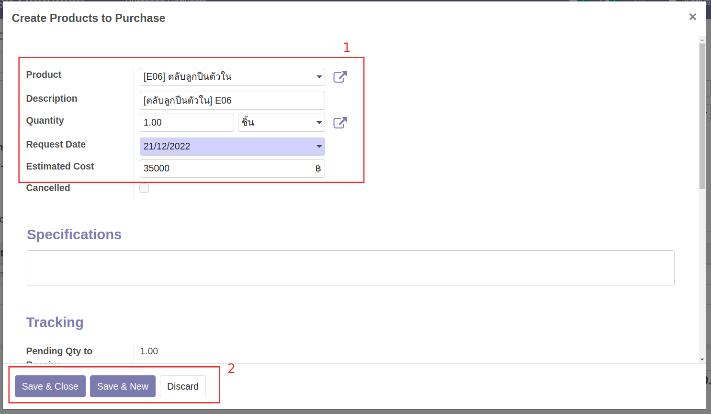
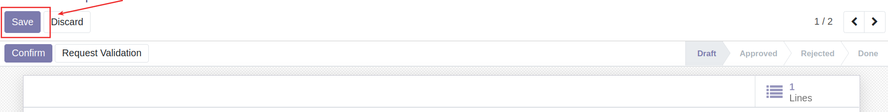
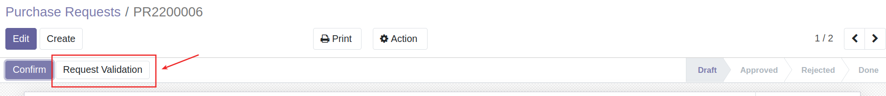

# กระบวนการขอซื้อขอจ้าง

## การสร้างใบขอซื้อขอจ้าง (Purchase Request:PR)

**Menu:** Purchase Requests > Purchase Requests > Purchase Requests

1. กดปุ่ม Create เพื่อสร้าง Purchase Request 

2. กรอกข้อมูลการข้อซื้อที่ Header ดังนี้

    * Requested By: ผู้ขอ (ระบบแสดงค่าเริ่มต้นตามชื่อ user ที่ login)
    * Creation Date: วันที่สร้างเอกสาร
    * Source Document: เอกสารต้นทางของการขอซื้อขอจ้าง
    * Description: คำอธิบายการขอซื้อขอจ้าง

3. ที่แท็บ Product กด Add a Line เพื่อเพิ่มรายการที่ต้องการขอซื้อขอจ้าง

4. ระบบแสดงหน้าต่างให้กรอกข้อมูลจัดซื้อจัดจ้าง ดังนี้

    * Product: สินค้า/บริการที่ต้องการขอซื้อขอจ้าง
    * Description: รายละเอียดเพิ่มเติมการขอซื้อจ้าง
    * Quantity: จำนวนที่ต้องการ
    * Requested Date: วันที่ทำรายการ (ระบบ Default วันที่ปัจจุบันมาให้)
    * Estimated Cost: ยอดซื้อโดยประมาณ

5. กดปุ่ม Save เพื่อบันทึกข้อมูลและตรวจทาน หากต้องการแก้ไขข้อมูลสามารถกด Edit เพื่อแก้ไข

6. สามารถแนบเอกสารประกอบการพิจารณาได้ที่ รูปคลิป ด้านล่างของเอกสาร

7. กดปุ่ม Request Validation เพื่อส่งอนุมัติการจัดซื้อจัดจ้าง

    
---
End.

