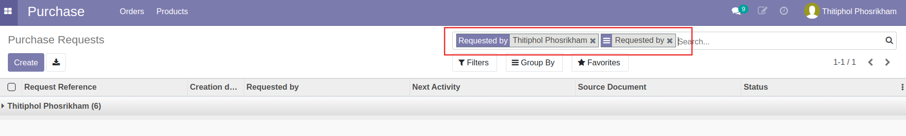
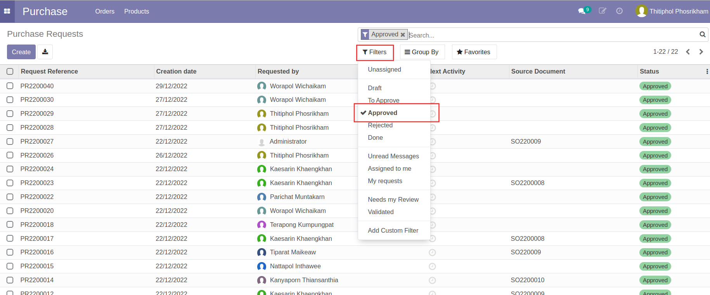
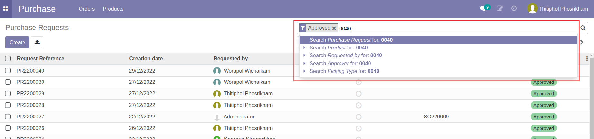
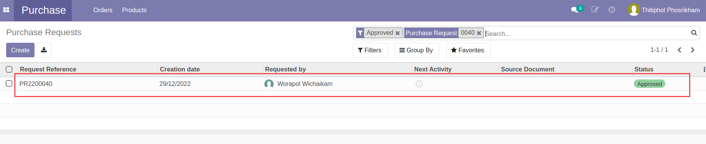
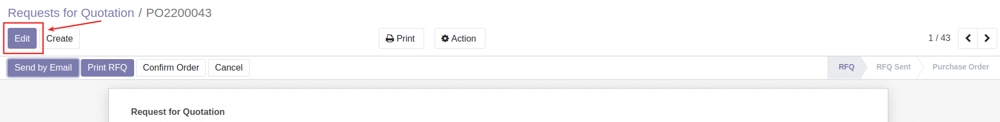
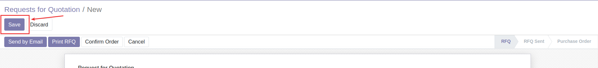
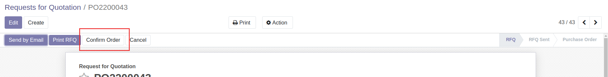
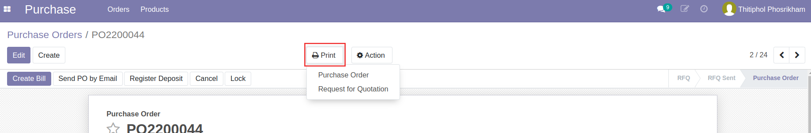

# กระบวนการสั่งซื้อสั่งจ้าง

## การสร้างใบสั่งซื้อสั่งจ้าง (Purchase Order: PO)

เมื่อมีการตกลงราคาจัดซื้อสินค้ากับ Vendor/Supplier แล้ว ฝ่ายจัดซื้อจะต้องมาสร้างเอกสาร Requests for Quotation (RFQ) และยืนยันการจัดซื้อ Purchase Order (PO)

**Menu:** Purchase > Orders > Purchase Requests

1. ในหน้ารายการขอซื้อ (PR) ระบบจะกรองเอกสารที่ผู้ใช้งานทำการขอซื้อขึ้นมาแสดงให้ก่อน ต้องกดกากบาทลบตัวกรองทั้งหมดออกเพื่อให้ระบบแสดงรายการเอกสารขอซื้อ (PR)ของผู้ใช้งานอื่น

2. เลือกตัวกรอง Approved เพื่อค้นหารายการ Purchase Request (PR) ที่ได้รับการอนุมัติแล้ว 

3. ค้นหารายการ Purchase Request (PR) ด้วยเลขที่เอกสาร PR และเลือก *Search Purchase Request for:*

4. กดบรรทัดรายการ เพื่อเปิดเอกสารใบ PR

5. กดปุ่ม Create RFQ เพื่อสร้างเอกสาร RFQ

6. ระบบแสดงหน้าต่างเพื่อให้เลือก Vendor/Supplier ที่ต้องการจัดซื้อจัดจ้าง และตรวจสอบข้อมูล

    * (1) Supplier: เลือก Vendor/Supplier ที่ทำการจัดซื้อ
    * (2) ตรวจสอบ Product และ Quantity ที่จะทำการจัดซื้อ
    * (3) กดปุ่ม Create RFQ เพื่อยืนยัน

7. ระบบสร้างเอกสาร RFQ ขึ้นมา กดที่รายการเพื่อเปิดเอกสาร

8. กดปุ่ม Edit เพื่อแก้ไขข้อมูล

9. แก้ไขราคาที่ได้มีการตกลงไว้ และตรวจสอบความถูกต้อง  

    * (1) ส่วน Header
        * Vendor: ชื่อ Vendor/Supplier ที่เลือกไว้
        * Currency: กรณีเป็นการจัดซื้อจัดจ้างต่างประเทศ สามารถเปลี่ยน Currency เป็นสกุลเงินที่ต้องการ
        * Order Deadline: วันที่การสั่งซื้อสั่งจ้าง
        * Receipt Date: วันที่ส่งมอบสินค้า/บริการที่ตกลงกับ Vendor/Supplier
    * (2) แท็บ Products
        * Product: สินค้าที่ขอจัดซื้อ
        * Quantity: จำนวน
        * Unit Price: ราคาต่อ 1 หน่วย
        * Taxes: ภาษีมูลค่าเพิ่ม (ถ้ามี)
        * Sub Total: ราคารวมสินค้า ไม่รวมภาษี
    !!! Note
        กรอก Unit Price ตามจำนวนเงินของ Currency นั้นๆ และระบบจะแสดงยอด Total ตาม Currency ที่เลือก
        

10. เมื่อแก้ไขและตรวจสอบข้อมูลเรียบร้อยแล้ว กดปุ่ม Save เพื่อบันทึกข้อมูลและตรวจทานอีกครั้ง

    * ถ้าไม่ถูกต้อง ต้องการแก้ไข ให้กดปุ่ม Edit และแก้ไขให้ถูกต้อง และกดปุ่ม Save
    * ถ้าถูกต้องให้ดำเนินการขั้นตอนต่อไป

11. กดปุ่ม Confirm Order เพื่อส่งอนุมัติเอกสาร สถานะเอกสารเปลี่ยนจาก RFQ เป็น To Approve

12. เมื่อเอกสาร PO อนุมัติแล้ว สถานะของเอกสารจะเปลี่ยนจาก To Approve เป็น Purchase Order สามารถกดปุ่ม Print ดาวน์โหลดเอกสาร PO เพื่อส่งให้ Vendor/Supplier

!!! Info
    สามารถดูลำดับขั้นและสถานะการอนุมัติเอกสารได้ที่ Reviews ที่ด้านล่างของเอกสาร
    

End.