# กระบวนการจัดซื้อจัดจ้าง

## การสร้างใบสั่งซื้อสั่งจ้าง (Purchase Order:PO)

เมื่อมีการตกลงราคาจัดซื้อสินค้ากับคู่ค้าแล้ว ผฝ่ายจัดซื้อจะต้องมาสร้างเอกสาร RFQ เพื่อส่งอนุมัติการจัดซื้อและออกใบ Purchase Order (PO)

**Menu:** Purchase > Orders > Purchase Requests

1. เลือกรายการ Purchase Request (PR) ที่มีสถานะ Approved เพื่อสร้าง Requests for Quotation (RFQ)
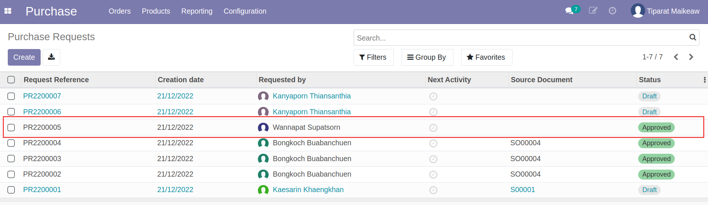

2. กดปุ่ม Create RFQ เพื่อสร้างเอกสาร RFQ
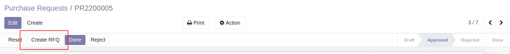

3. ระบบแสดงหน้าต่างเพื่อตรวจสอบข้อมูลเลือก Vendor ที่ต้องการจัดซื้อจัดจ้าง ตรวจสอบ Product และ Quantity และกดปุ่ม Create
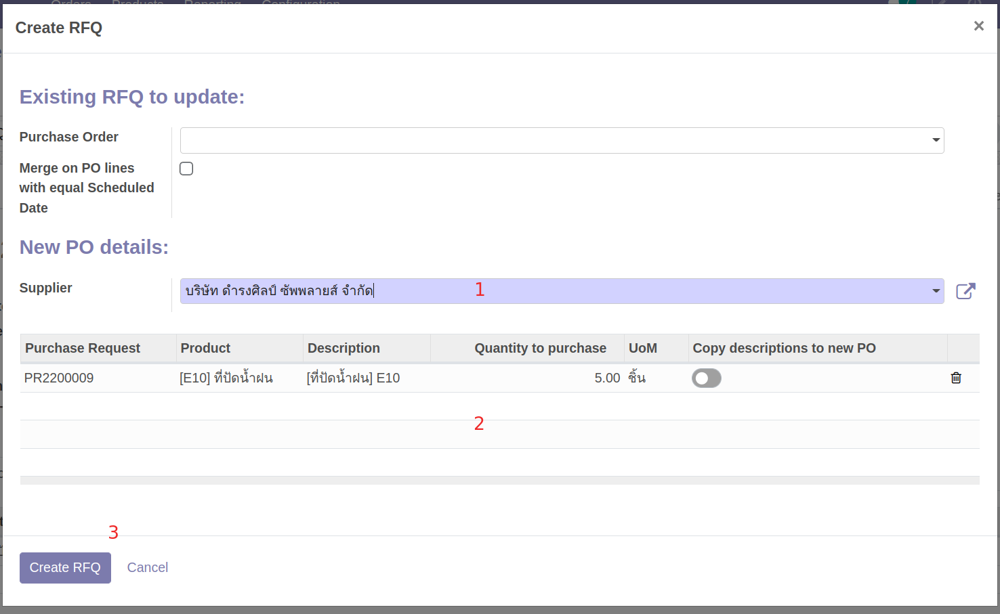
    * (1) Supplier: เลือกคู่ค้าที่ทำการจัดซื้อ
    * (2) ตรวจสอบรายการสินค้าที่จะทำการจัดซื้อ
    * (3) กดปุ่ม Create RFQ เพื่อยืนยัน

4. ระบบสร้างเอกสาร RFQ ขึ้นมา กดที่รายการเพื่อเปิดเอกสาร
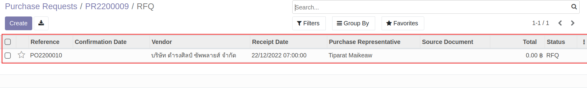

5. กดปุ่ม Edit เพื่อแก้ไขข้อมูล
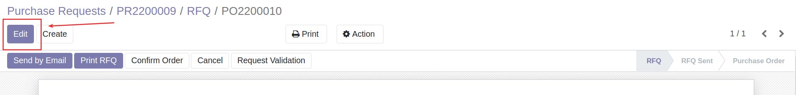

6. แก้ไขราคาที่ได้มีการตกลงกับคู่ค้าไว้ และตรวจสอบความถูกต้อง  
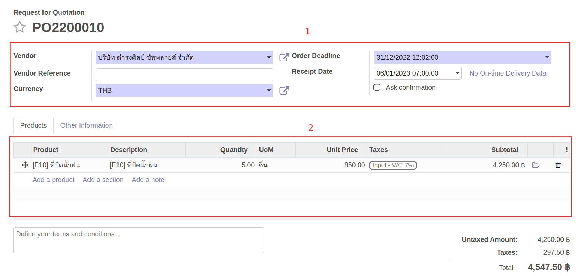
    * (1) ส่วน Header
        * Vendor: รายชื่อคู่ค้าที่เลือกไว้
        * Currency: กรณีเป็นการจัดซื้อจัดจ้างต่างประเทศ สามารถเปลี่ยน Currency เป็นสกุลเงินที่ต้องการ
        * Order Deadline: วันที่การสั่งซื้อสั่งจ้าง
        * Receipt Date: วันที่ส่งมอบสินค้า/บริการที่ตกลงกับ Vendor
    * (2) แท็บ Product
        * Product: สินค้าที่ขอจัดซื้อ
        * Quantity: จำนวนที่ขอซื้อ
        * Unit Price: ราคาต่อ 1 หน่วยที่ได้ตกลงกันไว้
        * Taxes: ภาษีมูลค่าเพิ่ม
        * Sub Total: ราคารวมสินค้า ไม่รวมภาษี
    !!! Note
        กรณีเลือก Currency อื่นๆ >> ให้กรอก Unit Price ตามจำนวนเงินของ currency นั้นๆ
        และระบบจะแสดงยอด Total ตาม currency ที่เลือก
        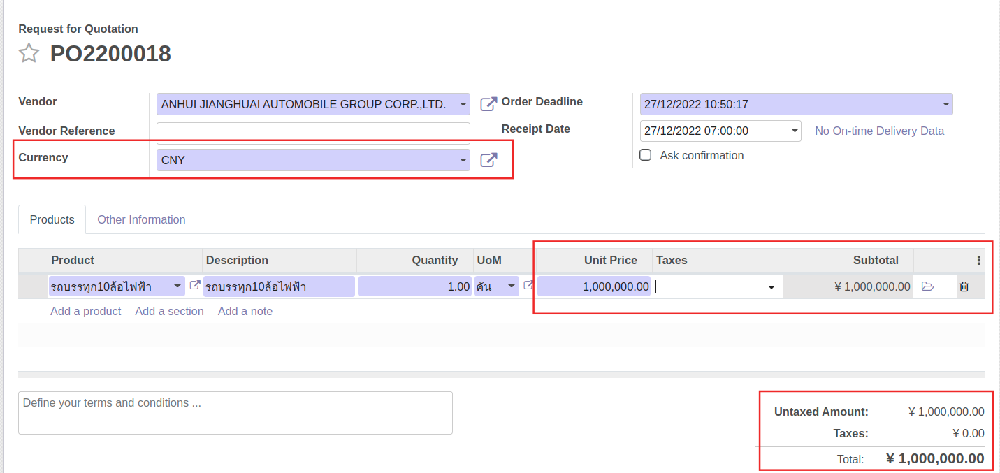

7. เมื่อแก้ไขและตรวจสอบข้อมูลเรียบร้อยแล้ว กดปุ่ม Save เพื่อบันทึกข้อมูล
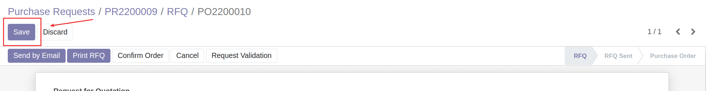

8. กดปุ่ม Request Validation เพื่อส่งอนุมัติเอกสาร
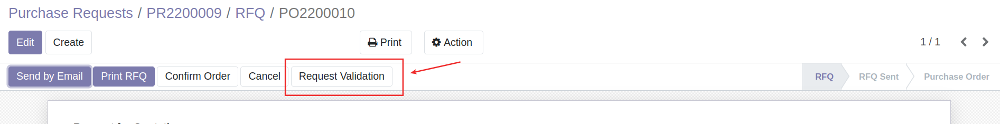

!!! Info
    * สามารถดูลำดับขั้นและสถานะการอนุมัติเอกสารได้ที่ Reviews ที่ด้านล่างของเอกสาร เมื่ออนุมัติครบตามลำดับขั้นแล้ว สถานะเอกสารจะเปลี่ยนเป็น Purchase Order (PO)
    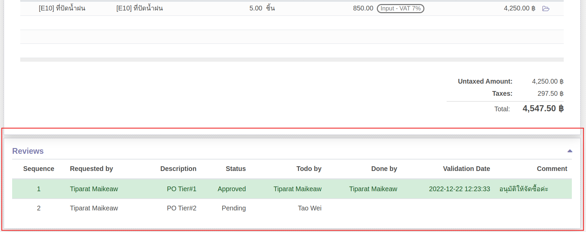

---

## การสร้างเอกสารจ่ายเงินมัดจำ (Draft)

หลังจาก PO ได้รับอนุมัติและต้องมีการจ่ายเงินมัดจำ สามารถดำเนินการได้ดังนี้

**Menu:** Purchase > Orders > Purchase Orders

1. ค้นหาและเลือกเอกสาร PO ที่ต้องการ
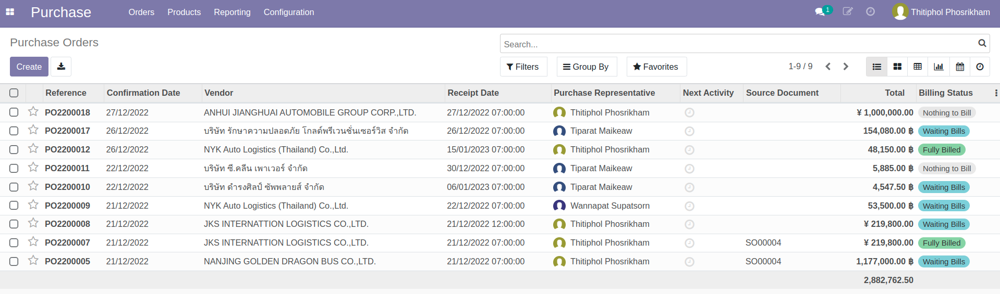

2. กดปุ่ม Register Deposit 
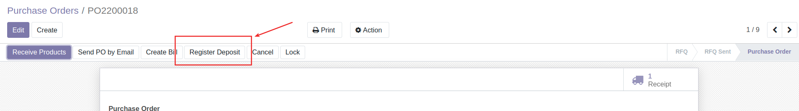

3. ระบบจะแสดงหน้าต่างและให้เลือกดำเนินการดังนี้ 
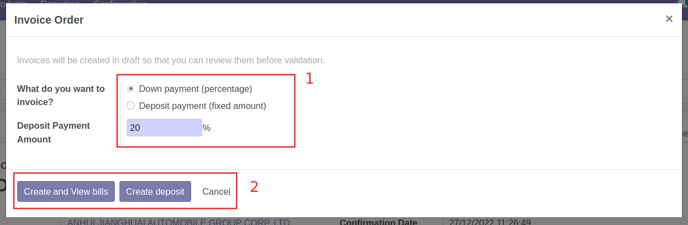 
  * เลือกการสร้างบิลจ่ายเงินมันจำ
    * Down Payment (percentage): สร้างบิลเงินมัดจำ โดยคำนวณจาก % ของยอดเต็ม 
    * Deposit Payment (fixed amount): สร้างบิลเงินมัดจำ โดยกรอกจำนวน 
  * เลือกการดำเนินการ
    * Create and View bills: สร้างบิลฉบับร่างและเรียกดู
    * Create deposit: สร้างบรรทัดรายการเงินมัดจำ แต่ไม่ต้องการสร้างบิล
    * Cancel: ยกเลิกการสร้างเอกสาร

End.
