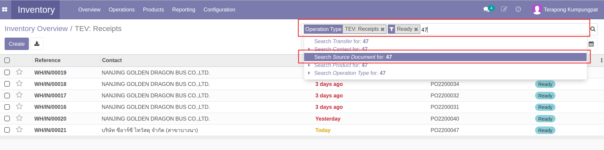
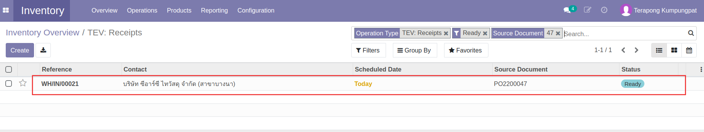
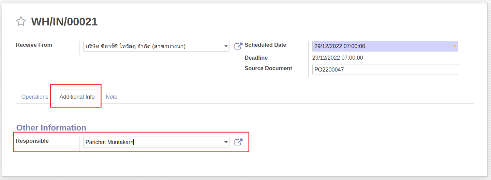
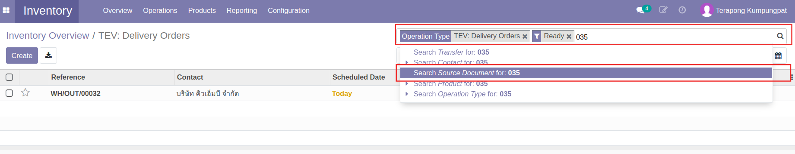
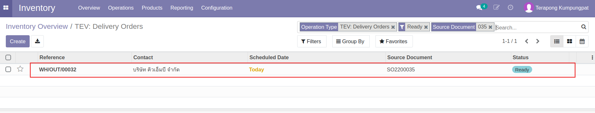
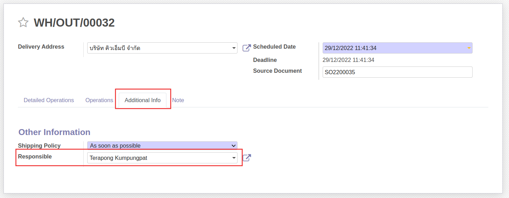

# กระบวนการจัดการสต็อก

## การรับของเข้าสต็อก

**Menu:** Inventory > Overview

เมื่อมีการจัดซื้อสินค้าที่ต้องมีการรับเข้าสต็อก ฝ่ายสโตร์จะทำการรับของในระบบ โดยมีขั้นตอนดังนี้

1. ที่กล่อง Receipts แสดงจำนวนรายการที่รอรับของเข้าสต็อก
 
    * To Process: รายการรอดำเนินการ 
    * Late: รายการรับของล่าช้า  

2. กดปุ่ม To Process 

3. ระบบแสดงรายการรอรับของเข้าสต็อก สถานะ Ready เป็นค่าเริ่มต้น ค้นหารายการรับของด้วยการกรอกเลขเอกสาร PO และเลือก *Search Source Document for:*

    
4. กดที่บรรทัดรายการเพื่อเปิดเอกสารรับของ

5. กดปุ่ม Edit เพื่อกรอกข้อมูล 

6. กรอกและตรวจสอบข้อมูลการรับของ
    

    * (1) ข้อมูลส่วน Header
        * Receive From: แสดงชื่อคู่ค้าที่ทำการส่งของ
        * Scheduled Date: เลือกวันที่บันทึกรับของเข้าสต็อก
        * Deadline Date: แสดงกำหนดการวันที่รับของที่กรอกไว้ตอนทำใบ PO
        * Source Document: แสดงเลขที่ PO ที่สั่งซื้อสินค้ารายกาารนี้
    * (2) ที่แท็บ Operations
        * Product: แสดงชื่อสินค้าที่สั่งซื้อ
        * Demand: แสดงจำนวนที่สั่งซื้อ
        * Done: กรอกจำนวนสินค้าที่ต้องการรับเข้าสต็อก

    

    * ที่แท็บ Additional Info
        *  Responsible: เลือกชื่อผู้ทำรายการรับของเข้าสต็อกเป็นชื่อตนเอง 

7. กดปุ่ม Save เพื่อบันทึกข้อมูล ตรวจทานอีกครั้ง

8. กดปุ่ม Validate เพื่อยืนยันการรับของเข้าสต๊อก สถานะเอกสารจะเปลี่ยนจาก Ready เป็น Done

!!! Note
    กรณีกรอกจำนวนสินค้าที่รับเข้าสต็อกน้อยกว่าจำนวนที่สั่งซื้อ เมื่อกด Validate ระบบจะแสดงหน้าต่างให้เลือกการดำเนินการดังนี้
    
    
    * Create Backorder: กรณีต้องการรับของส่วนที่เหลือภายหลัง ระบบจะสร้างใบรับของใบใหม่พร้อมระบุจำนวนที่เหลือให้อัตโนมัติ เพื่อรอทำรายการรับของส่วนที่เหลือภายหลัง
    * No Backorder: กรณีไม่ต้องการรับของส่วนที่เหลือแล้ว

---

## การตัดของออกจากสต็อก
เมื่อมีการยืนยันการขายหรือบริการซ่อมที่ต้องเบิกอะไหล่ (Sale Order) จากทีม Sale แล้ว ฝ่ายสโตร์จะทำการตัดของออกจากสต็อกในระบบ โดยมีขั้นตอนดังนี้

**Menu:** Inventory > Overview

1. ที่เมนู Delivery Orders แสดงจำนวนรายการที่รอส่งของ
 
    * To Process: รายการรอดำเนินการ  
    * Late: รายการส่งของล่าช้า  

2. กดปุ่ม To Process 

3. ระบบแสดงรายการรอส่งของ สถานะ Ready เป็นค่าเริ่มต้น ค้นหารายการรับของด้วยการกรอกเลขเอกสาร SO และเลือก *Search Source Document for:*

4. กดที่บรรทัดรายการเพื่อเปิดเอกสารรับของ

5. กดปุ่ม Edit เพื่อกรอกข้อมูล 

6. กรอกและตรวจสอบข้อมูลการส่งของ
    
    
    * (1) ข้อมูลส่วน Header
        * Delivery Address: แสดงชื่อลูกค้าที่ต้องจัดส่ง
        * Scheduled Date: เลือกวันที่บันทึกส่งของ
        * Deadline Date: แสดงกำหนดการวันที่ส่งของ
        * Source Document: แสดงเลขที่ใบ SO
    * (2) ที่แท็บ Detailed Operations
        * Product: แสดงชื่อสินค้าที่ต้องส่ง
        * Reserved: แสดงจำนวนที่ต้องส่ง
        * Done: กรอกจำนวนสินค้าที่ต้องการส่งและตัดออกจากสต็อก

    

    * ที่แท็บ Additional Info
        * Responsible: เลือกชื่อผู้ทำรายการตัดของออกจากสต็อกเป็นชื่อตนเอง 

7. กดปุ่ม Save เพื่อบันทึกข้อมูล ตรวจทานอีกครั้ง

8. กดปุ่ม Validate เพื่อยืนยันการส่งและตัดของออกจากสต็อก สถานะเอกสารจะเปลี่ยนเป็น Done

!!! Note
    กรณีกรอกจำนวนสินค้าที่จัดส่งและตัดสต็อกน้อยกว่าจำนวนที่ลูกค้าสั่งซื้อ เมื่อกด Validate ระบบจะแสดงหน้าต่างให้เลือกการดำเนินการดังนี้
    
    
    * Create Backorder: กรณีต้องการส่งของส่วนที่เหลือภายหลัง ระบบจะสร้างใบส่งของใบใหม่พร้อมระบุจำนวนที่เหลือให้อัตโนมัติ เพื่อรอทำรายการรส่งของส่วนที่เหลือภายหลัง
    * No Backorder: กรณีไม่ต้องการส่งของส่วนที่เหลือแล้ว

---

## การเรียกรายงาน

### Stock Card

รายงานนี้ใช้สำหรับดูรายการเข้าออกจาก Location หนึ่งของสิันค้าตัวหนึ่ง ในช่วงเวลาหนึ่ง โดยผู้ใช้งานจะใส่ค่าการค้นหาตามต้องการก่อนดูรายงาน

**Menu:** Inventory > Reporting > Stock Card

* Period / Start Date / End Date: ช่วงเวลาที่สนใจ
* Product: สินค้าที่สนใจ
* Location: สถานที่จัดเก็บสินค้า
* สามารถออกรายงานได้ทั้งแบบ 1. View 2. PDF 3. Excel

* Column ในรายงานมีความหมายดังนี้
    * Date: วันที่ที่ของเข้า - ออก
    * Reference: เลขเอกสารอ้างอิง เช่นใบเบิก-คืน
    * In: จํานวนของที่เข้าคลัง
    * Out: จํานวนของที่ออกคลัง
    * Balance: จำนวนคงเหลือ

### Inventory Report

รายงานนี้ใช้สำหรับดูข้อมูลมูลค่าของในคลัง ณ เวลาใดเวลาหนึ่ง

**Menu:** Inventory > Reporting > Inventory Report

* กดปุ่ม Inventory at Date เพื่อกำหนดวันที่ต้องการดูมูลค่าของในคลัง (อดีตหรือปัจจบัน)

* สามารถค้นหาข้อมูล (Filter) บิดรายงานตามมุมมองที่ต้องการ (Group By)

### Inventory Valuation

รายงานนี้เน้นไปที่การดูมูลค่าของสินค้าคงคลัง โดยสามารถดูย้อนประวัติของมูลค่าคลังสินค้าที่เกิดขึ้นในทุกๆ Transaction ตามมูลค่า (Cost) ในขณะนั้น

**Menu:** Inventory > Reporting > Inventory Valuation

* กดปุ่ม Inventory at Date เพื่อกำหนดวันที่ต้องการดูมูลค่าของในคลัง (อดีตหรือปัจจบัน)

End.