# กระบวนการจัดการสโตร์

## การรับของเข้าสโตร์

**Menu:** Inventory > Overview

เมื่อมีการจัดซื้อสินค้าที่ต้องมีการรับเข้าสโตร์ ฝ่ายสโตร์จะทำการรับของในระบบ โดยมีขั้นตอนดังนี้

1. ที่เมนู Receipt แสดงจำนวนรายการที่รอรับของเข้าสโตร์
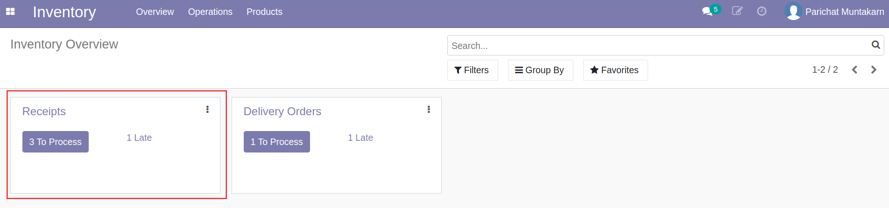 
    * To Process: รายการรอดำเนินการ 
    * Late: รายการรับของล่าช้า  

2. กดปุ่ม To Process 
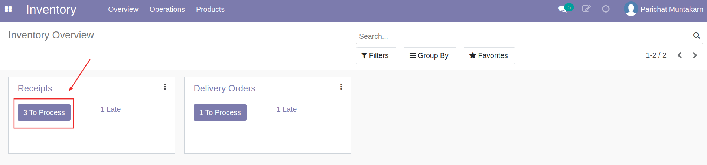

3. ระบบแสดงรายการรอรับของเข้าสโตร์ สถานะ Ready กดเลือกเอกสารเพื่อทำรายการรับของ
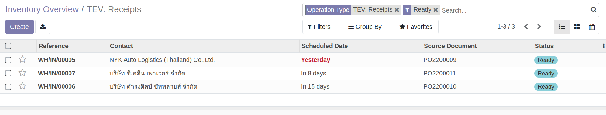

4. กดปุ่ม Edit เพื่อกรอกข้อมูล 
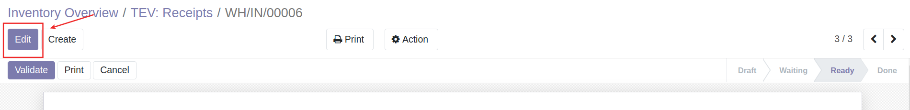

5. กรอกและตรวจสอบข้อมูลการรับของ
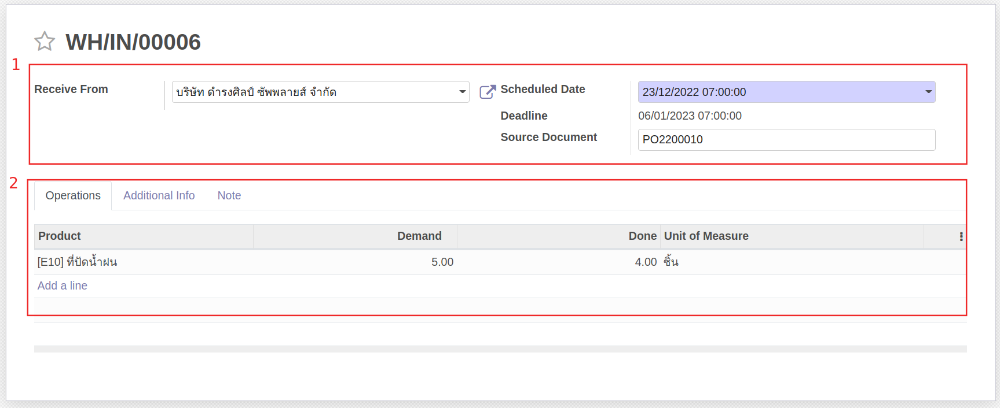
    * (1) ส่วน Header
        * Receive From: แสดงชื่อคู่ค้าที่ทำการส่งของ
        * Scheduled Date: เลือกวันที่บันทึกรับของเข้าสโตร์
        * Deadline Date: แสดงกำหนดการวันที่รับของที่กรอกไว้ตอนทำใบ PO
        * Source Document: แสดงเลขที่ PO ที่สั่งซื้อสินค้ารายกาารนี้
    * (2) ที่แท็บ Operations
        * Product: แสดงชื่อสินค้าที่สั่งซื้อ
        * Demand: แสดงจำนวนที่สั่งซื้อ
        * Done: กรอกจำนวนสินค้าที่ต้องการรับเข้าสโตร์

6. กดปุ่ม Save เพื่อบันทึกข้อมูล
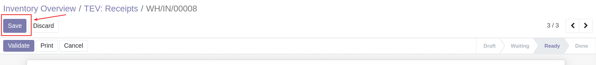 

7. กดปุ่ม Validate เพื่อยืนยันการรับของเข้าสโตร์ สถานะเอกสารจะเปลี่ยนเป็น Done
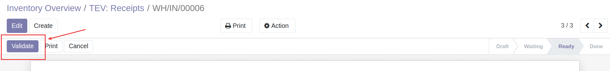

!!! Note
    กรณีกรอกจำนวนสินค้าที่รับเข้าสต็อคน้อยกว่าจำนวนที่สั่งซื้อ เมื่อกด Validate ระบบจะแสดงหน้าต่างให้เลือกการดำเนินการดังนี้
    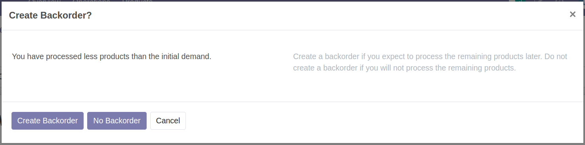
    
    * Create Backorder: กรณีต้องการรับของส่วนที่เหลือภายหลัง ระบบจะสร้างใบรับของพร้อมจำนวนที่เหลือให้อัตโนมัติ เพื่อรอทำรายการรับของส่วนที่เหลือภายหลัง
    * No Backorder: กรณีไม่ต้องการรับของส่วนที่เหลือแล้ว

---

## การตัดของออกจากสโตร์ 
เมื่อมีการยืนยันการขายหรือบริการซ่อมที่ต้องเบิกอะไหล่ (Sale Order) จากทีม Sale แล้ว ฝ่ายสโตร์จะทำการตัดของออกจากสโตร์ในระบบ โดยมีขั้นตอนดังนี้

**Menu:** Inventory > Overview

1. ที่เมนู Deliver Orders แสดงจำนวนรายการที่รอส่งของ
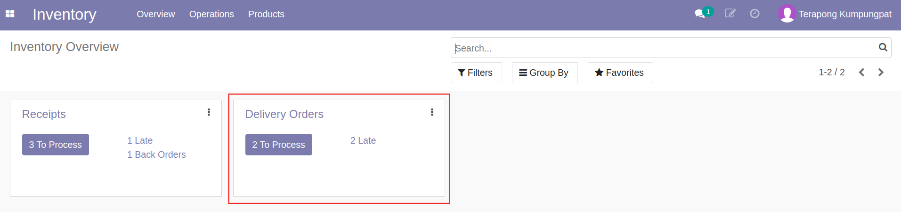 
    * To Process: รายการรอดำเนินการ  
    * Late: รายการส่งของล่าช้า  

2. กดปุ่ม To Process 
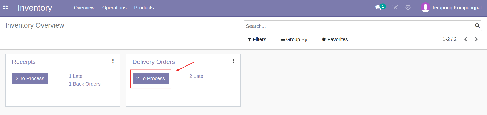

3. ระบบแสดงรายการรอส่งของ สถานะ Ready กดเลือกเอกสารเพื่อทำรายการส่งของ
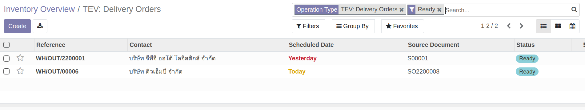

4. กดปุ่ม Edit เพื่อกรอกข้อมูล 
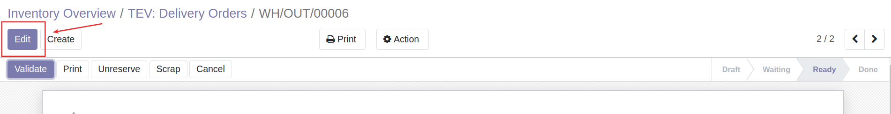

5. กรอกและตรวจสอบข้อมูลการส่งของ
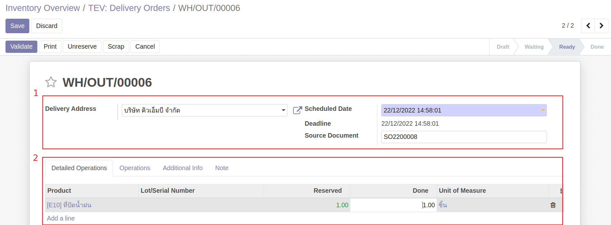
    * (1) ส่วน Header
        * Delivery Address: แสดงชื่อลูกค้าที่ต้องจัดส่ง
        * Scheduled Date: เลือกวันที่บันทึกส่งของ
        * Deadline Date: แสดงกำหนดการวันที่ส่งของ
        * Source Document: แสดงเลขที่ใบ SO
    * (2) ที่แท็บ Detailed Operations
        * Product: แสดงชื่อสินค้าที่ต้องส่ง
        * Reserved: แสดงจำนวนที่ต้องส่ง
        * Done: กรอกจำนวนสินค้าที่ต้องการส่งและตัดออกจากสโตร์

6. กดปุ่ม Save เพื่อบันทึกข้อมูล 
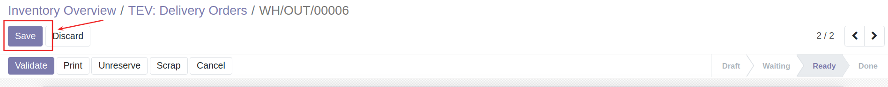

7. กดปุ่ม Validate เพื่อยืนยันการส่งและตัดของออกจากสโตร์ สถานะเอกสารจะเปลี่ยนเป็น Done
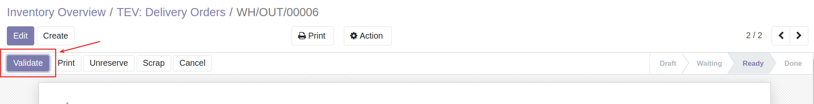

!!! Note
    กรณีกรอกจำนวนสินค้าที่จัดส่งและตัดสโตร์น้อยกว่าจำนวนที่ลูกค้าสั่งซื้อ เมื่อกด Validate ระบบจะแสดงหน้าต่างให้เลือกการดำเนินการดังนี้
    
    
    * Create Backorder: กรณีต้องการส่งของส่วนที่เหลือภายหลัง ระบบจะสร้างใบส่งของพร้อมจำนวนที่เหลือให้อัตโนมัติ เพื่อรอทำรายการรส่งของส่วนที่เหลือภายหลัง
    * No Backorder: กรณีไม่ต้องการส่งของส่วนที่เหลือแล้ว

---

End.