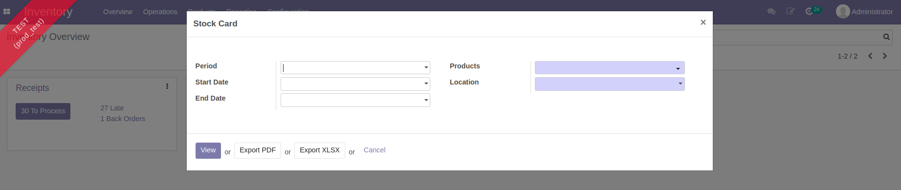
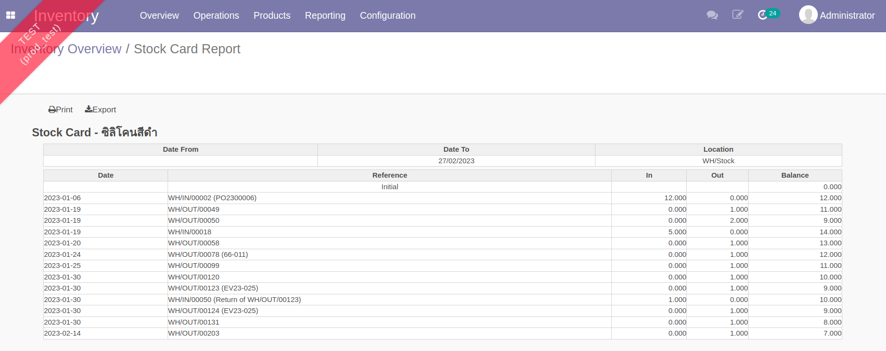
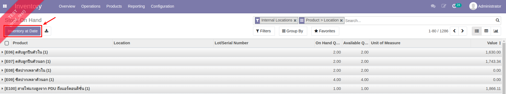
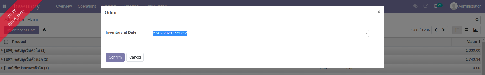
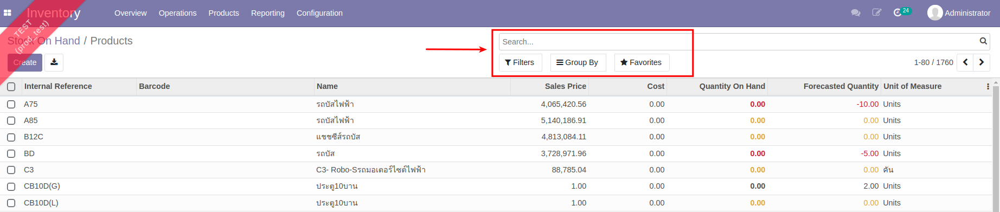
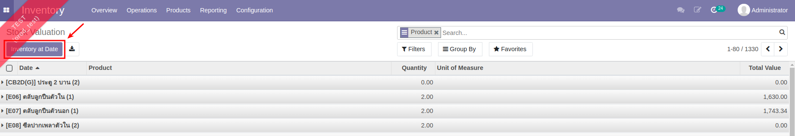
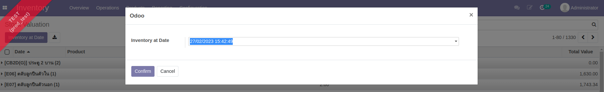

# การเรียกรายงาน

### Stock Card

รายงานนี้ใช้สำหรับดูรายการเข้าออกจาก Location หนึ่งของสิันค้าตัวหนึ่ง ในช่วงเวลาหนึ่ง โดยผู้ใช้งานจะใส่ค่าการค้นหาตามต้องการก่อนดูรายงาน

**Menu:** Inventory > Reporting > Stock Card

* Period / Start Date / End Date: ช่วงเวลาที่สนใจ
* Product: สินค้าที่สนใจ
* Location: สถานที่จัดเก็บสินค้า
* สามารถออกรายงานได้ทั้งแบบ 1. View 2. PDF 3. Excel

* Column ในรายงานมีความหมายดังนี้
    * Date: วันที่ที่ของเข้า - ออก
    * Reference: เลขเอกสารอ้างอิง เช่นใบเบิก-คืน
    * In: จํานวนของที่เข้าคลัง
    * Out: จํานวนของที่ออกคลัง
    * Balance: จำนวนคงเหลือ

---

### Inventory Report

รายงานนี้ใช้สำหรับดูข้อมูลมูลค่าของในคลัง ณ เวลาใดเวลาหนึ่ง

**Menu:** Inventory > Reporting > Inventory Report

* กดปุ่ม Inventory at Date เพื่อกำหนดวันที่ต้องการดูมูลค่าของในคลัง (อดีตหรือปัจจบัน)

* สามารถค้นหาข้อมูล (Filter) บิดรายงานตามมุมมองที่ต้องการ (Group By)

---

### Inventory Valuation

รายงานนี้เน้นไปที่การดูมูลค่าของสินค้าคงคลัง โดยสามารถดูย้อนประวัติของมูลค่าคลังสินค้าที่เกิดขึ้นในทุกๆ Transaction ตามมูลค่า (Cost) ในขณะนั้น

**Menu:** Inventory > Reporting > Inventory Valuation

* กดปุ่ม Inventory at Date เพื่อกำหนดวันที่ต้องการดูมูลค่าของในคลัง (อดีตหรือปัจจบัน)

End.

---