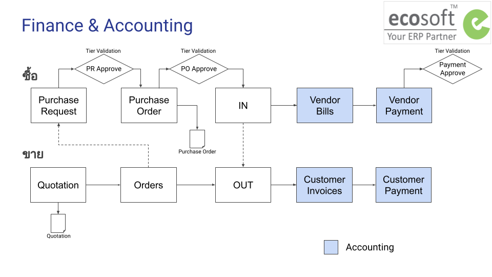

# ภาพรวมการเงินบัญชี

## กระบวนการทำงาน

1. การตั้งเจ้าหนี้ (Vendor Bills)
2. การบันทึกจ่ายชำระเงิน (Vendor Payment)
3. การตั้งลูกหนี้ (Customer Invoice)
4. การบันทึกรับชำระเงิน (Customer Payment)
5. การเบิกและบันทึกใช้เงินสดย่อย (Petty Cash)
6. การจัดการสินทรัพย์ 
7. การเรียกรายงาน