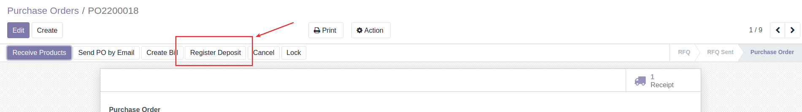
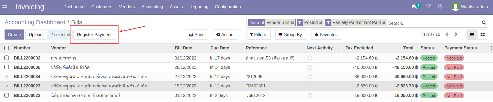
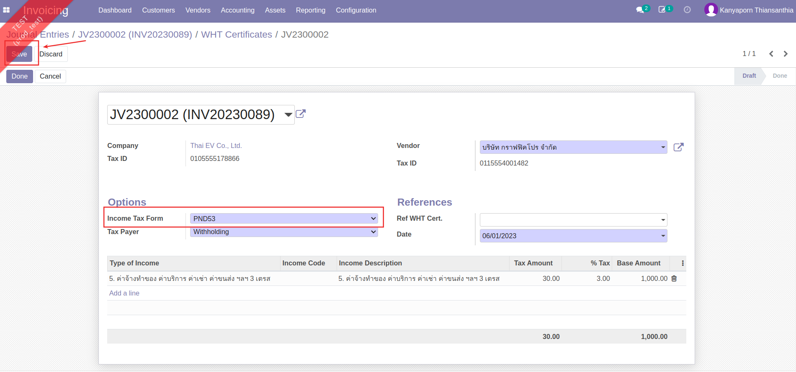
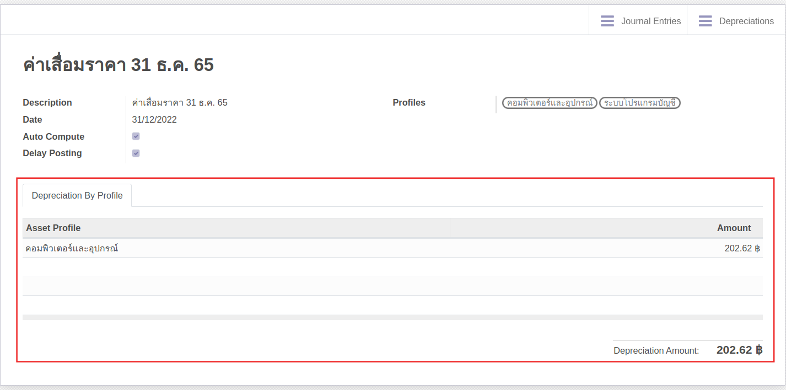
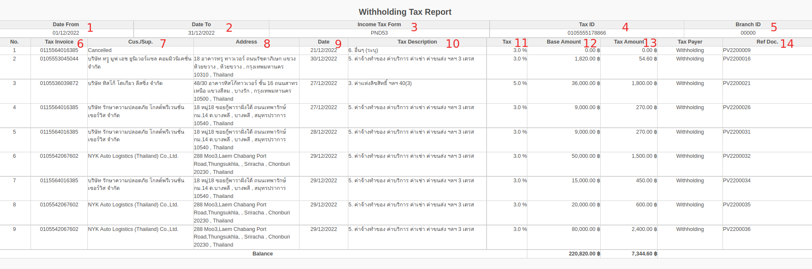
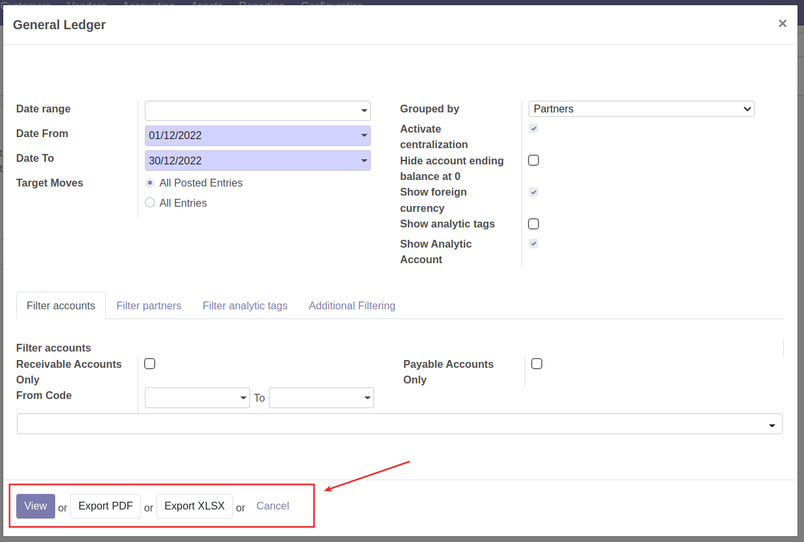

# กระบวนการบัญชีการเงิน

## การสร้างเอกสารจ่ายเงินมัดจำจาก PO

หลังจาก PO ได้รับอนุมัติและต้องมีการจ่ายเงินมัดจำ สามารถดำเนินการได้ดังนี้

**Menu:** Purchase > Orders > Purchase Orders

1. ที่ช่องค้นหา กรอกเลขใบ PO และเลือกการค้นหาจาก Order

2. กดที่รายการเพื่อเปิดเอกสาร

3. กดปุ่ม Register Deposit 

4. ระบบจะแสดงหน้าต่างและให้เลือกดำเนินการดังนี้ 
 
    * เลือกการสร้างบิลจ่ายเงินมัดจำ
        * Down Payment (percentage): สร้างบิลเงินมัดจำ โดยคำนวณจาก % ของยอดก่อนภาษี 
        * Deposit Payment (fixed amount): สร้างบิลเงินมัดจำ โดยกรอกจำนวนที่ต้องการ 
    * เลือกการดำเนินการ
        * Create and View bills: สร้างบิลฉบับร่างและเรียกดู
        * Create deposit: สร้างบรรทัดรายการเงินมัดจำในใบ PO แต่ไม่ต้องการสร้างบิล
        * Cancel: ยกเลิกการสร้างเอกสาร

---

## การตั้งเจ้าหนี้ (Vendor Bills)

### การตั้งเจ้าหนี้ (Vendor Bills) สกุลเงินบาทไทย

เมื่อต้องการตั้งเจ้าหนี้ สามารถดำเนินการได้ดังนี้ 

**Menu:** Invoicing > Dashboard > Vendor Bills

1. ที่กล่อง Vendor Bills 

    * Create: ใช้สำหรับสร้างเอกสารใหม่
    * Bills to Validate: แสดงจำนวนรายการที่รอการบันทึกบัญชี (เอกสารอยู่ในสถานะ Draft)
    * Bills to Pay: แสดงจำนวนรายการที่รอบันทึกจ่ายชำระเงิน (เอกสารอยู่ในสถานะ Posted / สถานะการจ่ายเงินเป็น สถานะการจ่ายเงินเป็น Partial Paid หรือ Not Paid)

2. กดปุ่ม Create เพื่อสร้างเอกสาร Vendor Bill สถานะ Draft

3. กรอกข้อมูลที่ Header และตรวจสอบข้อมูลการตั้งเจ้าหนี้

    * Vendor: เลือกคู่ค้าที่ต้องการตั้งหนี้
    * Bill Reference: กรอกเลขที่เอกสารใบแจ้งหนี้จากคู่ค้าเพื่ออ้างอิง (ถ้ามี)
    * Auto-Complete: สามารถเลือกเลขที่ PO ที่เกี่ยวข้อง ระบจะช่วยดึงข้อมูลสินค้าที่จัดซื้อตามใบ PO นั้นๆมากรอกให้ในแท็บ Invoice Lines
    * Bill Date: วันที่ตามใบแจ้งหนี้
    * Accounting Date: วันที่บันทึกบัญชี  ระบบเลือกให้เป็นวันที่ปัจจุบัน
    * Due Date: กำหนดการชำระเงิน สามารถเลือกเป็นระยะเวลาหรือระบุวันที่ได้ (หากมีการตั้งค่า Payment term ไว้ที่ข้อมูลหลัก Contacts ระบบจะช่วยดึงค่ามากรอกให้อัตโนมัติ)
    * ที่แท็บ Invoice Line 
        * กรณีดึงข้อมูลจากใบ PO ตรวจสอบข้อมูลและภาษี หากมีภาษีหัก ณ ที่จ่าย ให้เลือกประเภทหัก ณ ที่จ่ายในคอลัมน์ WHT
        * กรณีไม่ดึงข้อมูลจาก PO สามารถกรอกข้อมูลในแต่ละคอลัมน์ได้เลย
    !!! Note
        หากเอกสาร Vendor Bills ดึงข้อมูลใบ PO ที่มีการจัดซื้อสินทรัพย์ (Asset) 
        ที่แท็บ Invoice Line > คอลัมน์ Asset Profile จะแสดงข้อมูล Asset Profile ให้ตรวจสอบความถูกต้อง หากต้องการแก้ไขสามารถกดที่ช่องเพื่อเลือก Asset Profile ใหม่ได้
        
        และเมื่อทำการตั้งเจ้าหนี้ ระบบจะสร้างข้อมูลสินทรัพย์ สถานะ Draft ให้อัตโนมัติ
        

4. กดปุ่ม Save เพื่อบันทึกข้อมูลและตรวจทานอีกครั้ง หากต้องการแก้ไขให้กดปุ่ม Edit

    !!! Note
        กรณีมีภาษีมูลค่าเพิ่ม จะต้องกรอกข้อมูลใบกำกับภาษี โดย

        *   กดปุ่ม Edit 
        
        *   ไปที่แท็บ Tax Invoice เพื่อกรอกข้อมูลใบกำกับภาษี
        

5. กดปุ่ม Confirm เพื่อยืนยันการบันทึกค่าใช้จ่ายและตั้งเจ้าหนี้ สถานะเอกสารจะเปลี่ยนจาก Draft เป็น Posted และรอการบันทึกจ่ายชำระเงินต่อไป

---

### การตั้งเจ้าหนี้ (Vendor Bills) สกุลเงินต่างประเทศ

!!! Warning 
    ก่อนการตั้งเจ้าหนี้ ต้องแจ้งให้หัวหน้าบัญชีการเงินอัปเดตค่าเงินของวันที่ต้องการตั้งหนี้ก่อนเสมอ (คู่มือ Master Data > Currencies > การอัปเดตค่าเงิน)

การทำงานจะเหมือนขั้นตอนการบันทึกค่าใช้จ่ายและตั้งเจ้าหนี้ปกติและเมื่อกดปุ่ม Confirm แล้ว
ที่แท็บ Journal Items จะลงบันทึกบัญชีโดยคำนวณตามเรทเงินของวันนั้นๆ

---

## การบันทึกจ่ายชำระเงิน (Vendor Payment)

### การบันทึกจ่ายชำระเงินสกุลเงินบาทไทย (Vendor Payment) 
เมื่อต้องการบันทึกจ่ายชำระเงิน สามารถดำเนินการได้ดังนี้

**Menu:** Invoicing > Dashboard > Vendor Bills

1. ที่กล่อง Vendor Bills แสดง

    * Create: ใช้สำหรับสร้างเอกสารใหม่
    * Bills to Validate: แสดงจำนวนรายการที่รอการบันทึกบัญชี (เอกสารอยู่ในสถานะ Draft)
    * Bills to Pay: แสดงจำนวนรายการที่รอบันทึกจ่ายชำระเงิน (เอกสารอยู่ในสถานะ Posted / สถานะการจ่ายเงินเป็น Partially Paid หรือ Not Paid)

2. กดที่ Bills to Pay เพื่อดูรายการเอกสารที่รอบันทึกการจ่ายชำระเงิน

3. ทำเครื่องหมายด้านหน้าเอกสารที่ต้องการบันทึกจ่ายชำระ โดยสามารถเลือกเอกสารได้มากกว่า 1 รายการกรณีต้องการบันทึกจ่ายชำระหลายบิล (แต่ต้องเป็นบิลของคู่ค้ารายเดียวกัน) 

4. กดปุ่ม Register Payment 

5. ระบบแสดงหน้าต่างให้กรอกข้อมูลบันทึกจ่ายชำระเงิน ดังนี้

    * (1) กรอกข้อมูล
        * Journal: เลือก Journal ที่ต้องการบันทึกจ่ายชำระ
        * Recipient Bank Account: ระบบแสดงเลขบัญชีธนาคารของคู่ค้าให้ หากมีการตั้งค่าไว้ที่ ข้อมูล Contacts
        * Amount: กรอกจำนวนเงินที่จ่ายชำระตามจริง 
            * กรณียอดชำระจริง เท่ากับยอดที่ตั้งหนี้ ให้ข้ามไปทำข้อ (4)
            * กรณียอดชำระจริง แตกต่างจากยอดที่ตั้งหนี้ เช่น ค่าธรรมเนียม การหัก ณ ที่จ่าย เป็นต้น ให้ไปทำข้อ (2)
        * Payment Date: เลือกวันที่ ที่ได้ทำการจ่ายชำระเงิน
    * (2) กรณียอดชำระจริง แตกต่างจากยอดที่ตั้งหนี้ ระบบจะแสดงการดำเนินการให้เลือกดังนี้
        * Keep Open: คงค้างยอดเอาไว้ และไปทำข้อ (4)
        * Mark as fully paid: เลือกบันทึกบัญชียอด diff โดยเลือกบันทึกได้แค่ 1 บัญชี และไปทำข้อ (4)
        * Mark as fully paid (multi deduct): เลือกบันทึกบัญชียอด diff โดยสามารถเลือกบันทึกได้มากกว่า 1 บัญชี และไปทำข้อ (3)
    * (3) กรณีเลือก Mark as fully paid (multi deduct) กดปุ่ม Add a line เพื่อเลือกบัญชีที่ต้องการบันทึกยอด diff โดยสามารถกดเพิ่มบรรทัดรายการได้มากกว่า 1 บรรทัด
    * (4) กดปุ่ม Create Payment เพื่อยืนยันการบันทึกจ่ายชำระเงิน เมื่อกดเข้าไปดูเอกสาร จะมีคาดแแถบเขียวว่า Paid
    

6. ดูรายละเอียดการบันทึกบัญชีได้โดย

    * กดเครื่องหมาย i เพื่อแสดงหน้าต่างรายละเอียด
    * กดปุ่ม View เพื่อดูรายละเอียดมากขึ้น ระบบจะแสดงหน้าเอกสาร Payment (PV)

7. กดปุ่ม Request Validation เพื่อส่งอนุมัติเอกสาร PV กรณีมี ภาษีหัก ณ ที่จ่ายให้ไปทำตามขั้นตอนในคู่มือการออกใบหัก ณ ที่ จ่าย

    !!! Info
        สามารถดูลำดับขั้นและสถานะการอนุมัติเอกสารได้ที่ Reviews ที่ด้านล่างของเอกสาร
        

8. ดูรายละเอียดการบันทึกบัญชีได้โดย

    * กดเครื่องหมาย i เพื่อแสดงหน้าต่างรายละเอียด
    * กดปุ่ม View เพื่อดูรายละเอียดมากขึ้น ระบบจะแสดงหน้าเอกสาร Payment (PV) สามารถกดปุ่ม Smart Button "Journal Entries" เพื่อดูรายละเอียดการบันทึกบัญชี
    

!!! Note
    เมื่ออนุมัติครบทุกลำดับขั้นแล้ว
    ที่หน้า List view รายการเอกสารจะแสดงสีเขียว
    
    ในหน้าเอกสาร จะคาดแถบสีเขียวว่า Approved
    
    บัญชีการเงินก็จะไปทำการชำระเงินด้วยการโอน/เช็ค/เงินสดเป็นลำดับถัดไป

---

### การบันทึกจ่ายชำระเงินสกุลเงินต่างประเทศ (Vendor Payment)

!!! Warning 
    ก่อนการบันทึกจ่ายชำระเงินสกุลเงินต่างประเทศ (Vendor Payment) ต้องแจ้งให้หัวหน้าการเงินบัญชีอัปเดตค่าเงินก่อนเสมอ (คู่มือ Master Data > Currencies > การอัปเดตค่าเงิน)

เมื่อต้องการบันทึกจ่ายชำระเงิน สามารถดำเนินการได้ดังนี้

**Menu:** Invoicing > Dashboard > Vendor Bills

1. ที่กล่อง Vendor Bills แสดง

    * Create: ใช้สำหรับสร้างเอกสารใหม่
    * Bills to Validate: แสดงจำนวนรายการที่รอการบันทึกบัญชี (เอกสารอยู่ในสถานะ Draft)
    * Bills to Pay: แสดงจำนวนรายการที่รอบันทึกจ่ายชำระเงิน (เอกสารอยู่ในสถานะ Posted / สถานะการจ่ายเงินเป็น Partially Paid หรือ Not Paid)

2. กดที่ Bills to Pay เพื่อดูรายการเอกสารที่รอบันทึกการจ่ายชำระเงิน

3. ทำเครื่องหมายด้านหน้าเอกสารที่ต้องการบันทึกจ่ายชำระ โดยสามารถเลือกเอกสารได้มากกว่า 1 รายการกรณีต้องการบันทึกจ่ายชำระหลายบิล (แต่ต้องเป็นบิลของคู่ค้ารายเดียวกัน) 

4. กดปุ่ม Register Payment 

5. ระบบแสดงหน้าต่างให้กรอกข้อมูลบันทึกจ่ายชำระเงิน ดังนี้

    * (1) กรอกข้อมูล
        * Journal: เลือก Journal ที่ต้องการบันทึกจ่ายชำระสกุลเงินค่างประเทศ
        * Recipient Bank Account: ระบบแสดงเลขบัญชีธนาคารของคู่ค้าให้ หากมีการตั้งค่าไว้ที่ ข้อมูล Contacts
        * Amount: กรอกจำนวนเงินที่จ่ายชำระตามจริง 
            * กรณียอดชำระจริง เท่ากับยอดที่ตั้งหนี้ ให้ข้ามไปทำข้อ (4)
            * กรณียอดชำระจริง แตกต่างจากยอดที่ตั้งหนี้ เช่น ค่าธรรมเนียมการโอน กำไร/ขาดทุนจากอัตราแลกเปลี่ยน เป็นต้น ให้ไปทำข้อ (2)
        * Payment Date: เลือกวันที่ ที่ได้ทำการจ่ายชำระเงิน
    * (2) กรณียอดชำระจริง แตกต่างจากยอดที่ตั้งหนี้ ระบบจะแสดงการดำเนินการให้เลือกดังนี้
        * Keep Open: คงค้างยอดเอาไว้ และไปทำข้อ (4)
        * Mark as fully paid: เลือกบันทึกบัญชียอด diff โดยเลือกบันทึกได้แค่ 1 บัญชี และไปทำข้อ (4)
        * Mark as fully paid (multi deduct): เลือกบันทึกบัญชียอด diff โดยสามารถเลือกบันทึกได้มากกว่า 1 บัญชี และไปทำข้อ (3)
    * (3) กรณีเลือก Mark as fully paid (multi deduct) กดปุ่ม Add a line เพื่อเลือกบัญชีที่ต้องการบันทึกยอด diff โดยสามารถกดเพิ่มบรรทัดรายการได้มากกว่า 1 บรรทัด
    * (4) กดปุ่ม Create Payment เพื่อยืนยันการบันทึกจ่ายชำระเงิน เมื่อกดเข้าไปดูเอกสาร จะมีคาดแแถบเขียวว่า Paid
    (กรณีมียอดคงค้างจะแสดงแถบคาดสีเหลืองว่า Partial)
    

6. กดปุ่ม Request Validation เพื่อส่งอนุมัติเอกสาร PV
 

    !!! Info
        สามารถดูลำดับขั้นและสถานะการอนุมัติเอกสารได้ที่ Reviews ที่ด้านล่างของเอกสาร
        

7. ดูรายละเอียดการบันทึกบัญชีได้โดย

    * กดเครื่องหมาย i เพื่อแสดงหน้าต่างรายละเอียด
    * กดปุ่ม View เพื่อดูรายละเอียดมากขึ้น ระบบจะแสดงหน้าเอกสาร Payment (PV) สามารถกดปุ่ม Smart Button "Journal Entries" เพื่อดูรายละเอียดการบันทึกบัญชี
    

!!! Note
    เมื่ออนุมัติครบทุกลำดับขั้นแล้ว
    ที่หน้า List view รายการเอกสารจะแสดงสีเขียว
    
    ในหน้าเอกสาร จะคาดแถบสีเขียวว่า Approved
    
    บัญชีการเงินก็จะไปทำการชำระเงินด้วยการโอน/เช็ค/เงินสดเป็นลำดับถัดไป

---

### การออกใบหัก ณ ที่ จ่าย หลังจากทำ Payments

หากมีภาษีหัก ณ ที่จ่าย หลังจากทำ Register Payment แล้ว จะมีแถบสีเหลืองแสดง สามารถออกใบหัก ณ ที่จายได้ โดยมีขั้นตอนดังนี้

**Menu:** Invoicing > Vendors > Payments

1. ที่รายการ Payment (PV) แสดงแถบสีเหลือง

2. กดปุ่ม Edit เพื่อกรอกประเภทของภาษีหัก ณ ที่จ่าย

3. ที่ Withholding Tax Moves 

    * Type of Income: เลือกประเภทของภาษีหัก ณ ที่จ่าย 
    * Income Description: ระบบแสดงคำอธิบายเบื้องต้นมาให้ สามารถแก้ไขคำอธิบายได้
    
4. กดปุ่ม Save เพื่อบันทึกและตรวจสอบข้อมูล หากต้องการแก้ไขให้กดปุ่ม Edit

5. กด Create witholding tax cert. ที่แถบสีเหลืองด้านบนของเอกสาร เพื่อสร้างใบหัก ณ ที่จ่ายสถานะ Draft 

6. กด Show witholding tax certs เพื่อดูรายการใบหัก ณ ที่จ่าย

7. กดปุ่ม Edit

8. กรอกข้อมูล Income Tax Form และกดปุ่ม Save เพื่อบันทึกข้อมูล หากต้องการแก้ไขให้กดปุ่ม Edit

9. หากข้อมูลถูกต้องเรียบร้อยแล้ว ให้กดปุ่ม Done สถานะเอกสารจะเปลี่ยนเป็น Done 

10. กดปุ่ม Print > WHT Certificates (pdf) เพื่อดาวน์โหลดฟอร์มในรูปแบบ pdf

11. กลับมาที่เอกสาร Payments (PV) ใบเดิม โดยกด Path ของเอกสารที่ด้านบน

12. ที่เอกสาร Payments จะมี Smart Button WHT Cert เกิดขึ้น

13. กดปุ่ม Request Validation เพื่อส่งอนุมัติเอกสาร

    !!! Info
        * สามารถดูลำดับขั้นและสถานะการอนุมัติเอกสารได้ที่ Reviews ที่ด้านล่างของเอกสาร
        

14. สามารถกดปุ่ม Smart Button "Journal Entries" เพื่อดูรายละเอียดการบันทึกบัญชีได้
    
        
!!! Note 
    เมื่ออนุมัติครบทุกลำดับขั้นแล้ว ที่หน้า List view รายการเอกสารจะแสดงสีเขียว
    
    ในหน้าเอกสาร จะคาดแถบสีเขียวว่า Approved
    
    บัญชีการเงินก็จะไปทำการชำระเงินด้วยการโอน/เช็ค/เงินสดเป็นลำดับถัดไป

---

### การออกใบหัก ณ ที่ จ่าย ที่เมนู Journal Entries

**Menu:** Invoicing > Accouting > Journal Entries

1. กดปุ่ม Create เพื่อสร้างเอกสาร JV

2. กรอกข้อมูลส่วน Header

    * Reference: กรอกข้อมูลอ้างอิง
    * Accounting: วันที่ลงบัญชี
    * Journal: ประเภทสมุดรายวัน

3. ที่แท็บ Journal Items กด Add a Line และกรอกข้อมูล

    * Account: เลือกบัญชีที่ต้องการ
    * Partner: ชื่อคู่ค้า
    * Label: คำอธิบายรายการ (ถ้ามี)
    * Amount in Currency: แสดงจำนวนเงิน เมื่อกรอกจำนวนเงิน Debit/Credit
    * Debit: กรอกยอดเงินฝั่ง Debit
    * Credit: กรอกยอดเงินฝั่ง Crebit

4. กดปุ่ม Save เพื่อบันทึกข้อมูลและตรวจทาน หากต้องการแก้ไขให้กดปุ่ม Edit

5. กดปุ่ม Post เพื่อยืนยัน สถานะเอกสารจะปลี่ยนเป็น Posted และระบบจะแสดงแถบสีเหลือง ให้สร้างใบหัก ณ ที่จ่าย

6. กดปุ่ม Edit เพื่อกรอกประเภทภาษีหัก ณ ที่จ่าย

7. ที่แท็บ Withholding Moves กรอกข้อมูล

    * Type of Income: เลือกประเภทของภาษีหัก ณ ที่จ่าย 
    * Income Description: ระบบแสดงคำอธิบายเบื้องต้นมาให้ สามารถแก้ไขคำอธิบายได้
    * Income: กรอกจำนวนเงินค่าบริการก่อนหักภาษีหัก ณ ที่จ่าย 

8. กดปุ่ม Save เพื่อบันทึกข้อมูลและตรวจทานอีกครั้ง หากต้องการแก้ไขให้กดปุ่ม Edit

9. กด Create witholding tax cert. ที่แถบสีเหลืองด้านบนของเอกสาร เพื่อสร้างใบหัก ณ ที่จ่ายสถานะ Draft 

10. กด Show witholding tax certs เพื่อดูรายการใบหัก ณ ที่จ่าย

11. กดปุ่ม Edit

12. กรอกข้อมูล Income Tax Form และกดปุ่ม Save เพื่อบันทึกข้อมูล สามารถกดปุ่ม Print > WHT Certificates (pdf) เพื่อเรียกดูฟอร์มและตรวจสอบความถูกต้องได้ หากต้องการแก้ไขให้กดปุ่ม Edit

13. หากข้อมูลถูกต้องเรียบร้อยแล้ว ให้กดปุ่ม Done สถานะเอกสารจะเปลี่ยนเป็น Done 

14. กดปุ่ม Print > WHT Certificates (pdf) เพื่อดาวน์โหลดฟอร์มในรูปแบบ pdf

15. กลับมาที่เอกสาร Journal Entries (JV) ใบเดิม โดยกด Path ของเอกสารที่ด้านบน

16. ที่เอกสาร Journal Entries (JV) จะมี Smart Button WHT Certs เกิดขึ้น

---

### การกลับรายการภาษี (Clear Undue Vat)

**Menu:** Invoicing > Vendors > Payments

1. ค้นหาเอกสาร โดยกรอกเลขใบ PV 

2. กดที่บรรทัดรายการเพื่อเปิดเอกสาร

3. กดปุ่ม Edit เพื่อกรอกข้อมูลใบกำกับภาษีจาก Vendor

4. กรอกข้อมูลและดำเนินการ

    * (1) กรอกข้อมูล
        * Tax Invoice Number: กรอกเลขที่เอกสารใบกำกับภาษีที่ได้จาก Vendor
        * Tax Invoice Date: เลือกวันที่ตามเอกสารใบกำกับภาษี
    * (2) กดปุ่ม Save เพื่อบันทึกข้อมูลและตรวจทาน หากต้องการแก้ไขให้กดปุ่ม Edit

5. กดปุ่ม Clear tax เพื่อยืนยันการกลับรายการภาษี

---

## การตั้งลูกหนี้ (Customer Invoice)

เมื่อต้องการตั้งลูกหนี้และออกบิลให้ลูกค้า สามารถดำเนินการได้ดังนี้

**Menu:** Sales > To Invoice > Orders to Invoice

1. ค้นหาและเลือกรายการที่ต้องการตั้งลูกหนี้

2. ตรวจสอบข้อมูล

    * (1) ที่แท็บ Order Lines
        * Quantity: จำนวนสินค้า ที่ลูกค้าสั่ง
        * Delivered: จำนวนสินค้า ที่ส่งให้ลูกค้า
        * Invoiced: จำนวนสินค้า ที่ออกบิลให้ลูกค้า

3. ระบบแสดงหน้าต่างให้เลือกดำเนินการ

    * (1) เลือกการออกบิล
        * Regular invoice: ออกบิลปกติ
        * Down Payment (percentage): ออกบิลเรียกเก็บเงินบางส่วน โดยคำนวณตาม % 
        * Down Payment (fixed amount): ออกบิลเรียกเก็บเงินบางส่วน โดยกรอกจำนวนที่ต้องการ
    * (2) Create and View Invoice เพื่อสร้างเอกสาร Customer Invoice ฉบับร่างและเรียกดูหน้าเอกสาร

4. ที่หน้าเอกสาร Customer Invoice กดปุ่ม Edit 

5. กรอกและตรวจสอบข้อมูล

    * (1) Invoice Date: เลือกวันที่ออกใบวางบิล
    * (2) ตรวจสอบข้อมูลรายการขายและภาษี
    * (3) กดปุ่ม Save เพื่อบันทึกข้อมูลและตรวจสอบอีกครั้ง

6. กดปุ่ม Confirm เพื่อยืนยันการบันทึกบัญชี สถานะเอกสารจะเปลี่ยนเป็น Posted

7. สามารถเลือกดาวน์โหลดเอกสาร Customer Invoice ได้ดังนี้

    * Send & Print: กรณีต้องการส่ง Invoice ทาง email และดาวน์โหลดไฟล์ pdf
    * กดปุ่ม Print: กรณีต้องการเลือกประเภทของเอกสารที่ต้องการดาวน์โหลด
        * Invoices
        * Delivery Note/Tax Invoice
        * Receipt/Tax Invoice

---

## การบันทึกรับชำระเงิน (Customer Payment)

**Menu:** Invoicing > Dashboard > Customers Invoices

1. ที่กล่อง Customers Invoices แสดง

    * New Invoice: ใช้สำหรับสร้างเอกสารใหม่
    * Invoices to Validate: แสดงจำนวนรายการที่รอการบันทึกบัญชี (เอกสารอยู่ในสถานะ Draft)
    * Unpaid Invoices: แสดงจำนวนรายการที่รอบันทึกรับชำระเงิน (เอกสารอยู่ในสถานะ Posted / สถานะการจ่ายเงินเป็น Partially Paid หรือ Not Paid)

2. กดที่ Unpaid Invoices เพื่อดูรายการเอกสารที่รอบันทึกการจ่ายชำระเงิน

3. ทำเครื่องหมายด้านหน้าเอกสารที่ต้องการบันทึกรับชำระ โดยสามารถเลือกเอกสารได้มากกว่า 1 รายการ(แต่ต้องเป็นบิลของคู่ค้ารายเดียวกัน) 

3. กดปุ่ม Register Payment 

4. ระบบแสดงหน้าต่างให้กรอกข้อมูลบันทึกรับชำระเงิน ดังนี้

    * (1) กรอกข้อมูล
        * Journal: เลือก Journal ที่ต้องการบันทึก
        * Recipient Bank Account: แสดงเลขบัญชีธนาคารของบริษัทที่รับเงิน
        * Amount: กรอกจำนวนเงินที่รับชำระตามจริง 
            * กรณียอดรับชำระจริง เท่ากับยอดที่ตั้งลูกหนี้ ให้ข้ามไปทำข้อ (4)
            * กรณียอดชำระจริง แตกต่างจากยอดที่ตั้งลูกหนี้ ให้ไปทำข้อ (2)
        * Payment Date: เลือกวันที่ ที่ได้รับชำระเงิน
    * (2) กรณียอดรับชำระจริง แตกต่างจากยอดที่ตั้งลูกหนี้ไว้ ระบบจะแสดงการดำเนินการให้เลือกดังนี้
        * Keep Open: คงค้างยอดเอาไว้ และไปทำข้อ (4)
        * Mark as fully paid: เลือกบันทึกบัญชียอด diff โดยเลือกบันทึกได้แค่ 1 บัญชี และไปทำข้อ (4)
        * Mark as fully paid (multi deduct): เลือกบันทึกบัญชียอด diff โดยสามารถเลือกบันทึกได้มากกว่า 1 บัญชี และไปทำข้อ (3)
    * (3) กรณีเลือก Mark as fully paid (multi deduct) กดปุ่ม Add a line เพื่อเลือกบัญชีที่ต้องการบันทึกยอด diff โดยสามารถกดเพิ่มบรรทัดรายการได้มากกว่า 1 บรรทัด
    * (4) กดปุ่ม Create Payment เพื่อยืนยันการบันทึกจ่ายชำระเงิน เมื่อกดเข้าไปดูเอกสาร จะมีคาดแแถบเขียวว่า Paid (กรณีมียอดคงค้างจะแสดงแถบคาดสีเหลืองว่า Partial)
    

5. ดูรายละเอียดการบันทึกบัญชีได้โดย

    * กดเครื่องหมาย i เพื่อแสดงหน้าต่างรายละเอียด
    * กดปุ่ม View เพื่อดูรายละเอียดมากขึ้น ระบบจะแสดงหน้าเอกสาร Payment (RE)

6. กดปุ่ม Smart Button "Journal Entries" เพื่อดูรายละเอียดการบันทึกบัญชี

---

## การบันทึกลดหนี้เจ้าหนี้

การสร้างเอกสารลดหนี้สามารถเลือกสร้างได้จาก 2 เมนูดังนี้

**Menu:** Invoicing > Vendors > Bills

1. การสร้างใบลดหนี้ สามารถสร้างได้จากหน้าเอกสารตั้งหนี้เจ้าหนี้ โดยการกดปุ่ม Add Credit Note 
2. ระบบจะแสดงหน้าสำหรับการสร้างใบลดหนี้ มีความหมายดังนี้
    * (1) Credit Method
        * Partial Refund: ลดหนี้บางส่วน
        * Full Refund: ลดหนี้ทั้งหมด ใช้ในกรณีที่ต้องการกลับรายการ เอกสารตั้งหนี้เจ้าหนี้ (Vendor Bills)  ทันที
        * Full refund and new draft invoice: ลดหนี้ทั้งหมด สร้างเอกสารตั้งหนี้เจ้าหนี้ (Vendor Bills) ทันที
    * (2) Reason: เหตุผลการลดหนี้
    * (3) Reversal Date
        * Specific: ระบุวันที่บันทึกบัญชี 
        * Journal Entry Date: ไม่ระบุวันที่บันทึกบัญชี โดยระบบจะดึงจากวันที่บันทึกบัญชีของเอกสารที่ตั้งหนี้เจ้าหนี้ไว้
    * (4) Use Specific Journal: สมุดรายวันที่ใช้บันทึก
    * (5) Refund Date:  วันที่บันทึกบัญชี
    

3. ระบบจะสร้างเอกสารลดหนี้ให้อัตโนมัติ 
4. **หากเลือกแบบ Partial Refund:** ลดหนี้บางส่วน 
    * กด Edit เพื่อแก้ไขจำนวนที่ต้องการลดหนี้
    * กดปุ่ม Confirm เพื่อลงบันทึกบัญชี
    * ด้านล่างเอกสาร จะมีปุ่ม Add ให้จับคู่กับเอกสารที่ตั้งหนี้ เพื่อลดหนี้
    

5. **หากเลือกแบบ Full Refund:** ลดหนี้ทั้งหมด สถานะเอกสารตั้งหนี้ (Vendor Bills) จะเปลี่ยนเป็น Resersed แล้วระบบจะบันทึกเอกสารลดหนี้ให้เป็น Posted อัตโนมัติ

6. **หากเลือกแบบ Full refund and new draft invoice:** ลดหนี้ทั้งหมด ระบบจะสร้างเอกสารลดหนี้และจับคู่เอกสารตั้งหนี้เจ้าหนี้เพื่อกลับรายการ จากนั้นสร้างเอกสารสำหรับตั้งเจ้าหนี้ที่มีสถานะ Draft ใหม่อีกครั้งในทันที

**Menu:** Invoicing > Vendors > Refuns

1. กด Create เพื่อสร้างเอกสาร
2. กรอกรายละเอียดที่เกี่ยวข้องบน Header ของเอกสารดังนี้
    * (1) Vendor: เลือก Vendor
    * (2) Bill Reference: กรอกเลขที่เอกสารใบแจ้งหนี้จากคู่ค้าเพื่ออ้างอิง (ถ้ามี)
    * (3) Bill Payment: กรอกเลขืั้เอกสารการจ่าย (ถ้ามี)
    * (4) Bill Date: วันที่ตามเอกสารใบแจ้งหนี้
    * (5) Accounting Date: วันที่ลงบันทึกบัญชี
    * (6) Due Date: วันที่ครบกำหนดชำระเงิน หรือ เงื่อนไขการชำระเงิน
    * (7) Journal: ประเภทของสมุดรายวัน ซึ่งจะกำหนดค่าเริ่มต้นเป็น Vendor Bills
    

3. กดปุ่ม Add a line เพื่อเพิ่มรายการ
    * Label: ข้อความเพิ่มเติม หรือคำอธิบายรายการ
    * Account: รหัสบัญชี
    * Quantity: ปริมาณ
    * Price: ราคาต่อหน่วย
    

4. คลิกที่ Tab Journal items เพื่อตรวจสอบการลงบันทึกบัญชี

5. กดปุ่ม Save สถานะของเอกสารจะเป็น Draft อยู่ หากต้องการแก้ไขข้อมูล ให้ที่กดปุ่ม Edit
6. ตรวจสอบข้อมูลให้ครบถ้วนแล้วกดปุ่ม Confirm เพื่อลงบัญชี สถานะจะเปลี่ยนเป็น Posted
7. หากต้องการลดหนี้เจ้าหนี้สามารถกด Add ด้านล่างเอกสาร

8. หากต้องการรับเงินสามารถกด Register Payment ตามหัวข้อการบันทึกรับชำระเงิน

---

## การบันทึกลดหนี้ลูกหนี้

การสร้างเอกสารลดหนี้สามารถเลือกสร้างได้จาก 2 เมนูดังนี้

**Menu:** Invoicing > Customers > Invoices

**Menu:** Invoicing > Customers > Credit Notes

!!! Note 
    ขั้นตอนการทำงานเหมือนกับ **การบันทึกลดหนี้เจ้าหนี้**

---

## การโอนเงินระหว่างธนาคาร

การโอนเงินระหว่างธนาคารเป็นการโอนเงินจากบัญชีธนาคารหนึ่งไปยังบัญชีธนาคารปลายทางซึ่งในระบบสามารถจัดทำได้ตามขั้นตอน ดังนี้

**Menu:** Invoicing > Vendors > Payment

1. กดปุ่ม Create
2. ติ๊กเลือก Internal transfer ระบบจะแสดง Field ต่างๆ ดังนี้
    * (1) Payment Type: เลือกเป็น Send Money
    * (2) is internal Transfer: เลือกเพื่อทำการโอนระหว่างธนาคาร
    * (3) Customer/Vendor: ระบบ default Thai EV Co., Ltd.
    * (4) Destination Account: ระบบจะเลือกให้เป็น 11130-08 Bank Suspense Account (เป็นบัญชีพัก ไม่ต้องแก้ไข)
    * (5) Amount: จำนวนเงิน
    * (6) Payment Date: วันที่ Effective date
    * (7) Memo: ข้อความที่ต้องการบันทึกเพิ่มเติม
    * (8) Journal: เลือกสมุดรายวันของธนาคารต้นทาง (ธนาคารที่จ่ายออก)
    * (9) Destination Journal: เลือกสมุดรายวันของบัญชีปลายทาง (ธนาคารที่ได้รับเงิน)
    * (10) Recipient Bank account: รหัสบัญชีธนาคารของบัญชีปลายทาง (ธนาคารที่ได้รับเงิน)
    

3. กดปุ่ม Save เพื่อบันทึกรายการ และกดปุ่ม Confirm เพื่อทำการลงบัญชี
4. ระบบจะสร้าง Voucher 2 รายการ คือฝั่งรับเงิน (RE) และฝั่งจ่ายเงิน (PV) ซึ่งสามารถกดดูการเชื่อมโยงของเอกสารได้ดังนี้

!!! Info
    * คู่บัญชีการบันทึกโอนเงินระหว่างธนาคาร (สมุดรายวันของธนาคารที่โอนออก)  
        Dr. บัญชีพักโอนเงินระหว่างธนาคาร (โอนเงิน)  
        Cr. ธนาคาร (โอนเงิน)  

    * คู่บัญชีการบันทึกโอนเงินระหว่างธนาคาร (สมุดรายวันของธนาคารที่รับเงิน)  
        Dr. ธนาคาร (รับเงิน)  
        Cr. บัญชีพักโอนเงินระหว่างธนาคาร (รับเงิน)

---

## การเบิกและบันทึกใช้เงินสดย่อย (Petty Cash)

### การเบิกจ่ายวงเงิน Petty Cash ครั้งแรก

เมื่อต้องการเบิกจ่ายหรือเติมวงเงิน Petty Cash สามารถดำเนินการตามขั้นตอนดังนี้

**Menu:** Invoicing > Dashboard > Vendor Bills

1. ที่กล่อง Vendor Bills 

    * Create: เพื่อสร้างเอกสารใหม่
    * Bills to Validate: แสดงจำนวนรายการที่รอการบันทึกบัญชี (เอกสารอยู่ในสถานะ Draft)
    * Bills to Pay: แสดงจำนวนรายการที่รอบันทึกจ่ายชำระเงิน (เอกสารอยู่ในสถานะ Posted / สถานะการจ่ายเงินเป็น สถานะการจ่ายเงินเป็น Partial Paid หรือ Not Paid)

2. กดปุ่ม Create เพื่อสร้างเอกสาร Vendor Bill สถานะ Draft

3. กรอกข้อมูลที่ Header 

    * Vendor: เลือกชื่อผู้ถือวงเงิน Petty Cash
    * Bill Date: วันที่ตั้งเจ้าหนี้
    * Accounting Date: วันที่บันทึกบัญชี ระบบเลือกให้เป็นวันที่ปัจจุบัน
    * Due Date: กำหนดการชำระเงิน สามารถเลือกเป็นระยะเวลาหรือระบุวันที่ได้ (หากมีการตั้งค่า Payment term ไว้ที่ข้อมูลหลัก Contacts ระบบจะช่วยดึงค่ามากรอกให้อัตโนมัติ)

4. ที่เแท็บ Invoice Lines
 
    * Label: กรอก Petty Cash
    * Account: เลือกบัญชีบันทึก Petty Cash
    * Price: จำนวนเงิน

5. กดปุ่ม Save เพื่อบันมึกข้อมูลและตรวจทานอีกครั้ง

6. กดปุ่ม Confirm เพื่อยืนยันการบันทึกค่าใช้จ่ายและตั้งเจ้าหนี้ สถานะเอกสารจะเปลี่ยนจาก Draft เป็น Posted

และเข้าสู่กระบวนการบันทึกจ่ายชำระเงินต่อไป

---

### การบันทึกการใช้ Petty Cash

เมื่อไดรับเงิน Petty Cash แล้วและมีการนำไปใช้จ่ายในแต่ละเดือน หากถึงกำหนดจะต้องนำมาบันทึกการใช้ Petty Cash โดยมีขั้นตอนดังนี้

**Menu:** Invoicing > Vendors > Bills

1. กดปุ่ม Create เพื่อสร้างเอกสาร Vendor Bill สถานะ Draft

2. กรอกข้อมูลที่ Header 

    * Vendor: เลือกชื่อผู้ถือวงเงิน Petty Cash
    * Bill Date: วันที่ตั้งเจ้าหนี้
    * Accounting Date: วันที่บันทึกบัญชี ระบบเลือกให้เป็นวันที่ปัจจุบัน
    * Due Date: กำหนดการชำระเงิน สามารถเลือกเป็นระยะเวลาหรือระบุวันที่ได้ (หากมีการตั้งค่า Payment term ไว้ที่ข้อมูลหลัก Contacts ระบบจะช่วยดึงค่ามากรอกให้อัตโนมัติ)

3. ที่เแท็บ Invoice Lines
 
    * Add a Line บรรทัดที่ 1
        * Label: กรอก Petty Cash
        * Account: เลือกบัญชีบันทึก Petty Cash
        * Price: จำนวนเงิน (ติดลบ)
    * Add a Line บรรทัดอื่นๆ
        * Label: กรอกรายละเอียดค่าใช้จ่าย
        * Account: เลือกบัญชีที่จะบันทึก
        * Price: จำนวนเงินที่ใช้ 
    * Total ต้องเท่ากับ 0

4. กดปุ่ม Save เพื่อบันทึกข้อมูลและตรวจทานอีกครั้ง

5. กดปุ่ม Confirm เพื่อยืนยันการบันทึกค่าใช้จ่าย สถานะเอกสารจะเปลี่ยนจาก Draft เป็น Posted และมีแถบสีเขียวว่า Paid

!!! Note 
    เมื่อดูรายงาน Invocing > Accounting > General Ledger จะเห็นยอดคงเหลือของ Petty Cash ที่คอลัมน์ Balance
    

---

### การเติมวงเงิน Petty Cash

!!! Note
    ก่อนการทำเอกสาร Vendor Bills
    สามารถเปิดรายงาน Invocing > Accounting > General Ledger ดูยอดคงเหลือที่คอลัมน์ Balance เพื่อคิดจำนวนเงินที่ต้องการเติมได้
    

**Menu:** Invoicing > Vendors > Bills

1. กดปุ่ม Create เพื่อสร้างเอกสาร Vendor Bill สถานะ Draft

2. กรอกข้อมูลที่ Header 

    * Vendor: เลือกชื่อผู้ถือวงเงิน Petty Cash
    * Bill Date: วันที่ตั้งเจ้าหนี้
    * Accounting Date: วันที่บันทึกบัญชี ระบบเลือกให้เป็นวันที่ปัจจุบัน
    * Due Date: กำหนดการชำระเงิน สามารถเลือกเป็นระยะเวลาหรือระบุวันที่ได้ (หากมีการตั้งค่า Payment term ไว้ที่ข้อมูลหลัก Contacts ระบบจะช่วยดึงค่ามากรอกให้อัตโนมัติ)

3. ที่เแท็บ Invoice Lines
 
    * Label: กรอก Petty Cash
    * Account: เลือกบัญชีบันทึก Petty Cash
    * Price: จำนวนเงินที่ต้องการเติม

4. กดปุ่ม Save เพื่อบันทึกข้อมูลและตรวจทานอีกครั้ง

5. กดปุ่ม Confirm เพื่อยืนยันการบันทึกค่าใช้จ่ายและตั้งเจ้าหนี้ สถานะเอกสารจะเปลี่ยนจาก Draft เป็น Posted

และเข้าสู่กระบวนการบันทึกจ่ายชำระเงินต่อไป

!!! Note 
    เมื่อบันทึกจ่ายชำระเงินแล้ว และเปิดรายงาน Invocing > Accounting > General Ledger จะเห็นยอดเงิน Petty Cash ที่คอลัมน์ Balance ถูกเติมวงเงินแล้ว
    

---

## การจัดการสินทรัพย์ 

### การขึ้นทะเบียนสินทรัพย์

เมื่อมีการจัดซื้อสินทรัพย์และทำการตั้งหนี้แล้ว ระบบจะสร้างข้อมูลสินทรัพย์ สถานะ Draft ให้อัตโนมัติ สามารถดูข้อมูลสินทรัพย์ได้จากปุ่ม Smart Button "Asset" หน้า Invoice หรือดำเนินการดังนี้

**Menu:** Invoicing > Assets > Assets

1. เลือก Filter เป็น Draft เพื่อกรองการค้นหารายการสินทรัพย์ที่ยังมีสถานะเป็น Draft 

2. เลือกรายการสินทรัพย์ที่ต้องการตรวจสอบข้อมูล

3. กดปุ่ม Edit 

4. ที่ช่อง Salvage Value กรอกราคาซาก และตรวจสอบรายละเอียดอื่นๆของข้อมูลสินทรัพย์

5. กดปุ่ม Save เพื่อบันทึกข้อมูลและตรวจสอบข้อมูลอีกครั้ง หากต้องการแก้ไขสามารถกดปุ่ม Edit เพื่อแก้ไขได้

6. เมื่อข้อมูลถูกต้องเรียบร้อยแล้ว กดปุ่ม Confirm Asset เพื่อยืนยันการสร้างทะเบียนสินทรัพย์

7. สถานะ Asset จะเปลี่ยนนเป็น Running และระบบจะสร้างเลขทะเบียนสินทรัพย์ให้

8. ที่แท็บ Depreciation Board ระบบจะสร้างตารางการคิดค่าเสื่อมไว้ให้

---

### การบันทึกค่าเสื่อมราคา

เมื่อต้องการบันทึกค่าเสื่อมราคา แบบทีละหลายรายการ สามารถทำได้โดยมีขั้นตอนดังนี้

**Menu:** Invoicing > Assets > Compute Asset Batch

1. กดปุ่ม Create เพื่อสร้างเอกสาร

2. กรอกข้อมูลการบันทึกค่าเสื่อมราคา

    * (1) ชื่อเอกสาร Batch Name 
    * (2) Description: คําอธิบายรายการ
    * (3) Date: วันที่สุดท้ายที่ต้องการคิดค่าเสื่อม โดยระบบจะลงบันทึกค่าเสื่อมของวันที่ก่อนหน้า
    จนถึงวันที่ที่เลือก และจะเป็นวันที่ที่บันทึกบัญชี (Accounting date)
    * (4) Auto Compute: หากทำเครื่องหมายในช่อง ระบบจะคํานวณค่าเสื่อมให้อัตโนมัติเมื่อวันที่ตั้งตั้ค่าไว้ในข้อ 3
    * (5) Delay Posting: หากทำเครื่องหมายในช่อง ระบบจะสร้าง Voucher ที่มีสถานะเป็น Draft ไว้ให้ และบันทึกบัญชีให้เมื่อถึงวันที่กําหนด
    * (6) Profiles: เลือกหมวดหมู่ครุภัณฑ์ที่ต้องการบันทึกค่าเสื่อมราคา หากต้องการบันทึกค่าเสื่อมราคาของทุก Asset Profile ไม่ต้องกรอกข้อมูลส่วนนี้

3. กดปุ่ม Save เพื่อบันทึกข้อมูล และตรวจสอบอีกครั้ง หากต้องการแก้ไขสามารถกดปุ่ม Edit ได้

4. กดปุ่ม Compute เพื่อให้ระบบคำนวณและบันทึกค่าเสื่อมราคา สถานะเอกสารจะเปลี่ยนเป็น Computed

5. ที่แท็บ Depreciation By Profile จะแสดงรายการ Asset Profile ที่ทำการบันทึกค่าเสื่อมราคา

6. สามารถดูการบันทึกบัญชี ได้ที่ปุ่ม Smart Button "Journal Entries" หรือ "Depreciations"

7. เมื่อเปิดดูข้อมูลสินทรัพย์ที่อยู่ภายใต้ Asset Profile นั้นๆ ที่แท็บ Depreciation Board จะเห็นบรรทัดรายการเป็นสีดำ

---

### การตัดจำหน่ายสินทรัพย์

เมื่อต้องการตัดจำหน่ายสินทรัพย์ สามารถดำเนินการได้ดังนี้

**Menu:** Invoicing > Assets > Assets

1. ค้นหาสินทรัพย์ที่ต้องการตัดจำหน่าย ด้วยเลขทะเบียนสินทรัพย์ หรือชื่อสินทรัพย์

2. กดเลือกรายการสินทรัพย์ที่ต้องการตัดจำหน่าย

3. กดปุ่ม Remove ระบบจะแสดงหน้าต่างการ Remove Asset ให้กรอกข้อมูลดังนี้

    * กรณีตัดจำหน่ายจากการขาย
    

        * (1) Asset Removal Date: วันที่ตัดจําหน่าย
        * (2) Force Accounting Date: วันที่ในการลงบันทึกบัญชี
        * (3) Sale Value: กรอกราคาที่ขาย ระบบจะแสงฟิลด์ Asset Sale Account เพื่อให้เลือกบัญชีที่บันทึกรายได้
        * (4) Asset Sale Account: เลือกบัญชีที่บันทึกรายได้
        * (5) Removal Entry Policy: วิธีการตัดจำหน่าย ให้เลือก Gain/Loss on Sale
        * (6) Plus- Value Account: ลงบันทึกบัญชีกําไรจากการขายสินทรัพย์
        * (7) Min- Value Account: ลงบันทึกบัญชีขาดทุนจากการขายสินทรัพย์
        * (8) Note: บันทึกข้อความเพิ่มเติม (ถ้ามี)
        !!! Warning
            ก่อนหรือหลังการตัดจำหน่ายสินทรัพย์จากการขาย จะต้องทำขั้นตอนตั้งลูกหนี้ (Customer Invoice) และบันทึกรับชำระเงิน (Customer Payment) ด้วยทุกครั้ง 
            โดยในขั้นตอนลูกหนี้ (Customer Invoice) ต้องเลือกบันทึกบัญชีให้ตรงกับบัญชีที่เลือกในช่อง Asset Sale Account 
        
    * กรณีตัดจำหน่ายจากบริจาคหรือทิ้ง
    

        * (1) Force Accounting Date: วันที่ในการลงบันทึกบัญชี
        * (2) Removal Entry Policy: วิธีการตัดจำหน่าย ให้เลือก Residual Value
        * (3) Residual Value Account: บัญชีที่ต้องการลงส่วนต่างระหว่างราคาทุนและค่าเสื่อมสะสม
        * (4) Asset Removal Date: วันที่ตัดจําหน่าย
        * (5) Note: บันทึกข้อความเพิ่มเติม (ถ้ามี)

4. ตรวจสอบข้อมูล และเลือกดำเนินการ

    * กดปุ่ม Generate Removal Entries เพื่อยืนยันการบันทึกบัญชีการตัดจำหน่ายสินทรัพย์ สถานะจะเปลี่ยนเป็น Removed 
    * กด Cancel เพื่อยกเลิกการตัดจำหน่าย

5. เมื่อกดปุ่ม Generate Removal Entries แล้ว ระบบจะสร้าง Journal Entries สถานะ Draft กดเพื่อเปิดเอกสาร

6. ตรวจสอบข้อมูลการบันทึกบัญชี และกดปุ่ม Post เพื่อยืนยัน สถานะเอกสารจะเปลี่ยนเป็น Posted

---

## การปิดบัญชีภาษีหัก ณ ที่จ่าย

มีขั้นตอนการทำงานย่อย ดังนี้

1. ตรวจสอบรายงานภาษีหัก ณ ที่จ่าย
2. ตรวจสอบบัญชีแยกประเภท (General Ledger)
3. บันทึกค่าใช้จ่ายและตั้งเจ้าหนี้ เพื่อปิดบัญชีภาษีหัก ณ ที่จ่าย

### ตรวจสอบรายงานภาษีหัก ณ ที่จ่าย 

การเรียกดูรายงานภาษีหัก ณ ที่จ่ายผ่านเมนู WHT Income Tax Report ใช้สำหรับกรณีที่ต้องการดูรายการภาษีหัก ณ ที่จ่ายประจำเดือนในระบบ เพื่อทำการปิดบัญชี และนำส่งภาษีให้กับกรมสรรพากร

**Menu:** Invoicing > Reporting > WHT Income Tax Report

เมื่อกดที่เมนู WHT Income Tax Report ระบบจะแสดงหน้าต่าง

1. กรอกข้อมูลเพื่อเรียกรายงาน

    * (1) Income Tax Form: เลือกประเภทของภาษีหัก ณ ที่จ่าย
    * (2) Show cancelled: ทำเครื่องหมาย หากต้องการให้รายการที่มีสถานะยกเลิกออกในรายงาน
    * (3) Date From: วันที่เริ่มต้นการเรียกดูรายงาน
    * (4) Date To: วันที่สิ้นสุดการเรียกดูรายงาน

2. เลือกวิธีการดูรายงาน

    * View: เรียกดูรายงานในระบบ
    * Export PDF: เรียกดูรายงานเป็น PDF File เพื่อพิมพ์รายงานภาษีหัก ณ ที่จ่ายตามรูปแบบของกรมสรรพากร
    * Export XLSX: ระบบจะออกรายงานเป็น Excel File
    * Export TXT: ระบบจะออกรายงานเป็น Text File เพื่ออัพโหลดข้อมูลเข้าเว็บกรมสรรพากร
    * Cancel: ยกเลิกการเรียกดูรายงาน

3. ระบบจะแสดงรายงานภาษีหัก ณ ที่จ่าย ให้ตรวจสอบข้อมูลดังนี้

    * (1) Date From: วันที่เริ่มต้นของการเรียกรายงาน
    * (2) Date To: วันที่สิ้นสุดของการเรียกรายงาน
    * (3) Income Tax Form: ประเภทของภาษีหัก ณ ที่จ่าย
    * (4) Tax ID: เลขประจำตัวผู้เสียภาษีอากร
    * (5) Branch ID: รหัสสาขา
    * (6) Tax Invoice: เลขประจำตัวผู้เสียภาษีอากรผู้ถูกหักภาษี ณ ที่จ่าย
    * (7) Cus./Sup.: ชื่อผู้ถูกหักภาษี ณ ที่จ่าย
    * (8) Address: ที่อยู่ผู้ถูกหักภาษี ณ ที่จ่าย
    * (9) Date: วันที่หัก ณ ที่จ่าย
    * (10) Tax Description: ประเภทเงินได้
    * (11) Tax : เปอร์เซ็นต์ของการหัก ณ ที่จ่าย
    * (12) Base Amount: ยอดก่อนหักภาษี ณ ที่จ่าย
    * (13) Tax Amount: ภาษีที่หักและนำส่งไว้
    * (14) Doc Ref.: เอกสารอ้างอิง

4. ตรวจสอบยอดรวมของภาษีหัก ณ ที่จ่าย โดยดูที่ยอด Balance มุมล่างของรายงาน เพื่อนำไปบันทึกบัญชีสำหรับนำส่งภาษีให้กับกรมสรรพากร

### ตรวจสอบบัญชีแยกประเภท (General Ledger)

**Menu:** Invoicing > Reporting > General Ledger

เมื่อกดที่เมนู General Ledger ระบบจะแสดงหน้าต่าง

1. กรอกข้อมูลเพื่อเรียกรายงาน

    * (1) Date From: วันที่เริ่มต้นของการเรียกบัญชีแยกประเภท
    * (2) Date To: วันที่สิ้นสุดของการเรียกบัญชีแยกประเภท
    * (3) ที่แท็บ Filter accounts ค้นหาเลขที่บัญชีที่ต้องการปิดบัญชี

2. เลือกวิธีการดูรายงาน

    * View: เพื่อดูรายงานในระบบ
    * Export PDF: ระบบจะออกรายงานเป็น PDF File
    * Export XLSX: ระบบจะออกรายงานเป็น Excel file
    * Cancel: ยกเลิกการเรียกดูรายงาน

3. ตรวจสอบรายละเอียดและยอดรวมในบัญชีแยกประเภท เพื่อนำส่งภาษีหัก ณ ที่จ่ายให้กรมสรรพากร

### บันทึกค่าใช้จ่ายและตั้งเจ้าหนี้ เพื่อปิดบัญชีภาษีหัก ณ ที่จ่าย

**Menu:** Invoicing > Dashboard > Vendor Bills

1. ที่กล่อง Vendor Bills 

    * Create: ใช้สำหรับสร้างเอกสารใหม่
    * Bills to Validate: แสดงจำนวนรายการที่รอการบันทึกบัญชี (เอกสารอยู่ในสถานะ Draft)
    * Bills to Pay: แสดงจำนวนรายการที่รอบันทึกจ่ายชำระเงิน (เอกสารอยู่ในสถานะ Posted / สถานะการจ่ายเงินเป็น สถานะการจ่ายเงินเป็น Partial Paid หรือ Not Paid)

2. กดปุ่ม Create เพื่อสร้างเอกสาร Vendor Bill สถานะ Draft

3. กรอกข้อมูลที่ Header และตรวจสอบข้อมูลการตั้งเจ้าหนี้

    * Vendor: เลือกคู่ค้า กรมสรรพากร
    * Bill Reference: กรอกเลขที่เอกสารใบแจ้งหนี้จากคู่ค้าเพื่ออ้างอิง (ถ้ามี)
    * Bill Date: วันที่ตามใบแจ้งหนี้
    * Accounting Date: วันที่บันทึกบัญชี ระบบเลือกให้เป็นวันที่ปัจจุบัน
    * Due Date: กำหนดการชำระเงิน สามารถเลือกเป็นระยะเวลาหรือระบุวันที่ได้ (หากมีการตั้งค่า Payment term ไว้ที่ข้อมูลหลัก Contacts ระบบจะช่วยดึงค่ามากรอกให้อัตโนมัติ)
     
4. ที่แท็บ Invoice Line กด Add a line และกรอกข้อมูลภาษีหัก ณ ที่จ่าย

    * Label: กรอกคำอธิบายรายการ เช่น ปิดบัญชีภาษีหัก ณ ที่จ่ายค้างจ่าย-ภงด.53 เป็นต้น
    * Account: เลือกรหัสบัญชี
    * Price: ยอดเงินภาษี

5. กดปุ่ม Save เพื่อบันทึกข้อมูลและตรวจทานอีกครั้ง หากต้องการแก้ไขให้กดปุ่ม Edit

6. กดปุ่ม Confirm เพื่อยืนยันการบันทึกค่าใช้จ่ายและตั้งเจ้าหนี้ สถานะเอกสารจะเปลี่ยนจาก Draft เป็น Posted และรอการบันทึกจ่ายชำระเงินต่อไป

!!! Note 
    เมื่อเรียกดูรายงาน General Ledger อีกครั้ง จะเห็น Ending Balance คอลัมน์ Cumul. Bal. เท่ากับ 0
    

---

## การปิดบัญชีภาษีซื้อ ภาษีขาย

มีขั้นตอนการทำงานย่อย ดังนี้

1. ตรวจสอบรายงานภาษีขาย (Sale VAT Report)
2. ตรวจสอบรายงานภาษีซื้อ (Purchase VAT Report)
3. บันทึกค่าใช้จ่ายและตั้งเจ้าหนี้ เพื่อปิดบัญชีภาษี

### ตรวจสอบรายงานภาษีซื้อภาษีขาย

**Menu:** Invoicing > Reporting > Thai Tax Report

1. เมื่อกดเข้ามาที่เมนู Thai Tax Report ระบบแสดงหน้าต่างให้กรอกข้อมูลเพื่อเรียกรายงาน

    * (1) Tax: เลือกประเภทภาษีมูลค่าเพิ่ม
    * (2) Show Cancelled: ทำเครื่องหมาย หากต้องการให้รายการที่มีสถานะยกเลิกออกในรายงาน
    * (3) Date From: วันที่เริ่มต้นของการเรียกรายงาน
    * (4) Date To: วันที่สิ้นสุดของการเรียกรายงาน

2. เลือกวิธีการดูรายงาน

    
    * View: เพื่อดูรายงานในระบบ
    * Export PDF: ระบบจะออกรายงานเป็น PDF File
    * Export XLSX: ระบบจะออกรายงานเป็น Excel file
    * Cancel: ยกเลิกการเรียกดูรายงาน

3. ระบบจะแสดงรายงานภาษีมูลค่าเพิ่ม ให้ตรวจสอบข้อมูลดังนี้

    * (1) Date From: วันที่เริ่มต้นของการเรียกรายงาน
    * (2) Date To: วันที่สิ้นสุดของการเรียกรายงาน
    * (3) Company: ชื่อบริษัท
    * (4) Tax ID: เลขประจำตัวผู้เสียภาษีอากรของบริษัท
    * (5) Branch ID: รหัสสาขาของบริษัท
    * (6) Date: วันที่ในใบกำกับภาษี
    * (7) Number: เลขที่ใบกำกับภาษี
    * (8) Cus./Sup.: ชื่อคู่ค้าในใบกำกับภาษี
    * (9) Tax ID: เลขประจำตัวผู้เสียภาษีอากรของคู่ค้า
    * (10) Branch ID: รหัสสาขาของคู่ค้า
    * (11) Base Amount: ยอดก่อนรวมภาษีมูลค่าเพิ่ม
    * (12) Tax Amount: ภาษีมูลค่าเพิ่ม
    * (13) Dec Ref.: เอกสารอ้างอิง

4. ตรวจสอบยอดรวมของภาษีมูลค่าเพิ่ม โดยดูที่ยอดรวมมุมล่างของรายงาน เพื่อนําไปบันทึกบัญชีสําหรับนําส่งภาษีให้กับกรมสรรพากร

### ตรวจสอบบัญชีแยกประเภท (General Ledger)

**Menu:** Invoicing > Reporting > General Ledger

เมื่อกดที่เมนู General Ledger ระบบจะแสดงหน้าต่าง

1. กรอกข้อมูลเพื่อเรียกรายงาน

    * (1) Date From: วันที่เริ่มต้นของการเรียกบัญชีแยกประเภท
    * (2) Date To: วันที่สิ้นสุดของการเรียกบัญชีแยกประเภท
    * (3) ที่แท็บ Filter accounts ค้นหาบัญชีภาษีซื้อ ภาษีขาย 

2. เลือกวิธีการดูรายงาน

    * View: เพื่อดูรายงานในระบบ
    * Export PDF: ระบบจะออกรายงานเป็น PDF File
    * Export XLSX: ระบบจะออกรายงานเป็น Excel file
    * Cancel: ยกเลิกการเรียกดูรายงาน

3. ตรวจสอบรายละเอียดและยอดรวมในบัญชีแยกประเภท เพื่อนำส่งภาษีมูลค่าเพิ่มให้กรมสรรพากร

!!! Note
    กรณีภาษีขาย **มากกว่า** ภาษีซื้อ

    * บันทึกตั้งเจ้าหนี้กรมสรรพากรและจ่ายชำระ โดยไปที่เมนู Invoicing > Vendors > Invoices (ดูคู่มือ Accounting > การตั้งเจ้าหนี้ (Vendor Bills) สกุลเงินบาทไทย)

    กรณีภาษีขาย **น้อยกว่า** ภาษีซื้อ

    * ทำการปรับปรุงบัญชี  (ดูคู่มือ Accounting > การปรับปรุงบัญชี) 
    * บันทึกตั้งลูกหนี้กรมสรรพากร (แต่ไม่ต้องบันทึกรับชำระ)โดยไปที่เมนู Invoicing > Customers > Invoices (ดูคู่มือ Accounting > การตั้งลูกหนี้ Customer Invoice)

---

## การปรับปรุงบัญชี

**Menu:** Invoicing > Accounting > Journal Entries

1. กดปุ่ม Create เพื่อสร้างเอกสารปรับปรุง

2. กรอกข้อมูลการปรับปรุง

    * (1) ส่วน Header
        * Reference: กรอกข้อมูลอ้างอิง เช่น เลขที่เอกสารที่ต้องการปรับปรุง เป็นต้น
        * Accounting: วันที่ลงบัญชี
        * Journal: ประเภทสมุดรายวันที่ต้องการปรับปรุง
    * (2) ที่แท็บ Journal Items
        * กด Add a Line: เพื่อเพิ่มบรรทัดรายการคู่บัญชีที่ต้องการปรับปรุง
        * Account: เลือกบัญชีที่ต้องการปรับปรุง
        * Partner: ชื่อคู่ค้า (ถ้ามี)
        * Label: คำอธิบายรายการ (ถ้ามี)
        * Amount in Currency: แสดงจำนวนเงิน เมื่อกรอกจำนวนเงิน Debit/Credit
        * Debit: กรอกยอดเงินฝั่ง Debit
        * Credit: กรอกยอดเงินฝั่ง Crebit

3. กดปุ่ม Save เพื่อบันทึกข้อมูลและตรวจทาน หากต้องการแก้ไขให้กดปุ่ม Edit

4. กดปุ่ม Post เพื่อยืนยันการปรับปรุงบัญชี สถานะเอกสารจะปลี่ยนเป็น Posted

!!! Note
    * เมื่อเอกสารอยู่ในสถานะ Posted หากต้องการแก้ไขการปรับปรุง ให้กดปุ่ม Reset to Draft สถานะเอกสารจะเปลี่ยนเป็น Draft และสามารถกดปุ่ม Edit เพื่อแก้ไขรายละเอียดได้ 
    
    * เมื่อเอกสารอยู่ในสถานะ Draft หากต้องการยกเลิกการปรับปรุง ให้กดปุ่ม Cancel Entry สถานะเอกสารจะเปลี่ยนเป็น Cancelled
    

---

## การบันทึกรับชำระและจ่ายชำระจากยอดยกมา

มีขั้นตอนดำเนินการย่อยดังนี้

1. กรณีบันทึกรับชำระยอดยกมา
    - การบันทึกรับชำระเงิน (Customer Payment)
    - การจับคู่การกระทบยอด (Reconcile)

2. กรณีบันทึก0จ่ายชำระยอดยกมา
    - การบันทึกจ่ายชำระเงิน (Vendor Payment)
    - การจับคู่การกระทบยอด (Reconcile)

### การบันทึกรับชำระยอดยกมา

**การบันทึกรับชำระเงิน (Customer Payment)**

**Menu:** Invoicing > Customers > Payments

1. กดปุ่ม Create เพื่อสร้างเอกสาร PV

2. กรอกข้อมูลการรับชำระเงิน

    * (1) Payment Type: ระบบเลือกมาให้เป็น Receive Money (การรับเงิน)
    * (2) Partner Type: ระบบเลือกมาให้เป็น Customer (ลูกค้า)
    * (3) Customer/Vendor: เลือกชื่อ Customer
    * (4) Destination Account: เลือกบัญชีที่ต้องการบันทึกรับเงิน
    * (5) Amount: กรอกยอดเงินที่ได้รับ
    * (6) Date: เลือกวันที่ได้รับเงิน
    * (7) Memo: กรอกข้อมูลอ้างอิง เช่น เลขที่ใบวางบิล
    * (8) Journal: แสดงข้อมูลสมุดรายวันที่จะบันทึกรับเงิน ตรวจสอบความถูกต้อง
    * (9) Receipient Bank Account: แสดงเลขที่บัญชีที่รับเงิน

3. กดปุ่ม Save เพื่อบันทึกข้อมูลและตรวจทาน หากต้องการแก้ไขให้กดปุ่ม Edit

4. กดปุ่ม Confirm เพื่อยืนยันบันทึกรับชำระเงิน สถานะเอกสารจะเปลี่ยนเป็น Posted

---

**การจับคู่การกระทบยอด (Reconcile)**

**Menu:** Invoicing > Accounting > Reconciliation

1. ระบบจับคู่รายการกระทบยอดมาให้เบื้องต้น ตรวจสอบความถูกต้อง โดยสามารถกดที่ i ท้ายบรรทัดรายการเพื่อดูรายละเอียด 

2. หากไม่ต้องการจับคู่รายการที่ระบบเลือกมาให้ สามารถกด - ที่หน้าบรรทัดรายการเพื่อลบรายการ

3. ค้นหารายการที่ต้องการจับคู่โดย
 

    * ที่แท็บ Miscellaneous Matching แสดงรายการที่รอการจับคู่ทั้งหมด
    * ช่อง Search กรอกข้อมูลที่ต้องการค้นหา เช่น ชื่อลูกค้า เลขที่เอกสาร ยอดเงิน บัญชี เป็นต้น 

4. กดเลือกรายการที่ต้องการจับคู่ และตรวจทาน
 

5. กดปุ่ม Reconcile เพื่อยืนยันการจับคู่
 

---

### การบันทึกจ่ายชำระยอดยกมา

**การบันทึกจ่ายชำระเงิน (Vendor Payment)**

**Menu:** Invoicing > Vendors > Payments

1. กดปุ่ม Create เพื่อสร้างเอกสาร PV

2. กรอกข้อมูลการจ่ายชำระเงิน

    * (1) Payment Type: ระบบเลือกมาให้เป็น Send Money (การจ่ายเงิน)
    * (2) Partner Type: ระบบเลือกมาให้เป็น Vendor (คู่ค้า)
    * (3) Customer/Vendor: เลือกชื่อ Vendor
    * (4) Destination Account: เลือกบัญชีที่ต้องการบันทึกจ่ายเงิน
    * (5) Amount: กรอกยอดเงินที่ทำจ่าย
    * (6) Date: เลือกวันที่จ่ายเงิน
    * (7) Memo: กรอกข้อมูลอ้างอิง เช่น เลขที่ใบวางบิล
    * (8) Journal: แสดงข้อมูลสมุดรายวันที่จะบันทึกจ่ายชำระเงิน ตรวจสอบความถูกต้อง

3. กดปุ่ม Save เพื่อบันทึกข้อมูลและตรวจทาน หากต้องการแก้ไขให้กดปุ่ม Edit

4. กดปุ่ม Confirm เพื่อยืนยันบันทึกจ่ายชำระเงิน สถานะเอกสารจะเปลี่ยนเป็น Posted 

5. กดปุ่ม Request Validation เพื่อส่งอนุมัติการจ่ายชำระเงิน

!!! Info
        * สามารถดูลำดับขั้นและสถานะการอนุมัติเอกสารได้ที่ Reviews ที่ด้านล่างของเอกสาร
        

---

**การจับคู่การกระทบยอด (Reconcile)**

**Menu:** Invoicing > Accounting > Reconciliation

1. ระบบจับคู่รายการกระทบยอดมาให้เบื้องต้น ตรวจสอบความถูกต้อง โดยสามารถกดที่ i ท้ายบรรทัดรายการเพื่อดูรายละเอียด 

2. หากไม่ต้องการจับคู่รายการที่ระบบเลือกมาให้ สามารถกด - ที่หน้าบรรทัดรายการเพื่อลบรายการ

3. ค้นหารายการที่ต้องการจับคู่โดย
 

    * ที่แท็บ Miscellaneous Matching แสดงรายการที่รอการจับคู่ทั้งหมด
    * ช่อง Search กรอกข้อมูลที่ต้องการค้นหา เช่น ชื่อลูกค้า เลขที่เอกสาร ยอดเงิน บัญชี เป็นต้น 

4. กดเลือกรายการที่ต้องการจับคู่ และตรวจทาน
 

5. กดปุ่ม Reconcile เพื่อยืนยันการจับคู่
 

---

End.

