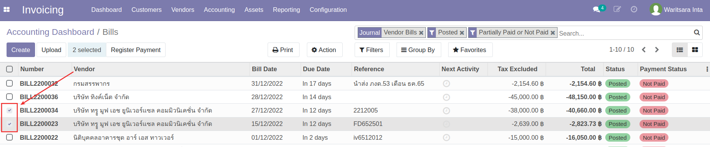

# กระบวนการการเงินบัญชี

## การตั้งเจ้าหนี้ (Vendor Bills)

### การตั้งเจ้าหนี้ (Vendor Bills) สกุลเงินบาทไทย

เมื่อได้รับเอกสารจัดซื้อและต้องการตั้งเจ้าหนี้ สามารถดำเนินการได้ดังนี้

**Menu:** Invoicing > Vendors > Bills

1. กดปุ่ม Create เพื่อสร้างเอกสาร Vendor Bill สถานะ Draft

2. กรอกข้อมูลที่ Header และตรวจสอบข้อมูลการตั้งเจ้าหนี้

    * Vendor: เลือกคู่ค้าที่ต้องการตั้งหนี้
    * Bill Reference: กรอกเลขที่เอกสารใบแจ้งหนี้จากคู่ค้าเพื่ออ้างอิง (ถ้ามี)
    * Auto-Complete: เลือกเลขที่ PO ที่เกี่ยวข้อง ระบจะช่วยดึงข้อมูลสินค้าที่จัดซื้อตามใบ PO นั้นๆมากรอกให้ในแท็บ Invoice Lines
    * Bill Date: วันที่ตามใบแจ้งหนี้
    * Accounting Date: ระบบเลือกให้เป็นวันที่ปัจจุบัน
    * Due Date: กำหนดการชำระเงิน สามารถเลือกเป็นระยะเวลาหรือระบุวันที่ได้ (หากมีการตั้งค่า Payment term ไว้ที่ข้อมูลหลัก Contacts ระบบจะช่วยดึงค่ามากรอกให้อัตโนมัติ)
    * ตรวจสอบข้อมูลที่แท็บ Invoice Line หากมีภาษีหัก ณ ที่จ่าย ให้เลือกประเภทหัก ณ ที่จ่ายในคอลัมน์ WHT 
3. กดปุ่ม Save เพื่อบันมึกข้อมูลและตรวจทานอีกครั้ง

    !!! Note
        กรณีมีภาษีมูลค่าเพิ่ม จะต้องกรอกข้อมูลใบกำกับภาษี โดย

        *   กดปุ่ม Edit 
        
        *   ไปที่แท็บ Tax Invoice เพื่อกรอกข้อมูลใบกำกับภาษี
        

4. กดปุ่ม Confirm เพื่อยืนยันการบันทึกค่าใช้จ่ายและตั้งเจ้าหนี้ สถานะเอกสารจะเปลี่ยนจาก Draft เป็น Posted และรอการทำจ่าย

### การตั้งเจ้าหนี้ (Vendor Bills) สกุลเงินต่างประเทศ

!!! Warning 
    ก่อนการตั้งเจ้าหนี้ ต้องแจ้งให้หัวหน้าการเงินบัญชีอัปเดตค่าเงินของวันที่ต้องการตั้งหนี้ก่อนเสมอ (คู่มือ Master Data > Currencies > การอัปเดตค่าเงิน)

การทำงานจะเหมือนขั้นตอนการบันทึกค่าใช้จ่ายและตั้งเจ้าหนี้ปกติ และเมื่อกดปุ่ม Confirm แล้ว
ที่แท็บ Journal Items จะทำการคำนวณตามเรทเงินของวันนั้นๆ เพื่อลงบันทึกบัญชี

---

## การบันทึกจ่ายชำระเงิน (Vendor Payment)

### การบันทึกจ่ายชำระเงิน (Vendor Payment)
เมื่อต้องการบันทึกจ่ายชำระเงิน สามารถดำเนินการได้ดังนี้

**Menu:** Invoicing > Vendors > Bills

1. กรองเอกสารที่รอทำจ่าย โดยไปที่ Filters และเลือกการกรอง Not Paid 

2. ทำเครื่องหมายด้านหน้าเอกสารที่ต้องการบันทึกจ่ายชำระ โดยสามารถเลือกเอกสารได้มากกว่า 1 รายการกรณีต้องการบันทึกจ่ายชำระหลายบิล (แต่ต้องเป็นบิลของคู่ค้ารายเดียวกัน) 

3. กดปุ่ม Register Payment 

4. ระบบแสดงหน้าต่างให้กรอกข้อมูลบันทึกจ่ายชำระเงิน ดังนี้

    * (1) กรอกข้อมูล
        * Journal: เลือก Journal ที่ต้องการบันทึกจ่ายชำระ
        * Recipient Bank Account: ระบบแสดงเลขบัญชีธนาคารของคู่ค้าให้ หากมีการตั้งค่าไว้ที่ ข้อมูล Contacts
        * Amount: กรอกจำนวนเงินที่จ่ายชำระตามจริง 
            * กรณียอดชำระจริง เท่ากับยอดที่ตั้งหนี้ ให้ข้ามไปทำข้อ (4)
            * กรณียอดชำระจริง แตกต่างจากยอดที่ตั้งหนี้ เช่น ค่าธรรมเนียม การหัก ณ ที่จ่าย เป็นต้น ให้ไปทำข้อ (2)
        * Payment Date: เลือกวันที่ ที่ได้ทำการจ่ายชำระเงิน
    * (2) กรณียอดชำระจริง แตกต่างจากยอดที่ตั้งหนี้ ระบบจะแสดงการดำเนินการให้เลือกดังนี้
        * Keep Open: คงค้างยอดเอาไว้ และไปทำข้อ (4)
        * Mark as fully paid: เลือกบันทึกบัญชียอด diff โดยเลือกบันทึกได้แค่ 1 บัญชี และไปทำข้อ (4)
        * Mark as fully paid (multi deduct): เลือกบันทึกบัญชียอด diff โดยสามารถเลือกบันทึกได้มากกว่า 1 บัญชี และไปทำข้อ (3)
    * (3) กรณีเลือก Mark as fully paid (multi deduct) กดปุ่ม Add a line เพื่อเลือกบัญชีที่ต้องการบันทึกยอด diff โดยสามารถกดเพิ่มบรรทัดรายการได้มากกว่า 1 บรรทัด
    * (4) กดปุ่ม Create Payment เพื่อยืนยันการบันทึกจ่ายชำระเงิน เมื่อกดเข้าไปดูเอกสาร จะมีคาดแแถบเขียวว่า Paid
    

!!! Info
    กรณีต้องการบันทึกการจ่ายชำระทีละใบ สามารถกดปุ่ม Register Payment ที่หน้าเอกสาร Vendor Bills ได้เช่นกัน
    

### การส่งอนุมัติจ่ายชำระเงิน

เมื่อทำบันทึกการจ่ายชำระแล้ว และต้องการส่งอนุมัติ สามารถดำเนินการได้ดังนี้

**Menu:** Invoicing > Vendors > Payments

1. เลือกรายการเอกสารที่ต้องการส่งอนุมัติ 

2. กดปุ่ม Request Validation เพื่อส่งอนุมัติตามลำดับ

    !!! Info
        * สามารถดูลำดับขั้นและสถานะการอนุมัติเอกสารได้ที่ Reviews ที่ด้านล่างของเอกสาร
        

3. เมื่ออนุมัติครบทุกลำดับขั้นแล้ว
    * ที่หน้า List view รายการเอกสารจะแสดงสีเขียว
    
    * ในหน้าเอกสาร จะคาดแถวสีเขียวว่า Approved
    

### การออกใบหัก ณ ที่ จ่าย

หากมีภาษีหัก ณ ที่จ่าย หลังจากทำ Register Payment แล้ว สามารถออกใบหัก ณ ที่จายได้ โดยมีขั้นตอนดังนี้

**Menu:** Invoicing > Vendors > Payments

1. เลือกรายการ Payment ที่ต้องการออกใบหัก ณ ที่จ่าย

2. กดปุ่ม Edit เพื่อกรอกประเภทของภาษีหัก ณ ที่จ่าย

3. เลือกประเภทของภาษีหัก ณ ที่จ่าย และกดปุ่ม Save เพื่อบันทึก

4. กด Create witholding tax cert. ที่แถบสีเหลืองด้านบนของเอกสาร เพื่อสร้างใบหัก ณ ที่จ่ายสถานะ Drat 

5. กด Show witholding tax certs เพื่อดูรายการใบหัก ณ ที่จ่าย

6. กดปุ่ม Edit

7. กรอกข้อมูล Income Tax Form และกดปุ่ม Save เพื่อบันทึกข้อมูล

8. หากข้อมูลถูกต้องเรียบร้อยแล้ว ให้กดปุ่ม Done สถานะเอกสารจะเปลี่ยนเป็น Done 

9. กดปุ่ม Print > WHT Certificates (pdf) เพื่อดาวน์โหลดฟอร์มในรูปแบบ pdf

10. ที่เอกสาร Payments จะมี Smart Button WHT Cert เกิดขึ้น

---

## การตั้งลูกหนี้ (Customer Invoice)
## การรับชำระเงิน (Customer Payment)
## การเบิกและบันทึกใช้เงินสดย่อย (Petty Cash)
## การจัดการสินทรัพย์ 
## การเรียกรายงาน
### รายงานภาษี
### Trial Balance
### General Ledger

!!! note
    xxx