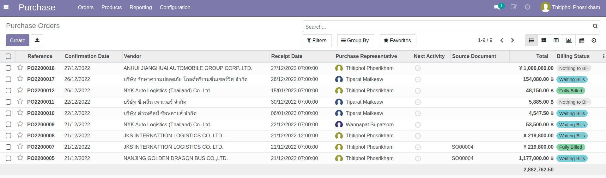
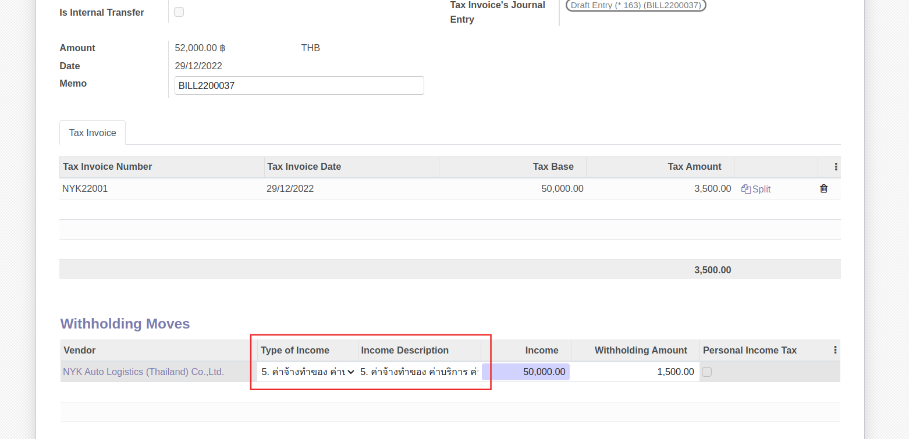
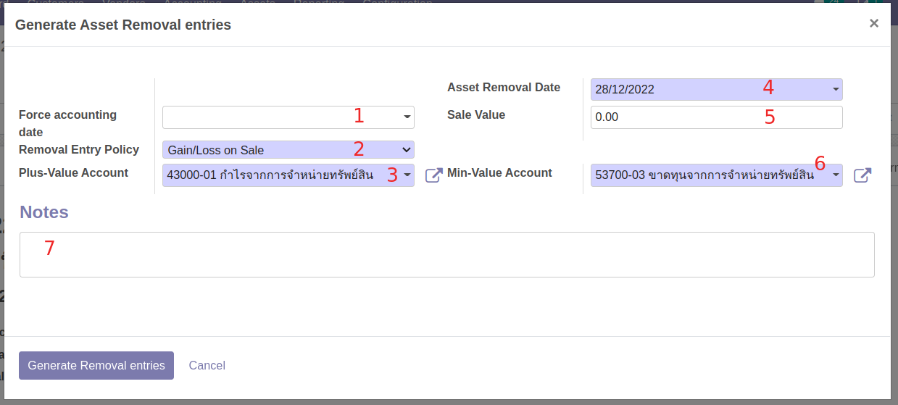
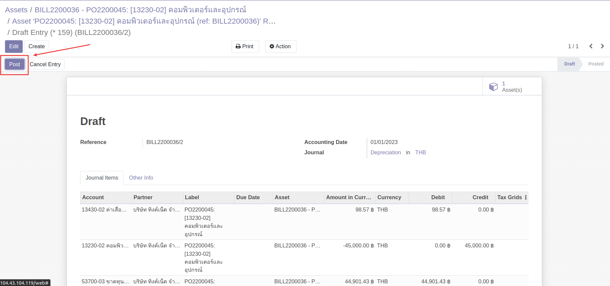

# กระบวนการบัญชีการเงิน

## การสร้างเอกสารจ่ายเงินมัดจำจาก PO (Draft)

หลังจาก PO ได้รับอนุมัติและต้องมีการจ่ายเงินมัดจำ สามารถดำเนินการได้ดังนี้

**Menu:** Purchase > Orders > Purchase Orders

1. ค้นหาและเลือกเอกสาร PO ที่ต้องการ

2. กดปุ่ม Register Deposit 

3. ระบบจะแสดงหน้าต่างและให้เลือกดำเนินการดังนี้ 
 
  * เลือกการสร้างบิลจ่ายเงินมัดจำ
    * Down Payment (percentage): สร้างบิลเงินมัดจำ โดยคำนวณจาก % ของยอดเต็ม 
    * Deposit Payment (fixed amount): สร้างบิลเงินมัดจำ โดยกรอกจำนวน 
  * เลือกการดำเนินการ
    * Create and View bills: สร้างบิลฉบับร่างและเรียกดู
    * Create deposit: สร้างบรรทัดรายการเงินมัดจำ แต่ไม่ต้องการสร้างบิล
    * Cancel: ยกเลิกการสร้างเอกสาร

---

## การตั้งเจ้าหนี้ (Vendor Bills)

### การตั้งเจ้าหนี้ (Vendor Bills) สกุลเงินบาทไทย (เพิ่ม Dashboard)

เมื่อต้องการตั้งเจ้าหนี้ สามารถดำเนินการได้ดังนี้ <สอนเข้าจากหน้า Dashboard>

**Menu:** Invoicing > Vendors > Bills

1. กดปุ่ม Create เพื่อสร้างเอกสาร Vendor Bill สถานะ Draft

2. กรอกข้อมูลที่ Header และตรวจสอบข้อมูลการตั้งเจ้าหนี้

    * Vendor: เลือกคู่ค้าที่ต้องการตั้งหนี้
    * Bill Reference: กรอกเลขที่เอกสารใบแจ้งหนี้จากคู่ค้าเพื่ออ้างอิง (ถ้ามี)
    * Auto-Complete: สามารถเลือกเลขที่ PO ที่เกี่ยวข้อง ระบจะช่วยดึงข้อมูลสินค้าที่จัดซื้อตามใบ PO นั้นๆมากรอกให้ในแท็บ Invoice Lines
    * Bill Date: วันที่ตามใบแจ้งหนี้
    * Accounting Date: วันที่บันทึกบัญชี  ระบบเลือกให้เป็นวันที่ปัจจุบัน
    * Due Date: กำหนดการชำระเงิน สามารถเลือกเป็นระยะเวลาหรือระบุวันที่ได้ (หากมีการตั้งค่า Payment term ไว้ที่ข้อมูลหลัก Contacts ระบบจะช่วยดึงค่ามากรอกให้อัตโนมัติ)
    * ที่แท็บ Invoice Line 
        * กรณีดึงข้อมูลจากใบ PO ตรวจสอบข้อมูล หากมีภาษีหัก ณ ที่จ่าย ให้เลือกประเภทหัก ณ ที่จ่ายในคอลัมน์ WHT
        * กรณีไม่ดึงข้อมูลจาก PO สามารถกรอกข้อมูลในแต่ละคอลัมน์ได้เลย

3. กดปุ่ม Save เพื่อบันทึกข้อมูลและตรวจทานอีกครั้ง

    !!! Note
        กรณีมีภาษีมูลค่าเพิ่ม จะต้องกรอกข้อมูลใบกำกับภาษี โดย

        *   กดปุ่ม Edit 
        
        *   ไปที่แท็บ Tax Invoice เพื่อกรอกข้อมูลใบกำกับภาษี
        

4. กดปุ่ม Confirm เพื่อยืนยันการบันทึกค่าใช้จ่ายและตั้งเจ้าหนี้ สถานะเอกสารจะเปลี่ยนจาก Draft เป็น Posted และเข้าสู่กระบวนการบันทึกจ่ายชำระเงินต่อไป

!!! Note
    หากเอกสาร Vendor Bills ดึงข้อมูลใบ PO ที่มีการจัดซื้อสินทรัพย์ (Asset) 
    ที่แท็บ Invoice Line > คอลัมน์ Asset Profile จะแสดงข้อมูล ตรวจสอบความถูกต้อง
    
    และเมื่อทำการตั้งเจ้าหนี้ ระบบจะสร้างข้อมูลสินทรัพย์ สถานะ Draft ให้อัตโนมัติ
    

### การตั้งเจ้าหนี้ (Vendor Bills) สกุลเงินต่างประเทศ

!!! Warning 
    ก่อนการตั้งเจ้าหนี้ ต้องแจ้งให้หัวหน้าการเงินบัญชีอัปเดตค่าเงินของวันที่ต้องการตั้งหนี้ก่อนเสมอ (คู่มือ Master Data > Currencies > การอัปเดตค่าเงิน)

การทำงานจะเหมือนขั้นตอนการบันทึกค่าใช้จ่ายและตั้งเจ้าหนี้ปกติและเมื่อกดปุ่ม Confirm แล้ว
ที่แท็บ Journal Items จะทำการคำนวณตามเรทเงินของวันนั้นๆ เพื่อลงบันทึกบัญชี

---

## การบันทึกจ่ายชำระเงิน (Vendor Payment)

### การบันทึกจ่ายชำระเงินสกุลเงินบาทไทย (Vendor Payment) 
เมื่อต้องการบันทึกจ่ายชำระเงิน สามารถดำเนินการได้ดังนี้

**Menu:** Invoicing > Vendors > Bills

1. กรองเอกสารที่รอทำจ่าย โดยไปที่ Filters และเลือกการกรอง Not Paid 

2. ทำเครื่องหมายด้านหน้าเอกสารที่ต้องการบันทึกจ่ายชำระ โดยสามารถเลือกเอกสารได้มากกว่า 1 รายการกรณีต้องการบันทึกจ่ายชำระหลายบิล (แต่ต้องเป็นบิลของคู่ค้ารายเดียวกัน) 

3. กดปุ่ม Register Payment 

4. ระบบแสดงหน้าต่างให้กรอกข้อมูลบันทึกจ่ายชำระเงิน ดังนี้

    * (1) กรอกข้อมูล
        * Journal: เลือก Journal ที่ต้องการบันทึกจ่ายชำระ
        * Recipient Bank Account: ระบบแสดงเลขบัญชีธนาคารของคู่ค้าให้ หากมีการตั้งค่าไว้ที่ ข้อมูล Contacts
        * Amount: กรอกจำนวนเงินที่จ่ายชำระตามจริง 
            * กรณียอดชำระจริง เท่ากับยอดที่ตั้งหนี้ ให้ข้ามไปทำข้อ (4)
            * กรณียอดชำระจริง แตกต่างจากยอดที่ตั้งหนี้ เช่น ค่าธรรมเนียม การหัก ณ ที่จ่าย เป็นต้น ให้ไปทำข้อ (2)
        * Payment Date: เลือกวันที่ ที่ได้ทำการจ่ายชำระเงิน
    * (2) กรณียอดชำระจริง แตกต่างจากยอดที่ตั้งหนี้ ระบบจะแสดงการดำเนินการให้เลือกดังนี้
        * Keep Open: คงค้างยอดเอาไว้ และไปทำข้อ (4)
        * Mark as fully paid: เลือกบันทึกบัญชียอด diff โดยเลือกบันทึกได้แค่ 1 บัญชี และไปทำข้อ (4)
        * Mark as fully paid (multi deduct): เลือกบันทึกบัญชียอด diff โดยสามารถเลือกบันทึกได้มากกว่า 1 บัญชี และไปทำข้อ (3)
    * (3) กรณีเลือก Mark as fully paid (multi deduct) กดปุ่ม Add a line เพื่อเลือกบัญชีที่ต้องการบันทึกยอด diff โดยสามารถกดเพิ่มบรรทัดรายการได้มากกว่า 1 บรรทัด
    * (4) กดปุ่ม Create Payment เพื่อยืนยันการบันทึกจ่ายชำระเงิน เมื่อกดเข้าไปดูเอกสาร จะมีคาดแแถบเขียวว่า Paid
    

5. ดูรายละเอียดการบันทึกบัญชีได้โดย

    * กดเครื่องหมาย i เพื่อแสดงหน้าต่างรายละเอียด
    * กดปุ่ม View เพื่อดูรายละเอียดมากขึ้น ระบบจะแสดงหน้าเอกสาร Payment (PV)

6. กดปุ่ม Smart Button "Journal Entries" เพื่อดูรายละเอียดการบันทึกบัญชี

!!! Info
    กรณีต้องการบันทึกการจ่ายชำระทีละใบ สามารถกดปุ่ม Register Payment ที่หน้าเอกสาร Vendor Bills ได้เช่นกัน
    

---

### การบันทึกจ่ายชำระเงินสกุลเงินต่างประเทศ (Vendor Payment) (Draft)

!!! Warning 
    ก่อนการบันทึกจ่ายชำระเงินสกุลเงินต่างประเทศ (Vendor Payment) ต้องแจ้งให้หัวหน้าการเงินบัญชีอัปเดตค่าเงินก่อนเสมอ (คู่มือ Master Data > Currencies > การอัปเดตค่าเงิน)

เมื่อต้องการบันทึกจ่ายชำระเงิน สามารถดำเนินการได้ดังนี้

**Menu:** Invoicing > Vendors > Bills

1. กรองเอกสารที่รอทำจ่าย โดยไปที่ Filters และเลือกการกรอง Not Paid 

2. ทำเครื่องหมายด้านหน้าเอกสารที่ต้องการบันทึกจ่ายชำระ โดยสามารถเลือกเอกสารได้มากกว่า 1 รายการกรณีต้องการบันทึกจ่ายชำระหลายบิล (แต่ต้องเป็นบิลของคู่ค้ารายเดียวกัน) 

3. กดปุ่ม Register Payment 

4. ระบบแสดงหน้าต่างให้กรอกข้อมูลบันทึกจ่ายชำระเงิน ดังนี้

    * (1) กรอกข้อมูล
        * Journal: เลือก Journal ที่ต้องการบันทึกจ่ายชำระสกุลเงินค่างประเทศ
        * Recipient Bank Account: ระบบแสดงเลขบัญชีธนาคารของคู่ค้าให้ หากมีการตั้งค่าไว้ที่ ข้อมูล Contacts
        * Amount: กรอกจำนวนเงินที่จ่ายชำระตามจริง 
            * กรณียอดชำระจริง เท่ากับยอดที่ตั้งหนี้ ให้ข้ามไปทำข้อ (4)
            * กรณียอดชำระจริง แตกต่างจากยอดที่ตั้งหนี้ เช่น ค่าธรรมเนียมการโอน กำไร/ขาดทุนจากอัตราแลกเปลี่ยน เป็นต้น ให้ไปทำข้อ (2)
        * Payment Date: เลือกวันที่ ที่ได้ทำการจ่ายชำระเงิน
    * (2) กรณียอดชำระจริง แตกต่างจากยอดที่ตั้งหนี้ ระบบจะแสดงการดำเนินการให้เลือกดังนี้
        * Keep Open: คงค้างยอดเอาไว้ และไปทำข้อ (4)
        * Mark as fully paid: เลือกบันทึกบัญชียอด diff โดยเลือกบันทึกได้แค่ 1 บัญชี และไปทำข้อ (4)
        * Mark as fully paid (multi deduct): เลือกบันทึกบัญชียอด diff โดยสามารถเลือกบันทึกได้มากกว่า 1 บัญชี และไปทำข้อ (3)
    * (3) กรณีเลือก Mark as fully paid (multi deduct) กดปุ่ม Add a line เพื่อเลือกบัญชีที่ต้องการบันทึกยอด diff โดยสามารถกดเพิ่มบรรทัดรายการได้มากกว่า 1 บรรทัด
    * (4) กดปุ่ม Create Payment เพื่อยืนยันการบันทึกจ่ายชำระเงิน เมื่อกดเข้าไปดูเอกสาร จะมีคาดแแถบเขียวว่า Paid
    (กรณีมียอดคงค้างจะแสดงแถบคาดสีเหลืองว่า Partial)
    

5. ดูรายละเอียดการบันทึกบัญชีได้โดย

    * กดเครื่องหมาย i เพื่อแสดงหน้าต่างรายละเอียด
    * กดปุ่ม View เพื่อดูรายละเอียดมากขึ้น ระบบจะแสดงหน้าเอกสาร Payment (PV)

6. กดปุ่ม Smart Button "Journal Entries" เพื่อดูรายละเอียดการบันทึกบัญชี

---

### การส่งอนุมัติจ่ายชำระเงิน

เมื่อทำบันทึกการจ่ายชำระแล้ว และต้องการส่งอนุมัติ สามารถดำเนินการได้ดังนี้

**Menu:** Invoicing > Vendors > Payments

1. เลือกรายการเอกสารที่ต้องการส่งอนุมัติ 

2. กดปุ่ม Request Validation เพื่อส่งอนุมัติตามลำดับ

    !!! Info
        * สามารถดูลำดับขั้นและสถานะการอนุมัติเอกสารได้ที่ Reviews ที่ด้านล่างของเอกสาร
        

3. เมื่ออนุมัติครบทุกลำดับขั้นแล้ว
    * ที่หน้า List view รายการเอกสารจะแสดงสีเขียว
    
    * ในหน้าเอกสาร จะคาดแถบสีเขียวว่า Approved
    

การเงินบัญชีก็จะไปทำการชำระเงินด้วยการโอน/เช็ค/เงินสดเป็นลำดับถัดไป

---

### การออกใบหัก ณ ที่ จ่าย

หากมีภาษีหัก ณ ที่จ่าย หลังจากทำ Register Payment แล้ว สามารถออกใบหัก ณ ที่จายได้ โดยมีขั้นตอนดังนี้

**Menu:** Invoicing > Vendors > Payments

1. เลือกรายการ Payment ที่ต้องการออกใบหัก ณ ที่จ่าย

2. กดปุ่ม Edit เพื่อกรอกประเภทของภาษีหัก ณ ที่จ่าย

3. เลือกประเภทของภาษีหัก ณ ที่จ่าย และกดปุ่ม Save เพื่อบันทึก

4. กด Create witholding tax cert. ที่แถบสีเหลืองด้านบนของเอกสาร เพื่อสร้างใบหัก ณ ที่จ่ายสถานะ Drat 

5. กด Show witholding tax certs เพื่อดูรายการใบหัก ณ ที่จ่าย

6. กดปุ่ม Edit

7. กรอกข้อมูล Income Tax Form และกดปุ่ม Save เพื่อบันทึกข้อมูล

8. หากข้อมูลถูกต้องเรียบร้อยแล้ว ให้กดปุ่ม Done สถานะเอกสารจะเปลี่ยนเป็น Done 

9. กดปุ่ม Print > WHT Certificates (pdf) เพื่อดาวน์โหลดฟอร์มในรูปแบบ pdf

10. ที่เอกสาร Payments จะมี Smart Button WHT Cert เกิดขึ้น

---

## การตั้งลูกหนี้ (Customer Invoice)

เมื่อต้องการตั้งลูกหนี้และออกบิลให้ลูกค้า สามารถดำเนินการได้ดังนี้

**Menu:** Sales > To Invoice > Orders to Invoice

1. ค้นหาและเลือกรายการที่ต้องการตั้งลูกหนี้

2. ตรวจสอบข้อมูล

    * (1) ที่แท็บ Order Lines
        * Quantity: จำนวนสินค้า ที่ลูกค้าสั่ง
        * Delivered: จำนวนสินค้า ที่ส่งให้ลูกค้า
        * Invoiced: จำนวนสินค้า ที่ออกบิลให้ลูกค้า

3. ระบบแสดงหน้าต่างให้เลือกดำเนินการ

    * (1) เลือกการออกบิล
        * Regular invoice: ออกบิลปกติ
        * Down Payment (percentage): ออกบิลเรียกเก็บเงินบางส่วน โดยคำนวณตาม % 
        * Down Payment (fixed amount): ออกบิลเรียกเก็บเงินบางส่วน โดยกรอกจำนวนที่ต้องการ
    * (2) Create and View Invoice เพื่อสร้างเอกสาร Customer Invoice ฉบับร่างและเรียกดูหน้าเอกสาร

4. ที่หน้าเอกสาร Customer Invoice กดปุ่ม Edit 

5. กรอกและตรวจสอบข้อมูล

    * (1) Invoice Date: เลือกวันที่ออกใบวางบิล
    * (2) ตรวจสอบข้อมูลรายการขายและภาษี
    * (3) กดปุ่ม Save เพื่อบันทึกข้อมูลและตรวจสอบอีกครั้ง

6. กดปุ่ม Confirm เพื่อยืนยันการบันทึกบัญชี สถานะเอกสารจะเปลี่ยนเป็น Posted

7. สามารถเลือกดาวน์โหลดเอกสาร Customer Invoice ได้ดังนี้

    * Send & Print: กรณีต้องการส่ง Invoice ทาง email และดาวน์โหลดไฟล์ pdf
    * กดปุ่ม Print: กรณีต้องการเลือกประเภทของเอกสารที่ต้องการดาวน์โหลด
        * Invoices
        * Delivery Note/Tax Invoice
        * Receipt/Tax Invoice

---

## การบันทึกรับชำระเงิน (Customer Payment)

**Menu:** Invoicing > Customers > Invoices

1. กรองเอกสารที่รอบันทึกรับชำระเงิน โดยไปที่ Filters และเลือกการกรอง Not Paid 

2. ทำเครื่องหมายด้านหน้าเอกสารที่ต้องการบันทึกรับชำระ โดยสามารถเลือกเอกสารได้มากกว่า 1 รายการ(แต่ต้องเป็นบิลของคู่ค้ารายเดียวกัน) 

3. กดปุ่ม Register Payment 

4. ระบบแสดงหน้าต่างให้กรอกข้อมูลบันทึกรับชำระเงิน ดังนี้

    * (1) กรอกข้อมูล
        * Journal: เลือก Journal ที่ต้องการบันทึก
        * Recipient Bank Account: แสดงเลขบัญชีธนาคารของบริษัทที่รับเงิน
        * Amount: กรอกจำนวนเงินที่รับชำระตามจริง 
            * กรณียอดรับชำระจริง เท่ากับยอดที่ตั้งลูกหนี้ ให้ข้ามไปทำข้อ (4)
            * กรณียอดชำระจริง แตกต่างจากยอดที่ตั้งลูกหนี้ ให้ไปทำข้อ (2)
        * Payment Date: เลือกวันที่ ที่ได้รับชำระเงิน
    * (2) กรณียอดรับชำระจริง แตกต่างจากยอดที่ตั้งลูกหนี้ไว้ ระบบจะแสดงการดำเนินการให้เลือกดังนี้
        * Keep Open: คงค้างยอดเอาไว้ และไปทำข้อ (4)
        * Mark as fully paid: เลือกบันทึกบัญชียอด diff โดยเลือกบันทึกได้แค่ 1 บัญชี และไปทำข้อ (4)
        * Mark as fully paid (multi deduct): เลือกบันทึกบัญชียอด diff โดยสามารถเลือกบันทึกได้มากกว่า 1 บัญชี และไปทำข้อ (3)
    * (3) กรณีเลือก Mark as fully paid (multi deduct) กดปุ่ม Add a line เพื่อเลือกบัญชีที่ต้องการบันทึกยอด diff โดยสามารถกดเพิ่มบรรทัดรายการได้มากกว่า 1 บรรทัด
    * (4) กดปุ่ม Create Payment เพื่อยืนยันการบันทึกจ่ายชำระเงิน เมื่อกดเข้าไปดูเอกสาร จะมีคาดแแถบเขียวว่า Paid (กรณีมียอดคงค้างจะแสดงแถบคาดสีเหลืองว่า Partial)
    

5. ดูรายละเอียดการบันทึกบัญชีได้โดย

    * กดเครื่องหมาย i เพื่อแสดงหน้าต่างรายละเอียด
    * กดปุ่ม View เพื่อดูรายละเอียดมากขึ้น ระบบจะแสดงหน้าเอกสาร Payment (RE)

6. กดปุ่ม Smart Button "Journal Entries" เพื่อดูรายละเอียดการบันทึกบัญชี

---

## การเบิกและบันทึกใช้เงินสดย่อย (Petty Cash)

### การเบิกจ่ายวงเงิน Petty Cash ครั้งแรก

เมื่อต้องการเบิกจ่ายหรือเติมวงเงิน Petty Cash สามารถดำเนินการตามขั้นตอนดังนี้

**Menu:** Invoicing > Vendors > Bills

1. กดปุ่ม Create เพื่อสร้างเอกสาร Vendor Bill สถานะ Draft

2. กรอกข้อมูลที่ Header 

    * Vendor: เลือกชื่อผู้ถือวงเงิน Petty Cash
    * Bill Date: วันที่ตั้งเจ้าหนี้
    * Accounting Date: วันที่บันทึกบัญชี ระบบเลือกให้เป็นวันที่ปัจจุบัน
    * Due Date: กำหนดการชำระเงิน สามารถเลือกเป็นระยะเวลาหรือระบุวันที่ได้ (หากมีการตั้งค่า Payment term ไว้ที่ข้อมูลหลัก Contacts ระบบจะช่วยดึงค่ามากรอกให้อัตโนมัติ)

3. ที่เแท็บ Invoice Lines
 
    * Label: กรอก Petty Cash
    * Account: เลือกบัญชีบันทึก Petty Cash
    * Price: จำนวนเงิน

4. กดปุ่ม Save เพื่อบันมึกข้อมูลและตรวจทานอีกครั้ง

5. กดปุ่ม Confirm เพื่อยืนยันการบันทึกค่าใช้จ่ายและตั้งเจ้าหนี้ สถานะเอกสารจะเปลี่ยนจาก Draft เป็น Posted

และเข้าสู่กระบวนการบันทึกจ่ายชำระเงินต่อไป

---
### การบันทึกการใช้ Petty Cash

เมื่อไดรับเงิน Petty Cash แล้วและมีการนำไปใช้จ่ายในแต่ละเดือน หากถึงกำหนดจะต้องนำมาบันทึกการใช้ Petty Cash โดยมีขั้นตอนดังนี้

**Menu:** Invoicing > Vendors > Bills

1. กดปุ่ม Create เพื่อสร้างเอกสาร Vendor Bill สถานะ Draft

2. กรอกข้อมูลที่ Header 

    * Vendor: เลือกชื่อผู้ถือวงเงิน Petty Cash
    * Bill Date: วันที่ตั้งเจ้าหนี้
    * Accounting Date: วันที่บันทึกบัญชี ระบบเลือกให้เป็นวันที่ปัจจุบัน
    * Due Date: กำหนดการชำระเงิน สามารถเลือกเป็นระยะเวลาหรือระบุวันที่ได้ (หากมีการตั้งค่า Payment term ไว้ที่ข้อมูลหลัก Contacts ระบบจะช่วยดึงค่ามากรอกให้อัตโนมัติ)

3. ที่เแท็บ Invoice Lines
 
    * Add a Line บรรทัดที่ 1
        * Label: กรอก Petty Cash
        * Account: เลือกบัญชีบันทึก Petty Cash
        * Price: จำนวนเงิน (ติดลบ)
    * Add a Line บรรทัดอื่นๆ
        * Label: กรอกรายละเอียดค่าใช้จ่าย
        * Account: เลือกบัญชีที่จะบันทึก
        * Price: จำนวนเงินที่ใช้ 
    * Total ต้องเท่ากับ 0

4. กดปุ่ม Save เพื่อบันทึกข้อมูลและตรวจทานอีกครั้ง

5. กดปุ่ม Confirm เพื่อยืนยันการบันทึกค่าใช้จ่าย สถานะเอกสารจะเปลี่ยนจาก Draft เป็น Posted และมีแถบสีเขียวว่า Paid

!!! Note 
    เมื่อดูรายงาน Invocing > Accounting > General Ledger จะเห็นยอดคงเหลือของ Petty Cash ที่คอลัมน์ Balance
    

---

### การเติมวงเงิน Petty Cash

!!! Note
    ก่อนการทำเอกสาร Vendor Bills
    สามารถเปิดรายงาน Invocing > Accounting > General Ledger ดูยอดคงเหลือที่คอลัมน์ Balance เพื่อคิดจำนวนเงินที่ต้องการเติมได้
    

**Menu:** Invoicing > Vendors > Bills

1. กดปุ่ม Create เพื่อสร้างเอกสาร Vendor Bill สถานะ Draft

2. กรอกข้อมูลที่ Header 

    * Vendor: เลือกชื่อผู้ถือวงเงิน Petty Cash
    * Bill Date: วันที่ตั้งเจ้าหนี้
    * Accounting Date: วันที่บันทึกบัญชี ระบบเลือกให้เป็นวันที่ปัจจุบัน
    * Due Date: กำหนดการชำระเงิน สามารถเลือกเป็นระยะเวลาหรือระบุวันที่ได้ (หากมีการตั้งค่า Payment term ไว้ที่ข้อมูลหลัก Contacts ระบบจะช่วยดึงค่ามากรอกให้อัตโนมัติ)

3. ที่เแท็บ Invoice Lines
 
    * Label: กรอก Petty Cash
    * Account: เลือกบัญชีบันทึก Petty Cash
    * Price: จำนวนเงินที่ต้องการเติม

4. กดปุ่ม Save เพื่อบันทึกข้อมูลและตรวจทานอีกครั้ง

5. กดปุ่ม Confirm เพื่อยืนยันการบันทึกค่าใช้จ่ายและตั้งเจ้าหนี้ สถานะเอกสารจะเปลี่ยนจาก Draft เป็น Posted

และเข้าสู่กระบวนการบันทึกจ่ายชำระเงินต่อไป

!!! Note 
    เมื่อบันทึกจ่ายชำระเงินแล้ว และเปิดรายงาน Invocing > Accounting > General Ledger จะเห็นยอดเงิน Petty Cash ที่คอลัมน์ Balance ถูกเติมวงเงินแล้ว
    

---

## Clear Undue Vat 

---

## การจัดการสินทรัพย์ 

### การขึ้นทะเบียนสินทรัพย์

เมื่อมีการจัดซื้อสินทรัพย์และทำการตั้งหนี้แล้ว ระบบจะสร้างข้อมูลสินทรัพย์ สถานะ Draft ให้อัตโนมัติ สามารถดูข้อมูลสินทรัพย์ได้จากปุ่ม Smart Button "Asset" หน้า Invoice หรือดำเนินการดังนี้

**Menu:** Invoicing > Assets > Assets

1. เลือก Filter เป็น Draft เพื่อกรองการค้นหารายการสินทรัพย์ที่ยังมีสถานะเป็น Draft 

2. เลือกรายการสินทรัพย์ที่ต้องการตรวจสอบข้อมูล

3. กดปุ่ม Edit 

4. ที่ช่อง Salvage Value กรอกราคาซาก และตรวจสอบรายละเอียดอื่นๆของข้อมูลสินทรัพย์

5. กดปุ่ม Save เพื่อบันทึกข้อมูลและตรวจสอบข้อมูลอีกครั้ง หากต้องการแก้ไขสามารถกดปุ่ม Edit เพื่อแก้ไขได้

6. เมื่อข้อมูลถูกต้องเรียบร้อยแล้ว กดปุ่ม Confirm Asset เพื่อยืนยันการสร้างทะเบียนสินทรัพย์

7. สถานะ Asset จะเปลี่ยนนเป็น Running และระบบจะสร้างเลขทะเบียนสินทรัพย์ให้

8. ที่แท็บ Depreciation Board ระบบจะสร้างตารางการคิดค่าเสื่อมไว้ให้

---

### การบันทึกค่าเสื่อมราคา

เมื่อต้องการบันทึกค่าเสื่อมราคา แบบทีละหลายรายการ สามารถทำได้โดยมีขั้นตอนดังนี้

**Menu:** Invoicing > Assets > Compute Asset Batch

1. กดปุ่ม Create เพื่อสร้างเอกสาร

2. กรอกข้อมูลการบันทึกค่าเสื่อมราคา

    * (1) ชื่อเอกสาร Batch Name 
    * (2) Description: คําอธิบายรายการ
    * (3) Date: วันที่สุดท้ายที่ต้องการคิดค่าเสื่อม โดยระบบจะลงบันทึกค่าเสื่อมของวันที่ก่อนหน้า
    จนถึงวันที่ที่เลือก และจะเป็นวันที่ที่บันทึกบัญชี (Accounting date)
    * (4) Auto Compute: หากทำเครื่องหมายในช่อง ระบบจะคํานวณค่าเสื่อมให้อัตโนมัติเมื่อวันที่ตั้งตั้ค่าไว้ในข้อ 3
    * (5) Delay Posting: หากทำเครื่องหมายในช่อง ระบบจะสร้าง Voucher ที่มีสถานะเป็น Draft ไว้ให้ และบันทึกบัญชีให้เมื่อถึงวันที่กําหนด
    * (6) Profiles: เลือกหมวดหมู่ครุภัณฑ์ที่ต้องการบันทึกค่าเสื่อมราคา หากต้องการบันทึกค่าเสื่อมราคาของทุก Asset Profile ไม่ต้องกรอกข้อมูลส่วนนี้

3. กดปุ่ม Save เพื่อบันทึกข้อมูล และตรวจสอบอีกครั้ง หากต้องการแก้ไขสามารถกดปุ่ม Edit ได้

4. กดปุ่ม Compute เพื่อให้ระบบคำนวณและบันทึกค่าเสื่อมราคา สถานะเอกสารจะเปลี่ยนเป็น Computed

5. ที่แท็บ Depreciation By Profile จะแสดงรายการ Asset Profile ที่ทำการบันทึกค่าเสื่อมราคา

6. สามารถดูการบันทึกบัญชี ได้ที่ปุ่ม Smart Button "Journal Entries" หรือ "Depreciations"

7. เมื่อเปิดดูข้อมูลสินทรัพย์ที่อยู่ภายใต้ Asset Profile นั้นๆ ที่แท็บ Depreciation Board จะเห็นบรรทัดรายการเป็นสีดำ

---

### การตัดจำหน่ายสินทรัพย์

เมื่อต้องการตัดจำหน่ายสินทรัพย์ สามารถดำเนินการได้ดังนี้

**Menu:** Invoicing > Assets > Assets

1. ค้นหาสินทรัพย์ที่ต้องการตัดจำหน่าย ด้วยเลขทะเบียนสินทรัพย์ หรือชื่อสินทรัพย์

2. กดเลือกรายการสินทรัพย์ที่ต้องการตัดจำหน่าย

3. กดปุ่ม Remove ระบบจะแสดงหน้าต่างการ Remove Asset ให้กรอกข้อมูลดังนี้

    * กรณีตัดจำหน่ายจากการขาย
    

        * (1) Force Accounting Date: วันที่ในการลงบันทึกบัญชี
        * (2) Removal Entry Policy: วิธีการตัดจำหน่าย ให้เลือก Gain/Loss on Sale
        * (3) Plus- Value Account: ลงบันทึกบัญชีกําไรจากการขายสินทรัพย์
        * (4) Asset Removal Date: วันที่ตัดจําหน่าย
        * (5) Sale Value: กรอกราคาที่ขาย
        * (6) Min- Value Account: ลงบันทึกบัญชีขาดทุนจากการขายสินทรัพย์
        * (7) Note: บันทึกข้อความเพิ่มเติม (ถ้ามี)
        
    * กรณีตัดจำหน่ายจากบริจาคหรือทิ้ง
    

        * (1) Force Accounting Date: วันที่ในการลงบันทึกบัญชี
        * (2) Removal Entry Policy: วิธีการตัดจำหน่าย ให้เลือก Residual Value
        * (3) Residual Value Account: บัญชีที่ต้องการลงส่วนต่างระหว่างราคาทุนและค่าเสื่อมสะสม
        * (4) Asset Removal Date: วันที่ตัดจําหน่าย
        * (5) Note: บันทึกข้อความเพิ่มเติม (ถ้ามี)

4. ตรวจสอบข้อมูล และเลือกดำเนินการ

    * กดปุ่ม Generate Removal Entries เพื่อยืนยันการบันทึกบัญชีการตัดจำหน่ายสินทรัพย์ สถานะจะเปลี่ยนเป็น Removed 
    * กด Cancel เพื่อยกเลิกการตัดจำหน่าย

5. เมื่อกดปุ่ม Generate Removal Entries แล้ว ระบบจะสร้าง Journal Entries สถานะ Draft กดเพื่อเปิดเอกสาร

6. ตรวจสอบข้อมูลการบันทึกบัญชี และกดปุ่ม Post เพื่อยืนยัน สถานะเอกสารจะเปลี่ยนเป็น Posted

---
## การปิดบัญชี

### การปรับปรุงบัญชี

## การเรียกรายงาน
### Asset registration ทะเบียนทรัพย์สิน
### General Ledger รายงานบัญชีแยกประเภท
### Trial Balance (TB) งบทดลอง
### Open Item รายการคงค้าง
### MIS report: Balance Sheet (BS) and Profit & Loss (PL)
### Aged Partner Balance รายงานอายุลูกหนี้/เจ้าหนี้

!!! note
    xxx