# การเรียกรายงานทางบัญชี

## General Ledger รายงานบัญชีแยกประเภท

**Menu:** Invoicing > Reporting > General Ledger

เมื่อกดที่เมนู General Ledger ระบบจะแสดงหน้าต่าง

1. กรอกข้อมูลเพื่อเรียกรายงาน
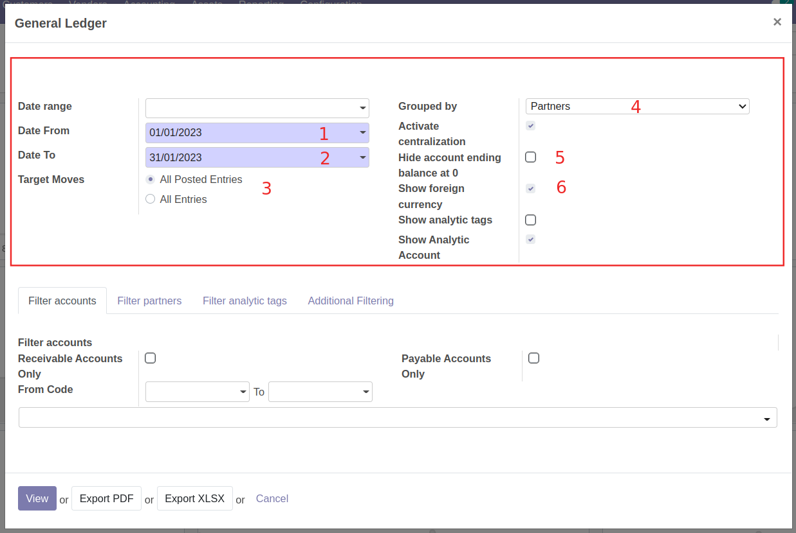

    * (1) Date From: วันที่เริ่มต้นของการเรียกบัญชีแยกประเภท
    * (2) Date To: วันที่สิ้นสุดของการเรียกบัญชีแยกประเภท
    * (3) Target Moves: 
        * All Posted Entry เฉพาะรายการที่ลงบัญชีแล้ว
        * All Entries ทุกรายการ
    * (4) Grouped by: การจัดกลุ่มรายการเพื่ออกรายงาน ระบบแสดง Partner เป็นค่าเริ่มต้น
    * (5) Hide account ending balance at 0: ทำเครื่องหมาย หากต้องการซ่อนบัญชีที่มียอดคงเหลือเป็น 0
    * (6) Show foreign currency: ทำเครื่องหมาย หากต้องการแสดงรายการสกุลเงินต่างประเทศ กรณีมีการบันทึกเป็นสกุลเงินต่างประเทศ
    
2. แท็บกรองข้อมูลการออกรายงาน สามารถเลือกกรองได้ดังนี้
    * Filter accounts เลือกกรองบัญชีที่ต้องการออกรายงาน 
    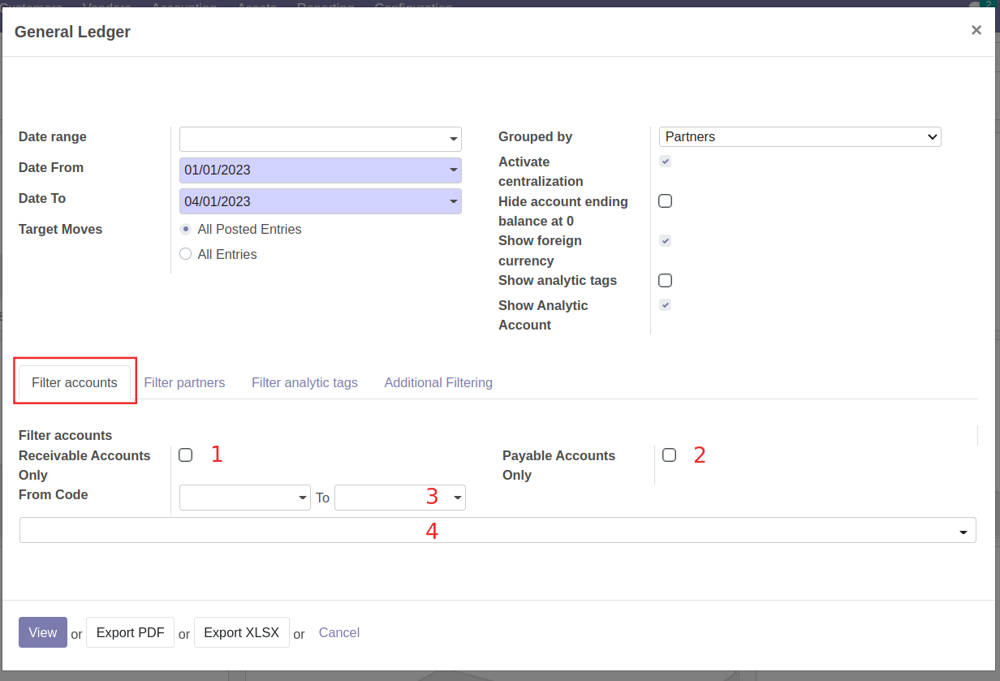

        * (1) Receivable Accounts Only: ทำเครื่องหมาย เมื่อต้องการออกรายงานบัญชีลูกหนี้
        * (2) Payable Accounts Only: ทำเครื่องหมาย เมื่อต้องการออกรายงานบัญชีเจ้าหนี้
        * (3) From Code .. to .. : เลือกช่วงรหัสบัญชีที่ต้องการออกรายงาน
        * (4) ค้นหาเลขที่บัญชีที่ต้องการออกรายงาน โดยสามารถเลือกได้มากกว่า 1 บัญชี สามารถกดปุ่มกากบาทเพื่อลบรายการได้
    
    * Filter partners เลือกกรองคู่ค้าที่ต้องการออกรายงาน
    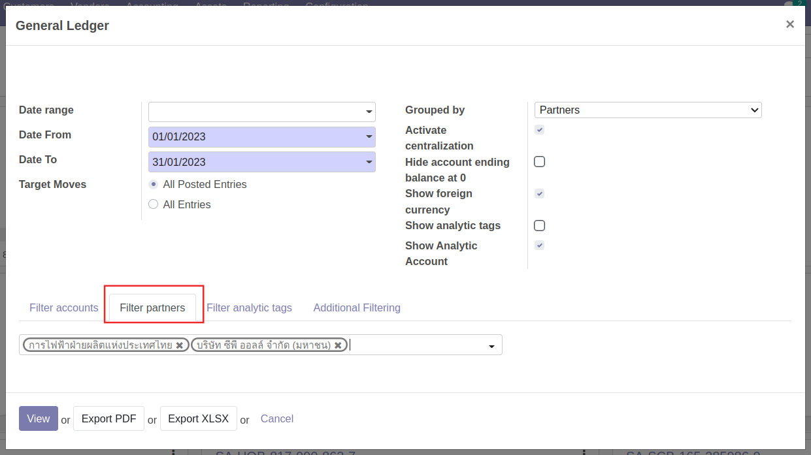
        
        * ค้นหาและเลือกคู่ค้าที่ต้องการออกรายงาน โดยสามารถเลือกได้มากกว่า 1 รายการ สามารถกดปุ่มกากบาทเพื่อลบรายการได้

3. เลือกวิธีการดูรายงาน

    * View: เพื่อดูรายงานในระบบ
    * Export PDF: ระบบจะออกรายงานเป็น PDF File
    * Export XLSX: ระบบจะออกรายงานเป็น Excel file
    * Cancel: ยกเลิกการเรียกดูรายงาน

!!! Note 
    หากต้องการดูรายงานบัญชีแยกประเภท (General Ledger) บนระบบ 
    สามารถดูรายงานได้อีกช่องทาง คือ ที่เมนู Invoicing > Accounting > General Ledger หรือ Partner Ledger
    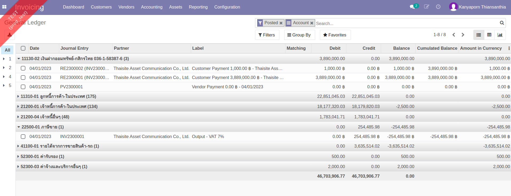

---

## Trial Balance (TB) งบทดลอง

**Menu:** Invoicing > Reporting > Trial Balance

เมื่อกดที่เมนู Trial Balance ระบบจะแสดงหน้าต่างเงื่อนไขการเรียกรายงาน

1. กรอกข้อมูลเพื่อเรียกรายงาน
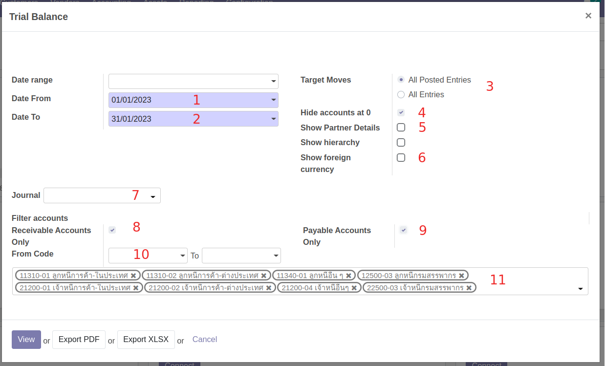
    
    * (1) Date From: วันที่เริ่มต้นรายงาน
    * (2) Date To: วันที่สิ้นสุดรายงาน
    * (3) Target moves:
        * All Posted Entry เฉพาะรายการที่ลงบัญชีแล้ว
        * All Entries ทุกรายการ
    * (4) Hide accounts at 0: ทำเครื่องหมาย หากต้องการซ่อนบัญชีที่มียอดคงเหลือเป็น 0
    * (5) Show Partner Details: ทำเครื่องหมาย หากต้องการดูบัญชีที่เป็นเจ้าหนี้และลูกหนี้
    * (6) Show foreign currency: ทำเครื่องหมาย หากต้องการแสดงรายการสกุลเงินต่างประเทศ กรณีมีการบันทึกเป็นสกุลเงินต่างประเทศ
    * (7) Journal: กรองประเภทของสมุดรายวัน
    * (8) Receiveable accounts: ทำเครื่องหมาย เมื่อต้องการออกรายงานบัญชีลูกหนี้
    * (9) Payable accounts: ทำเครื่องหมาย เมื่อต้องการออกรายงานบัญชีเจ้าหนี้
    * (10) From Code .. to .. : เลือกช่วงรหัสบัญชีที่ต้องการออกรายงาน
    * (11) ค้นหาเลขที่บัญชีที่ต้องการออกรายงาน โดยสามารถเลือกได้มากกว่า 1 บัญชี สามารถกดปุ่มกากบาทเพื่อลบรายการได้

2. เลือกวิธีการดูรายงาน
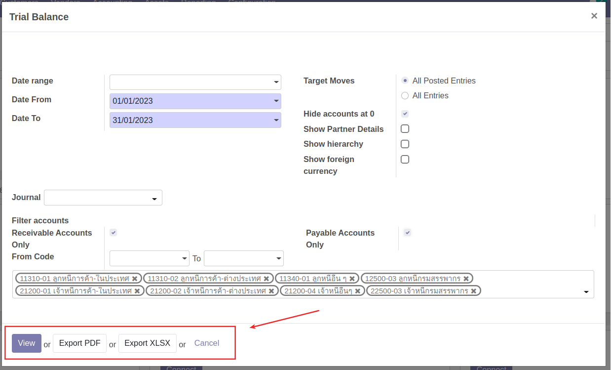

    * View: เพื่อดูรายงานในระบบ
    * Export PDF: ระบบจะออกรายงานเป็น PDF File
    * Export XLSX: ระบบจะออกรายงานเป็น Excel file
    * Cancel: ยกเลิกการเรียกดูรายงาน

---

## Open Item รายการคงค้าง

**Menu:** Invoicing > Reporting > Open Items

เมื่อกดที่เมนู Open Items ระบบจะแสดงหน้าต่างเงื่อนไขการเรียกรายงาน

1. กรอกข้อมูลเพื่อเรียกรายงาน
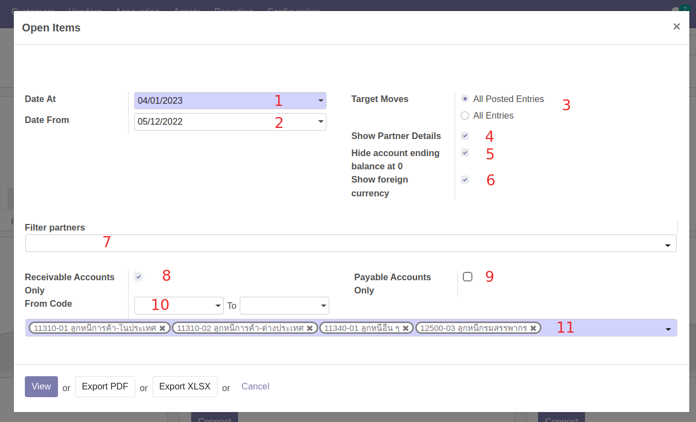

    * (1) Date At: วันที่สิ้นสุดรายงาน
    * (2) Date From: วันที่เริ่มต้นรายงาน
    * (3) Target moves:
        * All Posted Entry เฉพาะรายการที่ลงบัญชีแล้ว
        * All Entries ทุกรายการ
    * (4) Show Partner Details: ทำเครื่องหมาย หากต้องการดูบัญชีที่เป็นเจ้าหนี้และลูกหนี้
    * (5) Hide accounts at 0: ทำเครื่องหมาย หากต้องการซ่อนบัญชีที่มียอดคงเหลือเป็น 0
    * (6) Show foreign currency: ทำเครื่องหมาย หากต้องการแสดงรายการสกุลเงินต่างประเทศ กรณีมีการบันทึกเป็นสกุลเงินต่างประเทศ
    * (7) Filter partners: เลือกกรองชื่อคู่ค้าที่ต้องการออกรายงาน
    * (8) Receiveable accounts: ทำเครื่องหมาย เมื่อต้องการออกรายงานบัญชีลูกหนี้
    * (9) Payable accounts: ทำเครื่องหมาย เมื่อต้องการออกรายงานบัญชีเจ้าหนี้
    * (10) From Code .. to .. : เลือกช่วงรหัสบัญชีที่ต้องการออกรายงาน
    * (11) ค้นหาเลขที่บัญชีที่ต้องการออกรายงาน โดยสามารถเลือกได้มากกว่า 1 บัญชี สามารถกดปุ่มกากบาทเพื่อลบรายการได้

2. เลือกวิธีการดูรายงาน
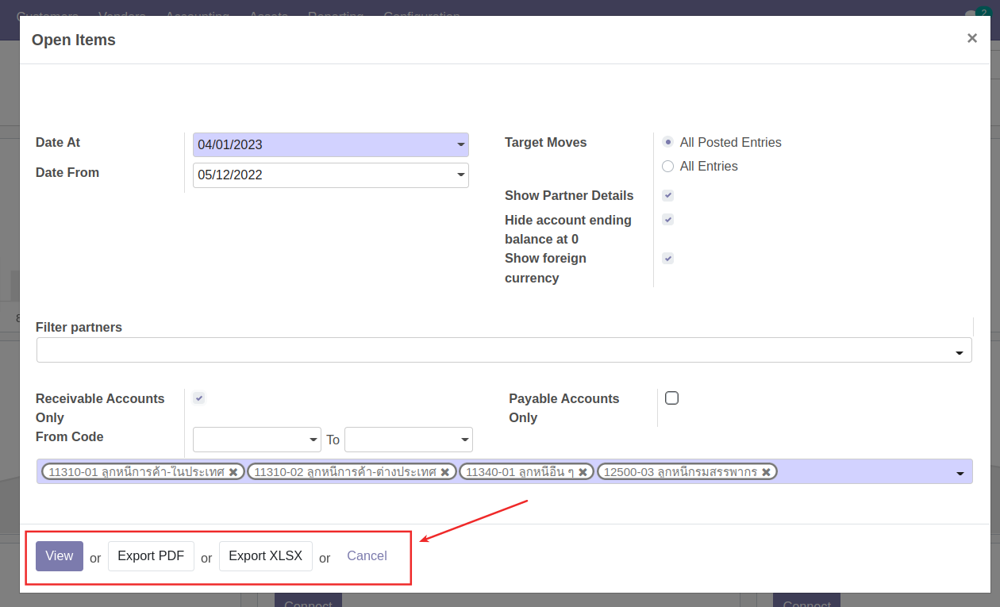

    * View: เพื่อดูรายงานในระบบ
    * Export PDF: ระบบจะออกรายงานเป็น PDF File
    * Export XLSX: ระบบจะออกรายงานเป็น Excel file
    * Cancel: ยกเลิกการเรียกดูรายงาน

---

## MIS report

**Menu:** Invoicing > Reporting > MIS report

ที่เมนู MIS Report สามารถเรียกดูรายงานได้ ดังนี้ 

* Balance Sheet (BS) งบแสดงฐานะทางการเงิน
* Profit & Loss (PL) งบกำไรขาดทุน

โดยสามารถเรียกดูรายงานโดยมีขั้นตอนดังนี้

1. กดปุ่ม Create เพื่อสร้างเอกสารการเรียกรายงาน
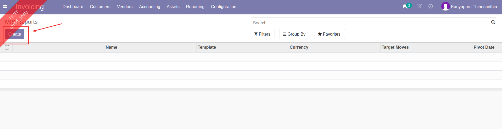

2. กรอกข้อมูลเพื่อเรียกรายงาน
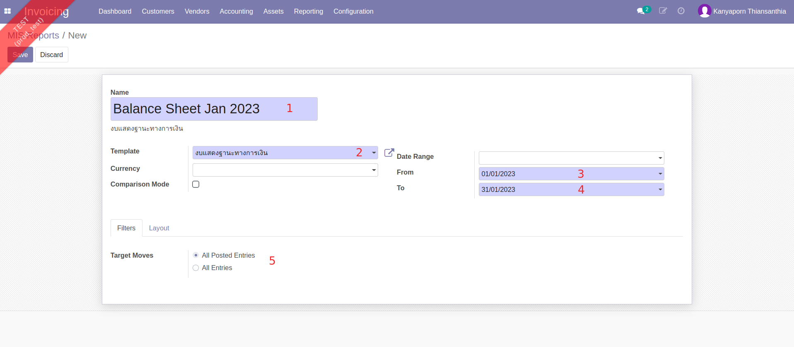

    * (1) Name: ตั้งชื่อรายงาน
    * (2) Template: เลือกรูปแบบรายงานที่ต้องการเรียกดู
        * งบแสดงฐานะทางการเงิน
        * งบกำไรขาดทุน
    * (3) Date From: วันที่เริ่มต้นรายงาน
    * (4) Date To: วันที่สิ้นสุดรายงาน
    * (5) แท็บ Filters เลือก Target Moves
        * All Posted Entry เฉพาะรายการที่ลงบัญชีแล้ว
        * All Entries ทุกรายการ

3. ตรวจทานข้อมูลการเรียกรายงาน และกดปุ่ม Save เพื่อบันทึก
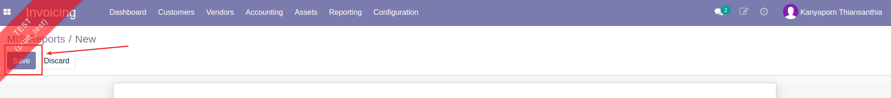

4. เลือกวิธีเรียกดูรายงาน
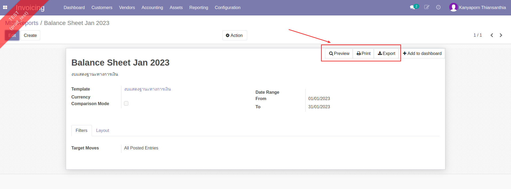
    
    * Preview: แสดงหน้ารายงานในระบบ โดยสามารถกดที่ตัวเลขเพื่อดูรายละเอียดรายการที่เกี่ยวข้องได้
    * Print: ดาวน์โหลดรายงาน ในรูปแบบไฟล์ PDF
    * Export: ดาวน์โหลดรายงาน ในรูปแบบไฟล์ Excel

---

## Aged Partner Balance รายงานอายุลูกหนี้/เจ้าหนี้

**Menu:** Invoicing > Reporting > Aged Partner Balance

เมื่อกดที่เมนู Aged Partner Balance ระบบจะแสดงหน้าต่างเงื่อนไขการเรียกรายงาน

1. กรอกข้อมูลเพื่อเรียกรายงาน
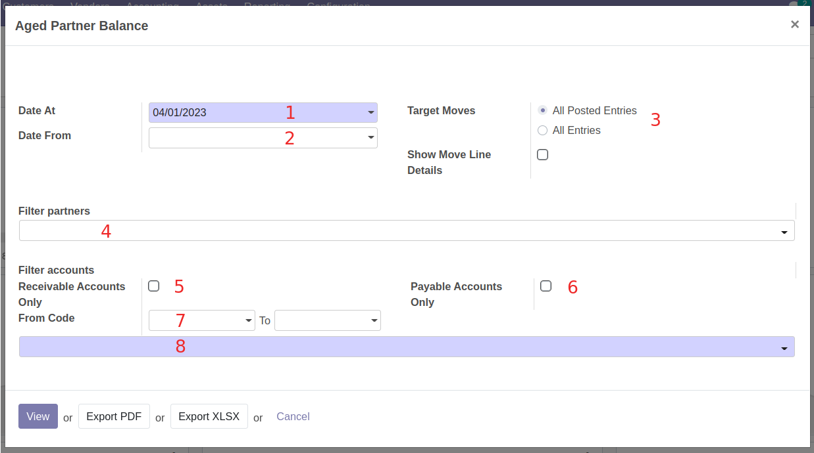

    * (1) Date At: วันที่สิ้นสุดรายงาน
    * (2) Date From: วันที่เริ่มต้นรายงาน
    * (3) Target moves:
        * All Posted Entry เฉพาะรายการที่ลงบัญชีแล้ว
        * All Entries ทุกรายการ
    * (4) Filter partners: เลือกกรองชื่อคู่ค้าที่ต้องการออกรายงาน
    * (5) Receiveable accounts: ทำเครื่องหมาย เมื่อต้องการออกรายงานบัญชีลูกหนี้
    * (6) Payable accounts: ทำเครื่องหมาย เมื่อต้องการออกรายงานบัญชีเจ้าหนี้
    * (7) From Code .. to .. : เลือกช่วงรหัสบัญชีที่ต้องการออกรายงาน
    * (8) ค้นหาเลขที่บัญชีที่ต้องการออกรายงาน โดยสามารถเลือกได้มากกว่า 1 บัญชี สามารถกดปุ่มกากบาทเพื่อลบรายการได้

2. เลือกวิธีการดูรายงาน
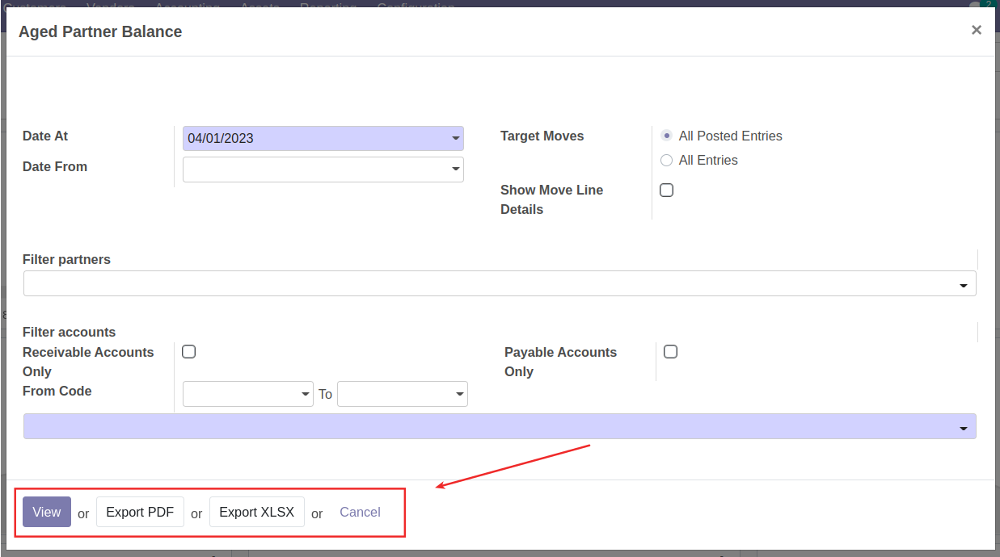

    * View: เพื่อดูรายงานในระบบ
    * Export PDF: ระบบจะออกรายงานเป็น PDF File
    * Export XLSX: ระบบจะออกรายงานเป็น Excel file
    * Cancel: ยกเลิกการเรียกดูรายงาน

---