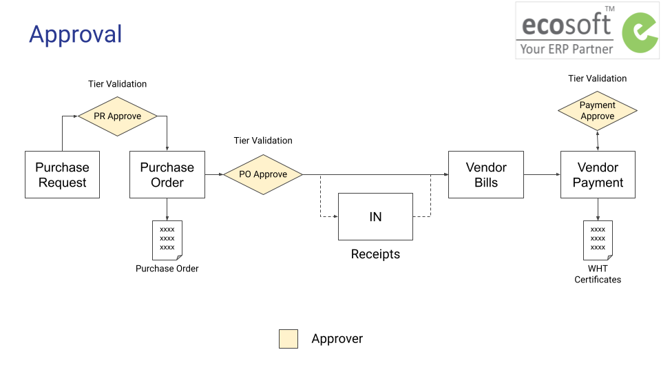

# ภาพรวมการอนุมัติเอกสาร

## เอกสารที่ต้องผ่านการอนุมัติ

การอนุมัติเอกสารของบริษัทฯ มีดังนี้

1. การอนุมัติใบขอซื้อ (PR Approve)
2. การอนุมัติจัดซื้อ (PO Approve)
3. การอนุมัติจ่ายเงิน (Payment Approve)

## ลำดับขั้นการอนุมัติเอกสาร
| เอกสาร | อนุมัติขั้นที่ 1 | อนุมัติขั้นที่ 2 |วงเงินการอนุมัติ |
| ------ | --------- |--------- |--------- |
| PR       | Manager | Director |-|
| PO       | Manager Purchase (คุณตุ๊ก) |Director Purchase (คุณโจ)|ไม่เกิน 100,000 บาท|
||Manager Purchase (คุณตุ๊ก)|KK (คุณกิตติกรณ์)|ตั้งแต่ 100,001 บาทขึ้นไป|
| ใบสำคัญจ่าย |Manager (คุณเก๋)|Director (คุณตุ๊กตา)|ไม่เกิน 50,000 บาท|
||Director (คุณตุ๊กตา)|CFO (คุณตุ๊กตา)|50,000 - 100,000 บาท|
||CFO (คุณตุ๊กตา)|KK (คุณกิตติกรณ์)|ตั้งแต่ 100,001 บาทขึ้นไป|

End.
