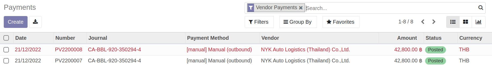

# การอนุมัติเอกสาร

## การอนุมัติการขอซื้อ (PR Approve)
หลังจากผู้ขอซื้อทำใบ PR และกดปุ่ม Request Validation แล้ว
เอกสารจะถูกส่งมาให้ผู้อนุมัติ โดยผู้อนุมัติสามารถดำเนินการได้ ดังนี้

1. ที่ไอคอน Reviews จะมีแจ้งจำนวนเอกสารที่รอการอนุมัติ กดเลือกเอกสาร Purchase Request

2. ระบบแสดงรายการเอกสาร PR ที่รอการอนุมัติ 

3. เลือกเอกสารที่ต้องการ ตรวจสอบและสามารถดำเนินการได้ ดังนี้

    * เลือก Validate พร้อมระบุเหตุผล: หากต้องการอนุมัติเอกสารใบนี้ สถานะเอกสารจะเปลี่ยนเป็น Approved และเอกสารจะถูกส่งต่อไปยังผู้อนุมัติหรือกระบวนการถัดไป
    * เลือก Reject พร้อมระบุเหตุผล:  หากต้องการตีกลับเอกสารใบนี้ สถานะเอกสารจะเปลี่ยนเป็น Rejected และเอกสารจะถูกตีกลับ ไม่ส่งต่อไปยังผู้อนุมัติหรือกระบวนการถัดไป

---

## การอนุมัติการจัดซื้อ (PO Approve)

หลังจากจัดซื้อทำใบ RFQ และกดปุ่ม Request Validation แล้ว
เอกสารจะถูกส่งมาให้ผู้อนุมัติ โดยผู้อนุมัติสามารถดำเนินการได้ ดังนี้

1. ที่ไอคอน Reviews จะมีแจ้งจำนวนเอกสารที่รอการอนุมัติ กดเลือกเอกสาร Purchase Order

2. ระบบแสดงรายการเอกสาร PO ที่รอการอนุมัติ 

3. เลือกเอกสารที่ต้องการ ตรวจสอบและสามารถดำเนินการได้ ดังนี้

    * เลือก Validate พร้อมระบุเหตุผล: หากต้องการอนุมัติเอกสารใบนี้ สถานะเอกสารจะเปลี่ยนเป็น Approved และเอกสารจะถูกส่งต่อไปยังผู้อนุมัติหรือกระบวนการถัดไป
    * เลือก Reject พร้อมระบุเหตุผล:  หากต้องการตีกลับเอกสารใบนี้ สถานะเอกสารจะเปลี่ยนเป็น Rejected และเอกสารจะถูกตีกลับ ไม่ส่งต่อไปยังผู้อนุมัติหรือกระบวนการถัดไป

---

## การอนุมัติการจ่ายเงิน (Payment Approve)

หลังจากการเงินทำบันทึกชำระเงินได้ใบ PV และกดปุ่ม Request Validation แล้ว
เอกสารจะถูกส่งมาให้ผู้อนุมัติ โดยผู้อนุมัติสามารถดำเนินการได้ ดังนี้

1. ที่ไอคอน Reviews จะมีแจ้งจำนวนเอกสารที่รอการอนุมัติ กดเลือกเอกสาร Payments

2. ระบบแสดงรายการเอกสาร PV ที่รอการอนุมัติ 

3. เลือกเอกสารที่ต้องการ ตรวจสอบและสามารถดำเนินการได้ ดังนี้

    * เลือก Validate พร้อมระบุเหตุผล: หากต้องการอนุมัติเอกสารใบนี้ 
    และเมื่ออนุมัติครบตามขั้นแล้ว การเงินจะเห็นรายการนี้ในหน้า PV เป็นสีเขียว
    
    * เลือก Reject พร้อมระบุเหตุผล:  หากต้องการตีกลับเอกสารใบนี้ และการเงินจะเห็นรายการนี้ในหน้า PV เป็นสีแดง
    

End.

