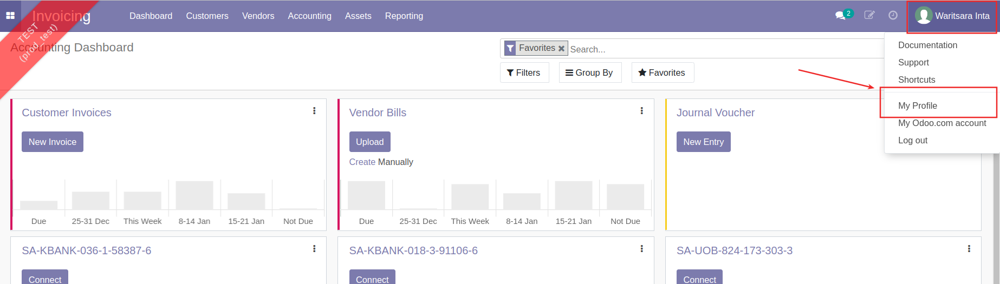
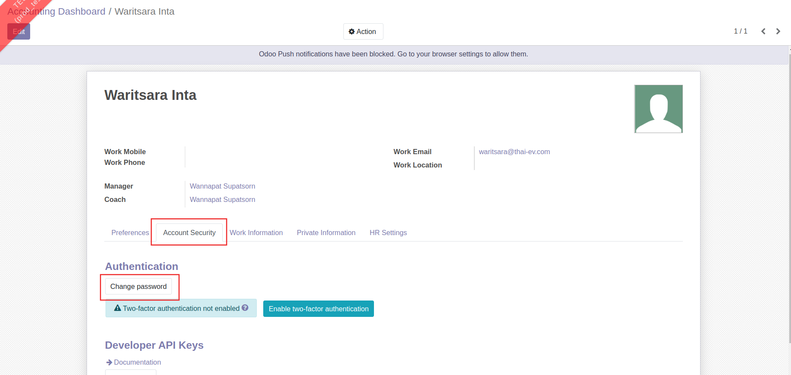
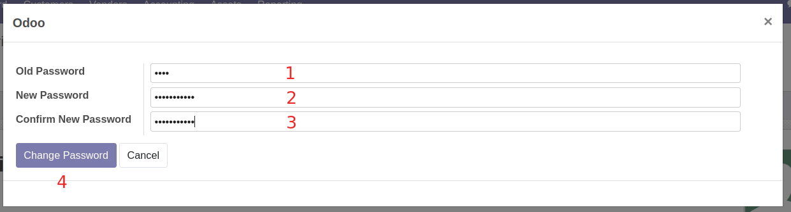

# วิธีการทำงานอื่นๆ

## วิธีการเปลี่ยนรหัสผ่าน

เมื่อผู้ใช้งานต้องการเปลี่ยนรหัสผ่านในการเข้าระบบ สามารถดำเนินการได้ โดยมีขั้นตอนดังนี้

1. ที่ชื่อ User กดและเลือกเมนู My Profile

2. ที่แท็บ Account Security กดปุ่ม Change Password

3. ระบบแสดงหน้าต่างเพื่อกรอกรหัสใหม่

    
    * (1) Old Password: กรอกรหัสเดิม
    * (2) New Password: กรอกรหัสใหม่
    * (3) Confirm New Password: ยืนยันรหัสใหม่อีกครั้ง
    * (4) กดปุ่ม Change Password เพื่อยืนยันการเปลี่ยนรหัสผ่าน

!!! Note
    เมื่อทำการเปลี่ยนรหัสผ่านแล้ว ระบบจะ Logout ให้อัตโนมัติ ผู้ใช้งานสามารถเข้าระบบอีกครั้งด้วยรหัสผ่านใหม่

End.
