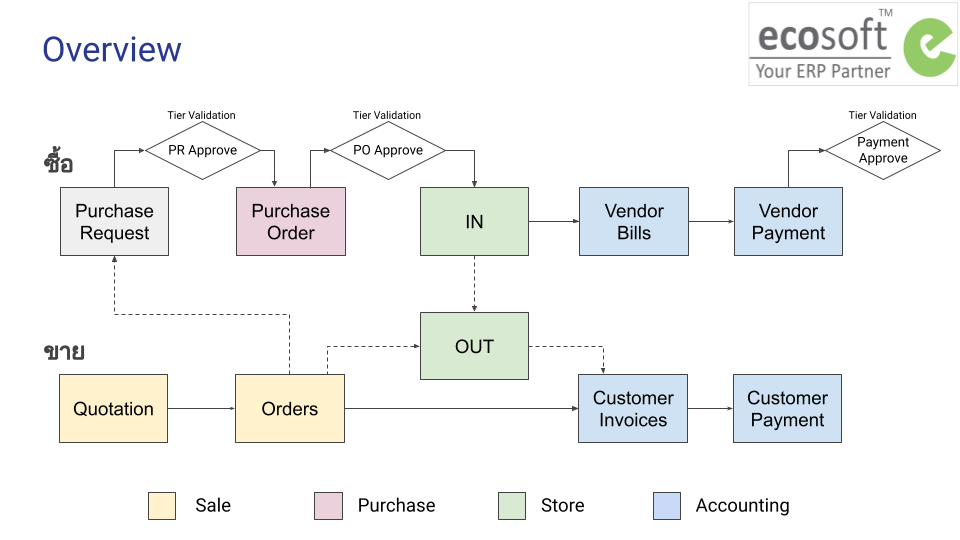

# ภาพรวม

## กระบวนการทำงาน

กระบวนการทำงานแบ่งตามฝ่ายต่างๆ ดังนี้

1. Sale - ฝ่ายขาย
    * การออกใบเสนอราคาและยืนยันการขาย 
2. Purchase - ฝ่ายจัดซื้อ 
    * การขอซื้อขอจ้าง โดยผู้ขอซื้อ
    * การจัดซื้อจัดจ้าง โดยฝ่ายจัดซื้อ
3. Inventory - ฝ่ายสโตร์
    * การรับของเข้าสโตร์
    * การตัดของออกจากสโตร์
4. Accounting - ฝ่ายบัญชี
    * การตั้งเจ้าหนี้ (Vendor Bills)
    * การบันทึกจ่ายชำระเงิน (Vendor Payment)
    * การตั้งลูกหนี้ (Customer Invoice)
    * การบันทึกรับชำระเงิน (Customer Payment)
    * การเบิกและบันทึกใช้เงินสดย่อย (Petty Cash)
    * การจัดการสินทรัพย์ 
    * การเรียกรายงาน

---

End.